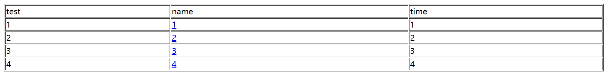
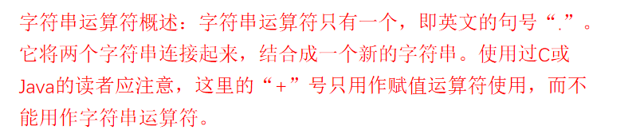
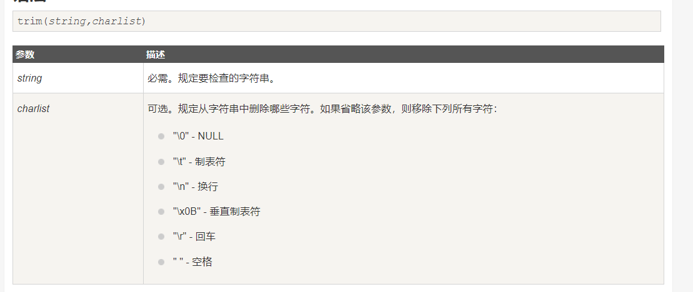
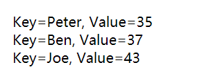
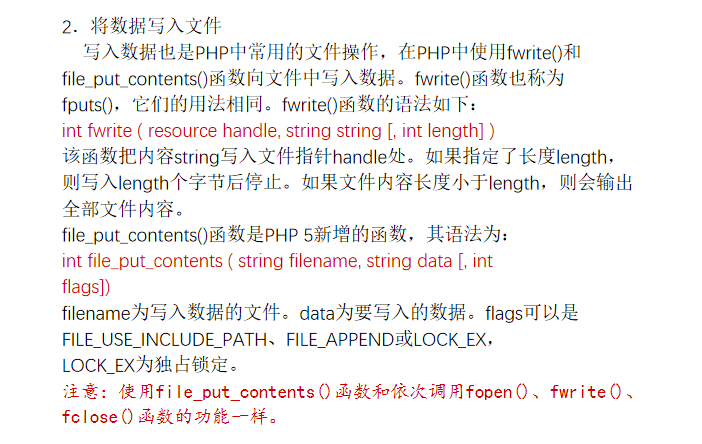

不会，看菜鸟教程吧

<a href="https://www.runoob.com/php/php-tutorial.html">PHP教程</a>

<!-- more -->

考试（选择10 * 3 判断10 * 2 简答3 * 10 编程 20）

大题重点：数据库（mysql或者PDO）与session

# 基础

### web工作原理

**通过网络运行**

**服务器，客户端模型B/S**

**URL如何对应服务器文件**

**PHP在哪里运行，结果是什么**

一般运行在服务器上

HTML,JS,CSS前端技术

**URL包含哪些部分远程调用，参数**

HTTP协议

### 静态与动态页面

get post方法

get传参大小有限制，不可创建文件

post传参大小一般无限制，可以创建文件

**服务器端的区别**

### PHP服务器

LAMP

 *LAMP*(Linux + Apache + MySQL/MariaDB + PHP) 

运行平台

如何安装与配置

phpinfo函数（重要！考试没法考）

# 语言基础

### html与php混合编程

**如何解析**  

例如

```php
一般来说，对于php，""里面的变量会输出其对应的值，''里面的原样输出
<?php
$a=123;
echo '$a';
echo "$a";
?>
<?php 
    echo '<input type="text" name="name">'
	echo '<input type="text" name="fname">'
?> 
```

**分段**

**一段不完整语法（循环/判断）**

编程，循环输出表格

示例 

```php
<?php
$temp = 5;
echo '<table border=1 width=1200>';
echo '<tr>';
echo '<td>test</td>';
echo '<td>name</td>';
echo '<td>time</td>';
echo '</tr>';
for ($i = 1; $i < $temp; $i++) {//动态生成表格
    echo '<tr>';
    echo '<td>' . $i . '</td>';
    echo '<td><a href="3-3.php?uid=' . $i . '"> ' . $i . ' </a></td>';
    echo '<td>' . $i . '</td>';

    echo '</tr>';
}
?>
```



**include和include_once**

include可以多次包含

include_once只能包含一次

```php
index.php包含两次
<?php
include "index.php";
// 其他代码
//
include "index.php";
?>

index.php只包含一次
<?php
include_once "index.php";
// 其他代码
//
include_once "index.php";
?>
```

### 数据类型

#### 基本类型

boolean

integer

float

字符串：

**单引号双引号区别**

**字符串连接**

字符串操作

object

array

特殊类型

resource

null

#### 类型转换

**强制转换**

**隐含**

**字符串与数字类型**

**检测数据类型（39页）**

### 常量（40）

**声明**

`define`

```php
<?php
// 区分大小写的常量名
define("GREETING", "欢迎访问 Runoob.com");
echo GREETING;    // 输出 "欢迎访问 Runoob.com"
echo '<br>';
echo greeting;   // 输出 "greeting"
?>
    
<?php
// 不区分大小写的常量名
define("GREETING", "欢迎访问 Runoob.com", true);
echo greeting;  // 输出 "欢迎访问 Runoob.com"
?>
```

**使用**

**检测**

**预定义常量（41）**

了解即可

### 变量

#### 如何声明变量

**变量声明无类型**

```cmd
  php变量是弱类型的
  
  PHP 变量规则：
  - 变量以 $ 符号开始，后面跟着变量的名称
  - 变量名必须以字母或者下划线字符开始
  - 变量名只能包含字母数字字符以及下划线（A-z、0-9 和 _ ）
  - 变量名不能包含空格
  - 变量名是区分大小写的（$y 和 $Y 是两个不同的变量）
```

  

**测试未声明的变量**

`isset()`

```php
<?php
$var = '';
 
// 结果为 TRUE，所以后边的文本将被打印出来。
if (isset($var)) {
    echo "变量已设置。" . PHP_EOL;
}
 
// 在后边的例子中，我们将使用 var_dump 输出 isset() 的返回值。
// the return value of isset().
//unset() 释放变量
 
$a = "test";
$b = "anothertest";
 
var_dump(isset($a));      // TRUE
var_dump(isset($a, $b)); // TRUE
 
unset ($a);
 
var_dump(isset($a));     // FALSE
var_dump(isset($a, $b)); // FALSE
 
$foo = NULL;
var_dump(isset($foo));   // FALSE
?>
```

**引用变量**

即用不同的名字访问同一个变量

`$b =&$a;`

```php
<?php
$a="ABC";
$b =&$a;
echo $a;//这里输出:ABC
echo $b;//这里输出:ABC
$b="EFG";
echo $a;//这里输出:EFG
echo $b;//这里输出:EFG
$a="HHH";
echo $a;//这里输出:HHH
echo $b;//这里输出:HHH
?>
```

```php
<?php
function test(&$a){
    $a=$a+100;
}
$b=1;
echo $b;//输出１
test($b);   //这里$b传递给函数的其实是$b的变量内容所处的内存地址，通过在函数里改变$a的值　就可以改变$b的值了
echo "<br>"; 
echo $b;//输出101
?>
```

#### 变量作用域（44）

**全局**

与JAVA差不多

外部定义的都是全局的，

函数内是局部的，只在函数内有效

在函数内调用函数外定义的全局变量，我们需要在函数中的变量前加上 **global** 关键字

```php
<?php
$x=5;
$y=10;

function myTest()
{
    global $x,$y;
    $y=$x+$y;
}

myTest();
echo $y; // 输出 15
?>
```

静态

当一个函数完成时，它的所有变量通常都会被删除。然而，有时候希望某个局部变量不要被删除。

要做到这一点，需要在第一次声明变量时使用 **static** 关键字：

然后，每次调用该函数时，该变量将会保留着函数前一次被调用时的值。

```php
<?php
function testStatic() {
    static $val = 1;
    echo $val;
    $val++;
}
testStatic();   //output 1
testStatic();   //output 2
testStatic();   //output 3
?>
```

#### 可变变量（46）

$$的意义

从右到左解析

```php
<?php
$a = 'hello';
$$a = 'world';
echo "$a ${$a}";//输出hello world
echo "$a $hello";//输出hello world
?>
```

#### 预定义变量

**$_POST**

**$_GET**

**$_REQUEST**

**$_SESSION**

**$_COOKIE**

**$_FILE**

### 运算

大多与C差不多

**字符串**

`.`



对于 “+”

true=1

对于字符串运算，PHP会自动截取最前面的数字进行运算，若开头为字母，则把它当作0运算

```php
<?php
$a = true;
$b = '12aa12';
$c='a123aa12';
echo @($c+$b+$a); 
?>
```

**逻辑===**

**== 与 ===的区别**

== 比较数值， ===既比较数值也比较类型

**！ ==**

===的反面，即类型不等或者数值不等

```php
<?php
$a = 1;
$b = '1';
//$b = '1abc';
if($a==$b)//true
//    if($a===$b)//false
//    if($a!==$b)//true
    echo 1;
else
    echo 0;
?>
```

**所有类型的变量都可以参与逻辑运算**

对于空字符串和null，为false，其余为true

对于数值0，为false，其余为true

### 函数定义与调用

**默认参数(可选参数)**

默认参数要放在非默认的右边，不然有可能出错

```php
<?php
//自定义一个函数person，用于打印一个人的属性
function person($name="张三", $age=20, $sex="男"){
    echo "姓名：{$name}, 年龄：{$age}, 性别：{$sex} <br>";
}
person();               //全部使用默认参数
person("李四");            //第一个默认参数被覆盖，后面两个参数为默认
person("李四",22);          //前两个默认参数被覆盖，后面一个参数为默认
person("李四",22,"女");        //三个默认参数都被覆盖
?>
    输出
姓名：张三, 年龄：20, 性别：男
姓名：李四, 年龄：20, 性别：男
姓名：李四, 年龄：22, 性别：男
姓名：李四, 年龄：22, 性别：女
```

**传值/传引用**

有点类似C的指针？

```php
<?php
function value($a){//传值方式
    $a+=1;
    echo $a;
}
function quote(&$a){//传引用方式
    $a+=1;
    echo $a;
}
$a = 1;
value($a);
echo $a;
echo '<br>';
quote($a);
echo $a;

?>
输出
21
22
```

**变量函数（58）了解**

有点类似C的函数指针？

```php
<?php
function value(){
    echo 233;
}
function quote($n){
    $n+=1;
    echo $n;
}function go($name="YLN"){
    echo $name;
}
$a = "value";
$a();
echo '<br>';
$a = "quote";
$a(2);
echo '<br>';
$a = "go";
$a("xiao");
?>
    
输出
233
3
xiao    
```

### 流程控制

**注意foreach语法**

下面有写

注意rand函数（66）

与C不同，获得的是随机**整数**

```php
<?php
$a=rand(1,3);
echo $a;
?>
    输出1-3间的整数
    1/2/3
```

### 字符串操作

trim/ltrim/rtrim

trim() - 移除字符串两侧的空白字符或其他预定义字符。



```php
<?php
$str = " Hello World! ";
echo $str . "<br>";
echo trim($str," HELD! ")."<br>";
echo trim($str," llold! ")."<br>";
echo trim($str);
?>
输出
Hello World!
ello World
Hello Wor
Hello World!
```

和上面的一样的

ltrim() - 移除字符串左侧的空白字符或其他预定义字符。

rtrim() - 移除字符串右侧的空白字符或其他预定义字符。


转义还原函数（85）

```php
addslashes()
stripslashes()
<?php
$str = "PHP,'Hello World!'";
echo $str."<br>";
echo addslashes($str)."<br>";
echo stripslashes($str);
?>
输出
PHP,'Hello World!'
PHP,\'Hello World!\'
PHP,'Hello World!'
```

长度strlen

```php
<?php
echo strlen("你好,PHP");
?>
输出
10（6+4）
utf-8编码下每个中文字符所占字节为3
中文字符串的处理可以使用 mb_strlen() 函数
```

截取substr

```php
<?php
$str="hello,this is yln956.github.io";
echo substr($str,0)."<br>";//0开始截取
echo substr($str,5)."<br>";
echo substr($str,4,6)."<br>";
echo substr($str,-4,2)."<br>";//倒数第四个开始截取两个
echo substr($str,2,-5);//从2开始截取到倒数第五
?>
输出
hello,this is yln956.github.io
,this is yln956.github.io
o,this
b.
llo,this is yln956.gith
```

查找strstr

```php
strstr() 函数搜索字符串在另一字符串中是否存在，如果是，返回该字符串及剩余部分，否则返回 FALSE。
该函数是区分大小写的。如需进行不区分大小写的搜索，请使用 stristr() 函数。
<?php
echo strstr("Hello world!","wor");  // 输出 world!
?>
```

替换str_replace

```php
str_replace() 函数替换字符串中的一些字符（区分大小写）。
该函数必须遵循下列规则：
如果搜索的字符串是一个数组，那么它将返回一个数组。
如果搜索的字符串是一个数组，那么它将对数组中的每个元素进行查找和替换。
如果同时需要对某个数组进行查找和替换，并且需要执行替换的元素少于查找到的元素的数量，那么多余的元素将用空字符串进行替换。
如果是对一个数组进行查找，但只对一个字符串进行替换，那么替代字符串将对所有查找到的值起作用。
注释：该函数是区分大小写的。请使用 str_ireplace() 函数执行不区分大小写的搜索。
<?php
echo str_replace("World","Peter","Hello World!");
?>
输出
Hello Peter!
```

**分割/合成（98）**

explode() 函数

把字符串打散为数组：

```php
<?php
$str='yln956.github.io';
print_r(explode('.',$str,0));
var_dump(explode('.',$str,0));
var_dump(explode('.',$str,2));
var_dump(explode('.',$str,-1));
?>
输出
Array ( [0] => yln956.github.io )

array (size=1)
  0 => string 'yln956.github.io' (length=16)

array (size=2)
  0 => string 'yln956' (length=6)
  1 => string 'github.io' (length=9)

array (size=2)
  0 => string 'yln956' (length=6)
  1 => string 'github' (length=6)
```

implode() 函数

把数组元素组合为一个字符串：

```php
<?php
$str=array('yln956','github','io');
echo implode(".",$str)."<br>";
echo implode(" ",$str)."<br>";
echo implode("+",$str)."<br>";
echo implode("-",$str);
?>
输出
yln956.github.io
yln956 github io
yln956+github+io
yln956-github-io
```

### 数组

数组类型可以任意

数组基本操作

**长度**

```php
获取数组的长度 - count() 函数
count() 函数用于返回数组的长度（元素的数量）：

<?php
$cars=array("Volvo","BMW","Toyota");
echo count($cars);
?>
输出
3
```

**foreach**

```php
<?php
$age=array("Peter"=>"35","Ben"=>"37","Joe"=>"43");

foreach($age as $x=>$x_value)
{
  echo "Key=" . $x . ", Value=" . $x_value;
  echo "<br>";
}
?>
```

运行结果



把数组当堆栈array_push($a,"3","4")

删除重复等操作array_unique($a)

**下表和键值的区别，下标可以不连续**

# 与WEB交互

### 表单的使用

**from基本参数**

基本表单元素

**表单中使用数组/多选**

```php
<form action="welcome.php" method="post">
    <div>头像: <input type="file" name="file" id="file"></div>
    <div>生日: <input type="date" name="birthday"></div>
    <div>名字: <input type="text" name="fname"></div>
    <div>密码: <input type="password"name="password" placeholder="请输入密码"></div>
    <div>年龄: <input type="text" name="age"></div>
    <select multiple="multiple" name="q[]">//多选
        <option value="">选择一个站点:</option>
        <option value="RUNOOB">Runoob</option>
        <option value="GOOGLE">Google</option>
        <option value="TAOBAO">Taobao</option>
    </select><br>
    <select name="q">//单选
        <option value="">选择一个站点:</option>
        <option value="RUNOOB">Runoob</option>
        <option value="GOOGLE">Google</option>
        <option value="TAOBAO">Taobao</option>
    </select>
    <div><input type="submit" value="提交"></div>
</form>
```

### POST和GET

POST是不可见的

GET在URL中，是可见的

### 如何在服务器得到WEB传递的参数

使用超级全局变量

- $_REQUEST
- $_POST
- $_GET
- $_FILES
- $_COOKIE
- $_SESSION
- 等等

$_GET['username']

$_POST['username']

### URL传递参数与POST的区别

get大小有限制

post一般没限制

### 文件上传(file含义了解)

### URL编码/解码

urlencode();编码
urldecode();解码

# 与JS集成（了解）

### 哪里运行

一般运行在浏览器中

### 什么作用

提供界面交互

### 嵌入与外部引用

# 日期和时间

### 时区设置

### timepestamp

### 时间类型与时间函数

**time函数，返回时间戳**

**date函数，根据时间戳返回时间**

```php
<?php
$t=time();//返回时间戳
echo($t . "<br>");
echo(date("Y-m-d-h:i:s",$t));//根据时间戳返回时间
echo date("Y-m-d-h:i:s");
?>
```

# cookie与session

### cookie原理（概念）

**服务器设置到浏览器setcookie**

**浏览器自动发送**

**作用域**

**过期时间**

```php
setcookie(name, value, expire, path, domain);
<?php
$expire=time()+60*60*24*30;
setcookie("user", "yln", $expire);
?>

<html>
.....
    
<?php
// 设置 cookie 过期时间为过去 1 小时
setcookie("user", "", time()-3600);
?
```

### session是什么

**原理，利用cookie令牌**

**与cookie区别**

**保存在服务器**

**如何判断用户状态**

### 如何操作session

**启动**

```php
<?php
include('getmysql.php');
session_start();
$_SESSION['user']['userid'] = $_POST['userid'];
$_SESSION['user']['user'] = vip;

echo  $_SESSION['user']['userid'];
echo  $_SESSION['user']['user'];
?>
```

**写**

**读**

**清除一个值**

**销毁整个session**

```php
<?php
include('getmysql.php');
session_start();
$_SESSION['user']['userid'] = $_POST['userid'];
$_SESSION['user']['user'] = vip;

echo  $_SESSION['user']['userid'];
echo  $_SESSION['user']['user'];

$_SESSION['user']['userid'] = 233;
session_destroy();//本页面不会销毁

unset($_SESSION['views']);//直接销毁
//
echo  $_SESSION['user']['userid'];
echo  $_SESSION['user']['user'];

?>
```

# 文件和目录

打开关闭文件

**读文件**

**redfile**

**file**

**file_get_contents**

1．从文件中读取数据
    从文件中读取数据，可以读取一个字符、一行字串或整个文件，还可以读取
任意长度的字串。
1）读取整个文件：readfile()、file()和file_get_contents()
**（1）readfile()函数**
       readfile()函数用于读入一个文件并将其写入到输出缓冲，如果出现错误则
返回false。函数语法如下：
int readfile(string filename)
      使用readfile()函数，不需要打开/关闭文件，不需要echo/print等输出语
句，直接写出文件路径即可。
**（2）file()函数**
        file()函数也可以读取整个文件的内容，只是file()函数将文件内容按行存
放到数组中，包括换行符在内。如果失败则返回false。函数语法如下：
array file(string filename)
**（3）file_get_contents()函数**
      该函数将文件内容（filename）读入失一个字符串。如果有offset和maxlen参数，将在
参数offset所指定的位置开始读取长度为maxlen的内容。如果败，返回false。函数语法
如下：
string file_get_contents(string filename[,int offset[,int maxlen]])
该函数适用于二进制对象，是将整个文件的内容读入到一个字符串中的首选方式。 


写文件fwrite



**文件和目录**

**scandir**

数组方式列出 images 目录中的文件和目录

```php
p<?php
$dir = "/images/";

// Sort in ascending order - this is default
$a = scandir($dir);

// Sort in descending order，降序
$b = scandir($dir,1);

print_r($a);
print_r($b);
?>
```

**is_dir**

is_dir() 函数检查指定的文件是否是一个目录。

如果目录存在，该函数返回 TRUE。

```php
<?php
$file = "images";
if(is_dir($file))
{
    echo ("$file is a directory");
}
else
{
    echo ("$file is not a directory");
}
?>
```

**如何上传文件**

在表单需要二进制数据时，比如文件内容，请使用 "**multipart/form-data**"。

```php
<form action="upload_file.php" method="post" enctype="multipart/form-data">
    <label for="file">文件名：</label>
    <input type="file" name="file" id="file"><br>
    <input type="submit" name="submit" value="提交">
</form>

//upload_file.php
<?php
            // 如果 upload 目录不存在该文件则将文件上传到 upload 目录下
            move_uploaded_file($_FILES["file"]["tmp_name"], "upload/" . $_FILES["file"]["name"]);
            echo "文件存储在: " . "upload/" . $_FILES["file"]["name"];

?>
```

# 面向对象

大多与JAVA一样

**定义类需要在一个PHP区块中**

**析构函数的特殊性**

常量

静态方法

静态函数

**$this和 ： :**

**parent/self/类名**

对象成员访问符号

**魔术方法**

**_get/ _set**

**_call**

三大特点：封装性，继承性，多态性

定义类需要在一个PHP区块中

析构函数的特殊性：（void __destruct(void)）

- PHP使用一种“垃圾回收”机制，自动清理不再使用的对象，析构函数会自动被调用，释放内存。
- 对象被销毁时被调用（和构造方法相反），作用释放内存。

$this->和::

- $this->表示实例化后调用具体对象
- ::用来直接调用类中的属性或方法，没有实例化

使用::的格式：关键字::变量名/常量名/方法名，这里的关键字：

- parent：可以调用父类中的成员变量、常量，成员方法
- self：可以调用当前类中的静态成员和常量
- 类名：可以调用该类的变量、常量、方法

对象成员访问符号

```cmd
-> 是对象成员访问符号 

//区分 

=> 是数组成员访问符号
```

魔术方法：*get/*set;_call

php面向对象中的public protected private 的含义，以及final关键字的含义

- public：公开的，可以在程序的任何位置（类内、类外）被其它类和对象调用

- private：只能在所属类的内部被调用和修改，不可以在类外被访问
- protected：可在本类和子类被调用，其它地方不可被调用
- final：被final修饰的类不能被继承，修饰的方法不能重写也不能覆盖

# PHP加密

crypt

md5

sha1

```php
$password = $_POST['password'];
$password = md5($password);
```

# PHP操作数据库

### mysql基础

安装

访问

WEB客户端

## 传统方式操作数据库

**连接**

**执行SQL**

**结果集操作**

```php
<?php
$servername = "localhost";
$username = "root";
$password = "123456";
$dbname = "ylndb";

// 创建连接
$conn = new mysqli($servername, $username, $password, $dbname);

$sql = "SELECT * FROM user";
$result = mysqli_query($conn, $sql);

$row = mysqli_fetch_assoc($result);//可以用这个数组判断重复，这个是一维数组
$sql = "INSERT INTO user (tou, userid, username,password,name,sex,telephone,qq,email,birthday)
        VALUES ('$tou', '$userid', '$username','$password','$name','$sex','$telephone','$qq','$email','$birthday')";
$res = mysqli_query($conn, $sql);
var_dump($row);
mysqli_close($conn);
?>
```

### PDO方式操作数据库

**PDO连接数据库以及DSN**

**执行SQL->参数绑定**

**结果集操作**

错误处理

事务处理

```php
<?php
$dbservername = "localhost";
$dbusername = "root";
$dbpassword = "123456";
$dbname = "ylndb";

$conn = new PDO("mysql:host=$dbservername;dbname=$dbname", $dbusername, $dbpassword);
$conn->setAttribute(PDO::ATTR_ERRMODE, PDO::ERRMODE_EXCEPTION);
$stmt = $conn->prepare("select * from user");
$stmt->execute();

//设置结果集为数组

$stmt->setFetchMode(PDO::FETCH_ASSOC);
$row = $stmt->fetchAll();//可以用这个数组判断重复,这个是二维数组
var_dump($row);
try {
    $conn = new PDO("mysql:host=$dbservername;dbname=$dbname", $dbusername, $dbpassword);
    // 设置 PDO 错误模式，用于抛出异常
    $conn->setAttribute(PDO::ATTR_ERRMODE, PDO::ERRMODE_EXCEPTION);
    $sql = "INSERT INTO user (tou, userid, username,password,name,sex,telephone,qq,email,birthday)
        VALUES ('$tou', '$userid', '$username','$password','$name','$sex','$telephone','$qq','$email','$birthday')";
    // 使用 exec() ，没有结果返回
    $conn->exec($sql);
    echo "注册成功";
} catch (PDOException $e) {
    echo $sql . "<br>" . $e->getMessage();
}
$conn = null;

?>
```


