> 搭建博客遇到了挺多问题，以此文章纪念一下自己搭博客的历程
>
> 也写给想要拥有一个自己的网站但没有资金成本的小白与曾经的自己。

<!-- more -->

# 前言

虽说是网站，对于个人来说，或许一般叫作博客。
但我不希望它仅仅是一个博客，而是能够成为一个处于自己现实生活之外、自由、实验、不用畏惧他人眼光甚至可以独断专行的地方。

当然，这本质还是一个新手向教程，也许会有点科普的感觉。

我会从整体上对搭建网站的流程和使用到的技术及步骤进行介绍（因为要铺开讲，倘若包括轶事，实在太多太杂，有些东西对于我自己而

已也不是很清楚，所以我也会点到为止），并让你明白这个东西在网站的过程中起到什么样的作用。

但我不会就细枝末节展开叙述，譬如如何注册账号、安装时如何点击下一步。

我希望看完此篇文章后，此前对此方面知识一无所知的小白，到最后也能搭建出一个属于自己的站点。（前提是认识基础的英语单词和**善**

**用搜索引擎**）别指望这个教程能让你直接成功，善用搜索引擎十分重要。


已经有所基础的同学大可跳读或者直接关闭。

> 注释处多为相关补充说明，对正常流程没有影响，若没有兴趣，可以略过。

# 步骤（本文以windows为例）

## 安装Git

> **什么是git?**
>
> Git是目前世界上最先进的分布式版本控制系统，可以有效、高速的处理从很小到非常大的项目版本管理。也就是用来管理你的hexo
>
> 博客文章，上传到GitHub的工具。Git非常强大，我觉得建议每个人都去了解一下。廖雪峰老师的Git教程写的非常好，大家可以了解
>
> 一下。[Git教程](https://www.liaoxuefeng.com/wiki/0013739516305929606dd18361248578c67b8067c8c017b000)

在安装Git之前，我建议先下载文本编辑器，我推荐两个文本编辑器

> **Visual Studio Code，简称 VS Code。**
>
> 目前最为强大易用的编辑器，轻量且快速。（~~宇宙第一编辑器~~）
>
> 注意：它并不是我们常常听到的 VS，VS 常常指的是 Visual Studio，是一个功能强大的 IDE（集成开发环境），体积也相比 VS Code 
>
> 都要大上一个量级

> **Sublime Text**
>
> Sublime Text 是一个文本编辑器（**收费软件**，可以无限期试用，但是会有激活提示弹窗），不喜欢弹窗就自己找教程PJ
>
> 同时也是一个先进的代码编辑器。Sublime Text是由程序员Jon Skinner于2008年1月份所开发出来，它最初被设计为一个具有丰富
>
> 扩展功能的Vim。

到git官网上下载[Download git](https://gitforwindows.org/)下载后会有一个Git Bash的命令行工具，以后就用这个工具来使用git。

（如果国内速度太慢，可以试试[这里](https://pc.qq.com/detail/13/detail_22693.html)）

## 安装 Node.js

> **什么是 Node.js ？**
> 这得从什么是 JS 说起，JS 也就是 JavaScript。（为什么有种从盘古开天辟地开始的感觉）没错，JavaScript 就是网页的盘古。JavaScript 是一种编程语言，我们所见到的网页中的交互和逻辑处理几乎都是由 JavaScript 完成。
> JavaScript 语法简单，易学易用。（当然也请不要小瞧它，虽然它入门门槛低，但上限同样也很高。包括但不限于实现网站前后端，手机桌面应用程序，机器学习，计算机图形学等。）
> 在 Node.js 诞生前，JavaScript 都运行于浏览器端。也就是说，它是鱼，浏览器是装满了水的水缸。
> 2008 年，Chrome V8 诞生。2009 年，Node.js 诞生。并成为 GitHub 早期最著名的开源项目。GitHub 可能大家已有所了解，后续再说。
> Node.js 便是一个基于 Chrome V8 引擎的 JavaScript 运行环境。（当年第一次看到这句话时，我也一脸懵逼。）按照我的理解，JavaScript 是鱼，Chrome V8 就是抽水机，Node.js 则把这台抽水机也装在你电脑上。于是你的电脑也有了 Node.js 这个和浏览器相似的水缸，也可以在里面运行 JavaScript 了！
> 当然 Node.js 和浏览器端还是因为自身定位和一些历史原因而有些许区别的，不再展开。
> [Node.js | 百度百科](https://baike.baidu.com/item/node.js/7567977)
> [JavaScript | MDN](https://developer.mozilla.org/zh-CN/docs/Web/JavaScript)

**Hexo是基于Node.js的静态博客框架，所以如果电脑没有Node.js的话请务必安装一下**

[下载｜ Node.js](https://nodejs.org/zh-cn/)

建议下载**长期支持版(或者自行百度下载老版本)**而非**当前发布版**（因为如果是最新版，容易出现一些奇妙的 bug）。

全部默认下一步进行安装。

cmd输入（什么？你不知道什么是cmd，自行百度吧）

```sh
# 查看Node包管理器版本 npm -> node.js package management
npm -version

# 查看Node.js版本
node --version
```

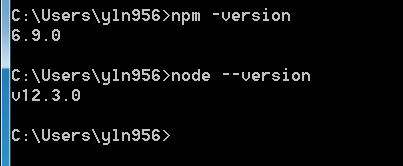_如果能正常显示则说明安装成功_

> Node.js 安装成功时也默认安装了 `npm`，在此后将会用到。
> `npm` 是随 Node.js 一起被安装的包管理工具，你可以理解成 Node.js 自带的应用商店。

对了，国内使用 npm 可能很慢。

**你可以考虑切换为 `taobao` 镜像源。**

```sh
npm config set registry https://registry.npm.taobao.org
```

## 安装hexo

> Hexo是一款基于Node.js的静态博客框架，依赖少易于安装使用，可以方便的生成静态网页托管在GitHub和Coding上，是搭建博客
>
> 的首选框架。大家可以进入[hexo官网](https://hexo.io/zh-cn/)进行详细查看，因为Hexo的创建者是台湾人，对中文的支持很友好，可以选择中文进行查看。

**选择一个空文件夹（可以自己创建一个）来保存将来属于你自己的博客**

这里我在桌面创建了一个文件夹叫myblog

在终端中输入以下命令：

```sh
npm install hexo-cli -g
# 如果安装失败，可能是没有权限，可以尝试头部加上 sudo 重新执行
# sudo npm install hexo-cli -g

#如果安装完毕检查一下Hexo是否安装成功
Hexo -v
```

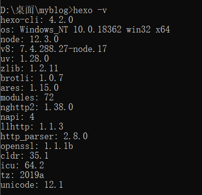

在确保Hexo已经安装后，就可以开始安装自己的博客了

先初始化一下自己的Hexo，在你建的目录**使用git bash**

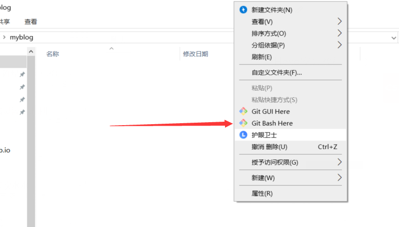

然后输入

```sh
#hexo init myblog
#建议使用 hexo init 你的名字.github.io，不过问题不大
hexo init [你的博客文件夹名称]
```

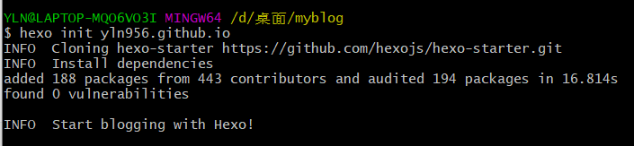

```sh
# 进入你的博客文件夹
cd 你的名字.github.io

# 默认安装所有 `package.json` 文件中提到的包
npm install

#如果觉得安装慢点话可以尝试使用淘宝镜像源 效果和 npm install 一样，会更快
npm install --registry https://registry.npm.taobao.org
```

安装好以后打开文件夹可以看见自动生成的文件目录结构

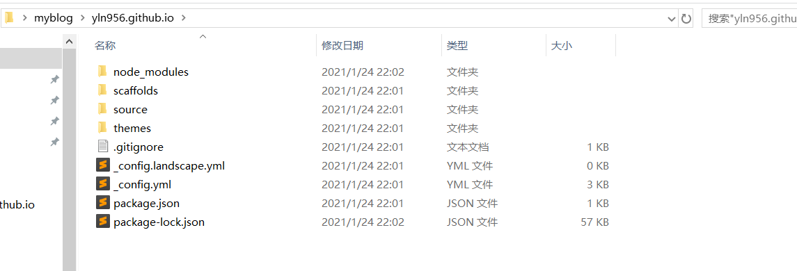

| 文件名称     | 实际作用            |
| ------------ | ------------------- |
| _config.yml  | 博客主题配置文件    |
| node_modules | node.js依赖包文件夹 |
| scaffolds    | 文章模板            |
| source       | 存放你的博客文章    |
| themes       | 博客主题文件夹      |

**你新建的博客文章全部放在`source/_posts`文件夹中，格式为Markdown格式**

> **什么是Markdown?**
>
> Markdown是一种轻量级标记语言，创始人为约翰·格鲁伯（英语：John Gruber）。 它允许人们使用易读易写的纯文本格式编写文档，然后转换成有效的XHTML（或者HTML）文档。这种语言吸收了很多在电子邮件中已有的纯文本标记的特性。

> **推荐一个Markdown编辑器**
>
> **Typora**
>
> Typora是一款轻便简洁的Markdown编辑器,支持即时渲染技术,这也是与其他Markdown编辑器最显著的区别.~~重点是免费~~!

> **什么是及时渲染技术？**
>
> 即时渲染技术使得你写Markdown就像是写Word文档一样流畅,不像其他编辑器的有工具栏.

这个时候已经可以在本地运行你的博客了只要输入指令

```shell
#生成hexo博客
hexo g
#运行hexo博客
hexo s

#创建新的博客文章名称
hexo new [你新的博客文章名称]
```

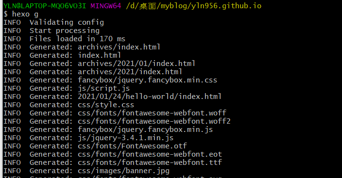

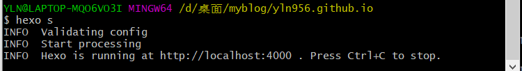

启动hexo后打开浏览器，输入`localhost:4000`即可查看你的博客

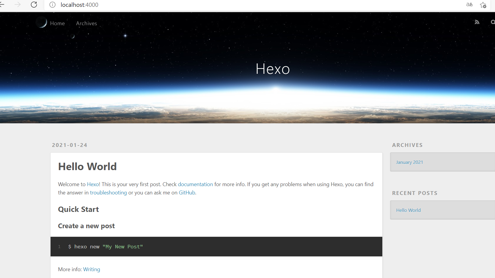

**如果需要停止输入`ctrl+c`即可**

## 注册 GitHub并新建仓库

打开[github官网](https://github.com/)

然后选择Sign up注册属于你自己的账号即可

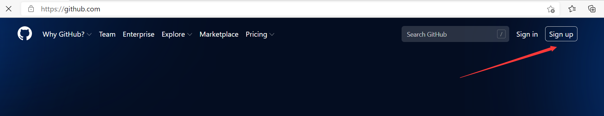

**生成ssh key**

在终端中输入

```sh
#这里youremail@example.com替换成你的邮箱
ssh-keygen -t rsa -C  youremail@example.com
```

**输入完后可以一路回车**

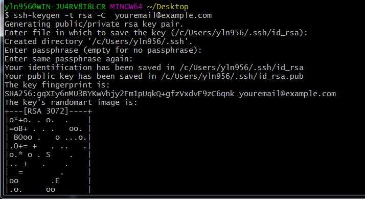

获取你本机当前的ssh key

在终端中输入

```shell
cat ~/.ssh/id_rsa.pub
```

**显示的内容为你ssh的公匙**

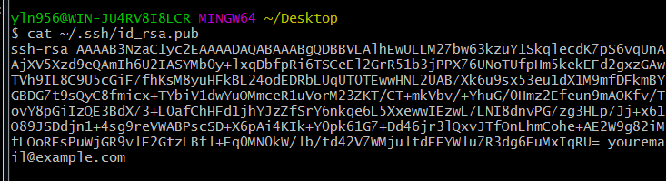

**将你的ssh key导入到GitHub中**

登陆GitHub账号，点击右上角头像->setting

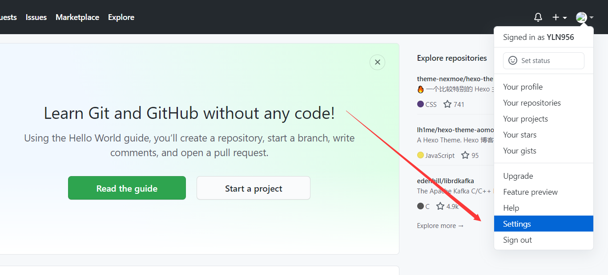

在setting页面中选择SSH and GPG keys->New SSH key

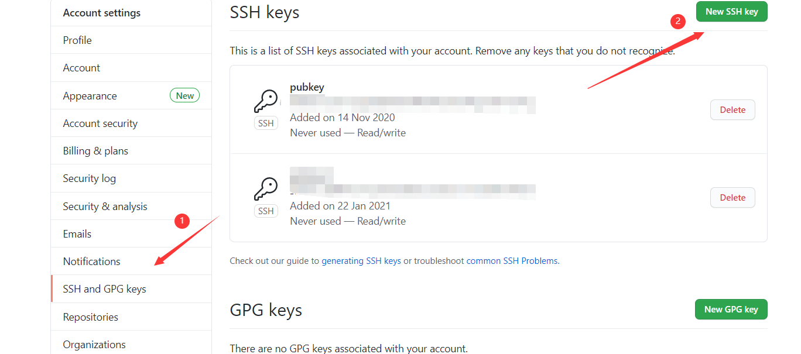

填入对应到title和ssh key内容，点击添加即可

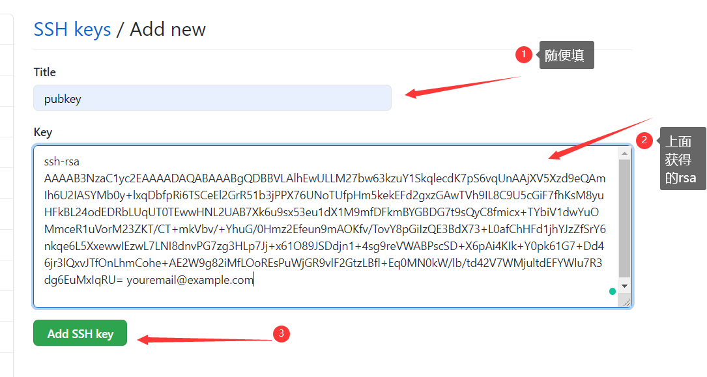

**创建Github仓库存储Hexo博客信息**

创建一个新的博客仓库

登陆GitHub账号选择右上角+号->New repository

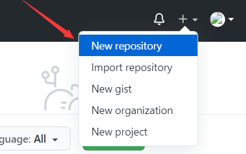

填写好你仓库名称后选择添加仓库即可

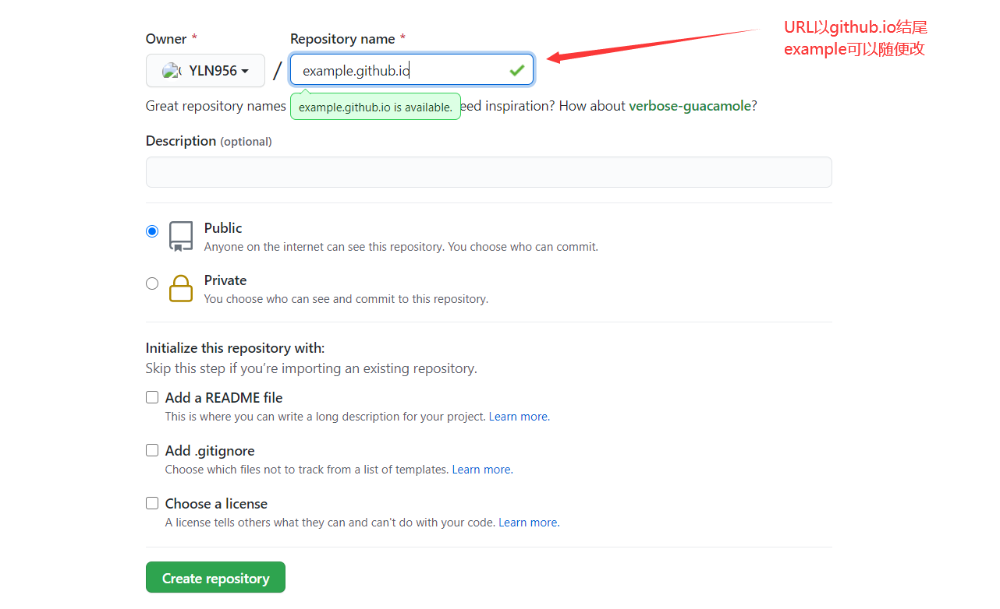

打开刚创建好的仓库，拷贝仓库http链接，下面会用到

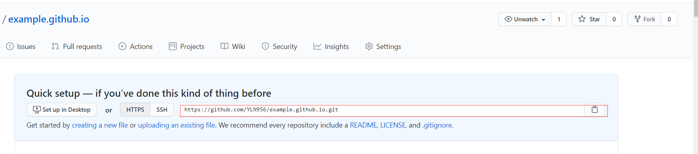

## 将Hexo的博客发布到Github

**打开`_config.yml`**

在配置文件中找到(ctrl+f)：`deploy`将对应段落修改成以下内容

```sh
# Deployment
## Docs: https://hexo.io/docs/deployment.html
deploy:
  type: git
  repo: 你的github仓库链接 			##就是刚刚上面拷贝的
  # repo: 'https://github.com/XXXXX/XXXX.github.io.git'
  branch: master
```

**然后安装deploy-git**

git bash输入

```sh
npm install hexo-deployer-git --save
```

**执行完以上指令后打开浏览器访问`你的GitHub账号名+github.io`即可查看你的博客**

> 使用 https，http 可能无法正常打开。HTTPS 是多了安全加密的 HTTP，Chrome 浏览器已经默认会显示 `http` 链接为不安全。
> 为了安全，建议开启强制 https 跳转。`项目地址页面 -> Settings -> Options -> GitHub Pages -> Enforce HTTPS`。（翻到下面）
> 此时，http 网址会自动重定向到 https

**如果你线下又写了新的博客，只需要执行`hexo d -g`即可部署到github上(当然，你要觉得输入麻烦，继续往下看)**

## 备份与自动部署

我们当前只是将生成的静态文件部署到了云端。

为了以防万一，我们应该将网站的源代码文件也推送到 GitHub 仓库备份。

```sh
# 与远程 Git 仓库建立连接，只此一次即可
git remote add origin https://github.com/你的用户名/你的名字.github.io
```

接下来准备提交，这几句命令将是你以后每次备份所需要输入。

```sh
# 添加到缓存区
git add -A
git commit -m "这次做了什么更改，简单描述下即可"
# 推送至远程仓库
git push
# 第一次提交，你可能需设置一下默认提交分支
# git push --set-upstream origin hexo
```

每次推送都要输入这三条命令，你可能觉得有些麻烦。
那么你可以编写 bash 脚本。

譬如，在根目录下新建 `update.sh`。

```sh
# 如果没有消息后缀，默认提交信息为 `:pencil: update content`
info=$1
if ["$info" = ""];
then info=":pencil: update content"
fi
git add -A
git commit -m "$info"
git push origin hexo
```

此后更新的话，只需要在终端执行 `sh update.sh` 即可(其实点击就行了)。

同样，嫌输入`hexo c&hexo g &hexo d`麻烦可以在根目录下新建`hexo.sh`

```sh
hexo c
hexo g
hexo d
```

更新麻烦，每次部署也很麻烦，可以使用持续集成进行自动部署。

> 什么是持续集成？
> 持续集成是一种软件开发实践。对软件进行自动化构建，以此来发现错误。
> Travis CI 就是一个线上持续集成服务的提供商。它可以拉取你每次推送到 GitHub 上的代码，然后根据你的要求对其进行构建。
> 我们可以趁机让它自动生成网站静态文件，然后自动帮我们部署。
> 除此之外，你还可以使用 [GitHub Actions](https://help.github.com/en/actions/getting-started-with-github-actions/about-github-actions) ，[Netlify](https://www.netlify.com/) 等服务。
> GitHub Actions 相比 Travis 等，自身便拥有仓库的 Token，不再需要额外设置，可以直接使用 `secrets.GITHUB_TOKEN`。
> 推荐一个专门用来部署 gh-pages 的 Actions [actions-gh-pages](https://github.com/peaceiris/actions-gh-pages)

关于更多更具体的自动化部署方案和操作步骤，可以参考 [初探无后端静态博客自动化部署方案](https://blog.ichr.me/post/automated-deployment-of-serverless-static-blog/)。

他在文章中详细介绍了 Netlify 、GitHub Actions 和 Travis CI 的部署方法。

你也可以参考 Hexo 的官方文档 [将 Hexo 部署到 GitHub Pages](https://hexo.io/zh-cn/docs/github-pages)

我就不在此画蛇添足。

## 多部署博客

这是我分别部署在github（国外）和gitee（国内）的博客

http://yln956.github.io/

https://yln956.gitee.io/

话不多说上教程

gitee也和github一样设置ssh然后建立仓库，这部分不会的百度

**然后打开`_config.yml`**

在配置文件中找到(ctrl+f)：`deploy`将对应段落修改成以下内容

```sh
# Deployment
## Docs: https://hexo.io/docs/one-command-deployment
deploy:
  type: git
  repo: 
      github: 你的github仓库链接
      gitee: 你的gitee仓库链接
      ##github: 'https://github.com/XXXXX/XXXXX.github.io.git'
      ##gitee: 'https://gitee.com/XXXXX/XXXXX.git'      
  branch: master
```

# 搭建博客遇到的一些问题

## 1.图片部署不显示

解决办法

1.首先把blog（hexo）目录下的_config.yml里的psot_asset_folder:设置为true

2.在blog（hexo）目录下执行:

```sh
npm install hexo-asset-image --save
```

3.在blog（hexo）目录下Git Bash Here，运行hexo n "博客名"来生成md博客时，会在_post目录下看到一个与博客同名的文件夹。

4.将想要上传的图片先扔到文件夹下，然后在博客中使用markdown的格式引入图片：

```sh

```

因为博客名和文件夹名字相同，所以不需要绝对路径，只要xxxx是文件夹的名字就可以了。

**使用Typora会更方便，这样设置就可以了**

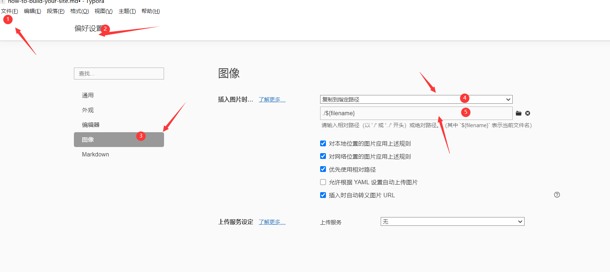

## 2.hexo本地与部署不一致

1. URL错误，检查是否能git成功

2. 部署到远程服务器没来得及更新，过一段时间再看

3. 浏览器保存了之前的数据，清除浏览器缓存后再强制刷新Shift+F5

4. branch错误
   搜索了网上很多解决方案，大多数提及的都是前面几种，最后找到了网友[*嗜睡狂魔*](https://www.zhihu.com/question/319817323/answer/649343660)的方法。

5. 远程服务器有以前静态页面的缓存。

   当时我只是改了主题的颜色然后发现怎么弄都不行，最后清空仓库重新git就好了

# 参考文章

- [文档|Hexo](https://hexo.io/zh-cn/docs/index.html)
- [廖雪峰git详细教程](https://www.liaoxuefeng.com/wiki/896043488029600)
- [hexo史上最全搭建教程](https://blog.csdn.net/sinat_37781304/article/details/82729029)