## 类和对象

### 引用

#### 引用和指向

`new Hero();`

 代表**创建**了一个Hero对象
但是也仅仅是创建了一个对象，没有办法访问它
为了访问这个对象，会使用**引用**来**代表**这个对象

`Hero h = new Hero();`
h这个变量是Hero类型，又叫做引用
=的意思指的h这个引用**代表**右侧创建的对象
“**代表**” 在面向对象里，又叫做“**指向**”

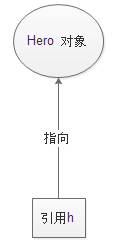


```java
public class Hero {
     
    String name; //姓名
     
    float hp; //血量
     
    float armor; //护甲
     
    int moveSpeed; //移动速度
     
    public static void main(String[] args) {
    	//创建一个对象
        new Hero();
        
        //使用一个引用来指向这个对象
        Hero h = new Hero();
        
    }   
     
}

```
#### 一个对象，多个引用

引用有多个，但是对象只有一个。
在这个例子里，所有引用都指向了同一个对象。
对象就像 "一个人"， 引用就像"身份证"
身份证证的复印件可以有多张，但是真正的"人" 只有这么一个

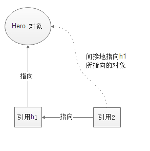

```java
public class Hero {
     
    String name; //姓名
     
    float hp; //血量
     
    float armor; //护甲
     
    int moveSpeed; //移动速度
     
    public static void main(String[] args) {
        
        //使用一个引用来指向这个对象
        Hero h1 = new Hero();
        Hero h2 = h1;  //h2指向h1所指向的对象
        Hero h3 = h1;
        Hero h4 = h1;
        Hero h5 = h4;
        
        //h1,h2,h3,h4,h5 五个引用，都指向同一个对象
        
    }   
     
}
 
```

#### 一个引用，多个对象

第8行，引用garen指向新创建的对象（对象1）
第9行，同一个引用garen指向新创建的对象（对象2）
这个时候，对象1，就没有任何引用指向了
换句话说，就没有任何手段控制和访问该对象，那么该对象就变得没有意义。

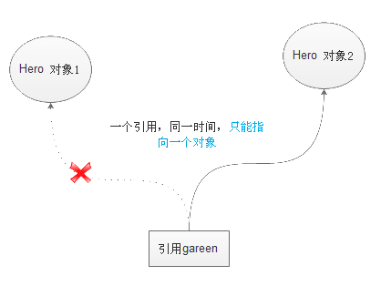

```java
package charactor;

public class Hero {
	public String name; 
	protected float hp; 

	public static void main(String[] args) {
	       Hero garen =  new Hero();
	       garen =  new Hero();
	}
}

```
#### 练习

如代码，问题:
h4所指向的对象和h2所指向的对象，是否是同一个对象？

```java
package charactor;
 
public class Hero {
    public String name; 
    protected float hp; 
 
    public static void main(String[] args) {
           Hero h1 =  new Hero();
           Hero h2 =  new Hero();
           Hero h3;
           Hero h4;
           h3 = h1;
           h4 = h3;
    }
}

```
#### 答案

不是同一个对象,h1,h3,h4为同一个对象，h2为另一个对象

```java
public class Hero {
    public String name;
    protected float hp;
  
    public static void main(String[] args) {
           Hero h1 =  new Hero();
           Hero h2 =  new Hero();
           Hero h3;
           Hero h4;
           h3 = h1;
           h4 = h3;
           System.out.println("h4的地址为：" + h4);
           System.out.println("h3的地址为：" + h3);
           System.out.println("h2的地址为：" + h2);
           System.out.println("h1的地址为：" + h1);
    }
}
```
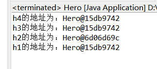

### 继承

#### 不继承

物品类有名称，价格属性

```java
public class Item {
    String name;
    int price;
}
```

武器类： Weapon**不继承Item**的写法
独立设计 name和price属性
同时多了一个属性 damage 攻击力

```java
public class Weapon{
    String name;
    int price;
    int damage; //攻击力

}
```

#### 继承

这一次Weapon**继承Item**
虽然Weapon自己没有设计name和price,但是通过继承Item类，也具备了name和price属性

```java
public class Weapon extends Item{
    int damage; //攻击力
     
    public static void main(String[] args) {
        Weapon infinityEdge = new Weapon();
        infinityEdge.damage = 65; //damage属性在类Weapon中新设计的
         
        infinityEdge.name = "无尽之刃";//name属性，是从Item中继承来的，就不需要重复设计了
        infinityEdge.price = 3600;
         
    }
     
}
```

#### 练习

设计一个类Armor护甲
继承Item类，并且额外提供一个属性ac: 护甲等级 int类型

实例化出两件护甲
名称 价格 护甲等级
布甲 300 15
锁子甲 500 40

#### 答案

```java
public class Item {
      String name;
      int prize;
}
public class Armor extends Item {
            int level;
}
public class Test {
 
    public static void main(String[] args) {
        Armor armor1 = new Armor();
        Armor armor2 = new Armor();
        armor1.name = "布甲";
        armor2.name = "锁子甲";
        armor1.prize = 300;
        armor2.prize = 500;
        armor1.level=15;
        armor2.level=40;
        System.out.print(armor1.name+"的价格为："+armor1.prize+",等级为："+armor1.level+"\n");
        System.out.print(armor2.name+"的价格为："+armor2.prize+",等级为："+armor2.level+"\n");
    }
 
}
```

### 方法重载

#### attack方法的重载

方法重载即方法的方法名相同，但参数类型不一样

比如物理攻击英雄叫做ADHero

为ADHero 提供三种方法

```java
public void attack()

public void attack(Hero h1)

public void attack(Hero h1, Hero h2)
```

方法名是一样的，但是参数类型不一样
在调用方法attack的时候，会根据传递的参数类型以及数量，自动调用对应的方法

```java
public class ADHero extends Hero {
    public void attack() {
        System.out.println(name + " 进行了一次攻击 ，但是不确定打中谁了");
    }
 
    public void attack(Hero h1) {
        System.out.println(name + "对" + h1.name + "进行了一次攻击 ");
    }
 
    public void attack(Hero h1, Hero h2) {
        System.out.println(name + "同时对" + h1.name + "和" + h2.name + "进行了攻击 ");
    }
 
    public static void main(String[] args) {
        ADHero bh = new ADHero();
        bh.name = "赏金猎人";
 
        Hero h1 = new Hero();
        h1.name = "盖伦";
        Hero h2 = new Hero();
        h2.name = "提莫";
 
        bh.attack(h1);
        bh.attack(h1, h2);
    }
 
}
```


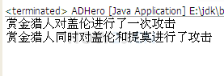

#### 可变数量的参数

如果要攻击更多的英雄，就需要设计更多的方法，这样类会显得很累赘，像这样：

```java
public void attack(Hero h1)

public void attack(Hero h1, Hero h2)

public void attack(Hero h1, Hero h2, Hero h3)
```

这时，可以采用可变数量的参数
**只需要设计一个方法**
`public void attack(Hero **...**heros)`
即可代表上述所有的方法了
在方法里，使用操作数组的方式处理参数heros即可

```java
public class ADHero extends Hero {
 
    public void attack() {
        System.out.println(name + " 进行了一次攻击 ，但是不确定打中谁了");
    }
 
    // 可变数量的参数
    public void attack(Hero... heros) {
        for (int i = 0; i < heros.length; i++) {
            System.out.println(name + " 攻击了 " + heros[i].name);
 
        }
    }
 
    public static void main(String[] args) {
        ADHero bh = new ADHero();
        bh.name = "赏金猎人";
 
        Hero h1 = new Hero();
        h1.name = "盖伦";
        Hero h2 = new Hero();
        h2.name = "提莫";
 
        bh.attack(h1);
        bh.attack(h1, h2);
 
    }
 
}
```

#### 练习

设计一个类Support (辅助英雄)继承Hero，提供一个heal(治疗)方法
对Support的heal方法进行重载
heal()
heal(Hero h) //为指定的英雄加血
heal(Hero h, int hp) //为指定的英雄加了hp的血
heal(int hp,Hero...Heros)//为n个指定英雄加了hp的血

#### 答案

```java
package Hero;

class Hero {
    String name;    
}

public class Support extends Hero {
	public void heal(){
		System.out.println(name+"对某位英雄进行了治疗");
	}
	public void heal(Hero h){
		System.out.println(name+"对" +h.name+"进行了治疗");
	}
	public void heal(Hero h,int hp){
		System.out.println(name+"给" +h.name+"加了"+hp+"hp");
	}
	public void heal(int hp,Hero...Heros){
		for(int i=0;i<Heros.length;i++) {
			System.out.println(name+"给" +Heros[i].name+"加了"+hp+"hp");
		}

	}

	public static void main(String[] args) {
		Support qn=new Support();
		qn.name="琴女";
		Hero ys=new Hero();
		ys.name="亚索";
		Hero tm=new Hero();
		tm.name="提莫";
		qn.heal();
		qn.heal(ys);
		qn.heal(tm, 1000);
		qn.heal(500, tm,ys);

	}

}

```

### 构造方法

#### 构造方法

方法名和类名一样（包括大小写）
**没有返回类型**
实例化一个对象的时候，必然调用构造方法

```java
public class Hero {
 
    String name;
 
    float hp;
 
    float armor;
 
    int moveSpeed;
 
    // 方法名和类名一样（包括大小写）
    // 没有返回类型
    public Hero() {
        System.out.println("实例化一个对象的时候，必然调用构造方法");
    }
     
    public static void main(String[] args) {
        //实例化一个对象的时候，必然调用构造方法
        Hero h = new Hero();
    }
 
}
```

#### 隐藏的构造方法

Hero类的构造方法是

`public Heo(){`  

`}`
这个无参的构造方法，如果不写，就会默认提供一个

```java
public class Hero {
     
    String name; //姓名
     
    float hp; //血量
     
    float armor; //护甲
     
    int moveSpeed; //移动速度
     
    //这个无参的构造方法，如果不写，
    //就会默认提供一个无参的构造方法
    //  public Hero(){ 
    //      System.out.println("调用Hero的构造方法");
    //  }
 
    public static void main(String[] args) {
        Hero garen =  new Hero();
        garen.name = "盖伦";
        garen.hp = 616.28f;
        garen.armor = 27.536f;
        garen.moveSpeed = 350;
         
        Hero teemo =  new Hero();
        teemo.name = "提莫";
        teemo.hp = 383f;
        teemo.armor = 14f;
        teemo.moveSpeed = 330;
    }  
     
}
```

#### 有参的构造方法

一旦提供了一个有参的构造方法
同时又**没有显式**的提供一个无参的构造方法
那么默认的无参的构造方法，就“木有了“

```java
public class Hero {
      
    String name; //姓名
      
    float hp; //血量
      
    float armor; //护甲
      
    int moveSpeed; //移动速度
      
    //有参的构造方法
    //默认的无参的构造方法就失效了
    public Hero(String heroname){ 
        name = heroname;
    }
      
    public static void main(String[] args) {
        Hero garen =  new Hero("盖伦"); 
          
        Hero teemo =  new Hero(); //无参的构造方法“木有了”
    }  
      
}
```

#### 构造方法的重载

构造方法也是可以重载的

```java
public class Hero {
       
    String name; //姓名
       
    float hp; //血量
       
    float armor; //护甲
       
    int moveSpeed; //移动速度
       
    //带一个参数的构造方法
    public Hero(String heroname){ 
        name = heroname;
    }
     
    //带两个参数的构造方法
    public Hero(String heroname,float herohp){ 
        name = heroname;
        hp = herohp;
    }
       
    public static void main(String[] args) {
        Hero garen =  new Hero("盖伦"); 
        Hero teemo =  new Hero("提莫",383);
    }
     
}
```

#### 练习

为Hero设计4个参数的构造方法
这四个参数分别是
String heroName
float heroHP
float heroArmor
int heroMoveSpeed

#### 答案

```java
public class Hero{
    public Hero(String heroName,float heroHP,float heroArmor,int heroMoveSpeed) {
        System.out.println("英雄:"+heroName +" 血线"+heroHP+" 护甲"+ heroArmor+" 移动步长:"+heroMoveSpeed);
    }
     
    public static void main(String[] args) {
        Hero h22 = new Hero("盖伦", 5000, 200, 3);
    }
}
```

### this

#### this即代表当前对象

this这个关键字，相当于普通话里的“**我**”

小明说 “我吃了” 这个时候，“**我**” 代表小明
小红说 “我吃了” 这个时候，“**我**” 代表小红
"**我**"代表当前人物

**this**这个关键字，相当于普通话里的“**我**”
**this即代表当前对象**

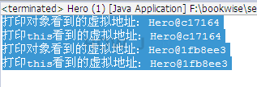

```java
public class Hero {
     
    String name; //姓名
     
    float hp; //血量
     
    float armor; //护甲
     
    int moveSpeed; //移动速度
 
    //打印内存中的虚拟地址
    public void showAddressInMemory(){
        System.out.println("打印this看到的虚拟地址："+this);
    }
     
    public static void main(String[] args) {
        Hero garen =  new Hero();
        garen.name = "盖伦";
        //直接打印对象，会显示该对象在内存中的虚拟地址
        //格式：Hero@c17164 c17164即虚拟地址，每次执行，得到的地址不一定一样
 
        System.out.println("打印对象看到的虚拟地址："+garen);
        //调用showAddressInMemory，打印该对象的this，显示相同的虚拟地址
        garen.showAddressInMemory();
         
        Hero teemo =  new Hero();
        teemo.name = "提莫";
        System.out.println("打印对象看到的虚拟地址："+teemo);
        teemo.showAddressInMemory();
    }  
     
}
```

#### 通过this访问对象的属性

```java
public class Hero {
     
    String name; //姓名
     
    float hp; //血量
     
    float armor; //护甲
     
    int moveSpeed; //移动速度
 
    //参数名和属性名一样
    //在方法体中，只能访问到参数name
    public void setName1(String name){
        name = name;
    }
     
    //为了避免setName1中的问题，参数名不得不使用其他变量名
    public void setName2(String heroName){
        name = heroName;
    }
     
    //通过this访问属性
    public void setName3(String name){
        //name代表的是参数name
        //this.name代表的是属性name
        this.name = name;
    }
     
    public static void main(String[] args) {
        Hero  h =new Hero();
         
        h.setName1("teemo");
        System.out.println(h.name);
         
        h.setName2("garen");
        System.out.println(h.name);    
         
        h.setName3("死歌");
        System.out.println(h.name);    
    }
     
}
```

#### 通过this调用其他的构造方法

如果要在一个构造方法中，调用另一个构造方法，可以使用this()

```java
public class Hero {
        
    String name; //姓名
        
    float hp; //血量
        
    float armor; //护甲
        
    int moveSpeed; //移动速度
        
    //带一个参数的构造方法
    public Hero(String name){
        System.out.println("一个参数的构造方法");
        this.name = name;
    }
      
    //带两个参数的构造方法
    public Hero(String name,float hp){
        this(name);
        System.out.println("两个参数的构造方法");
        this.hp = hp;
    }
 
    public static void main(String[] args) {
        Hero teemo =  new Hero("提莫",383);
         
        System.out.println(teemo.name);
         
    }
      
}
```

#### 练习

参考[练习-构造方法](https://how2j.cn/k/class-object/class-object-constructor/292.html#step2209) 设计一个构造方法,但是参数名称不太一样，分别是
String name
float hp
float armor
int moveSpeed

不仅如此，在这个构造方法中，调用这个构造方法

 `public Hero(String name,float hp)`

#### 答案

```java
package Hero;

public class Hero {
    
    String name; //姓名
        
    float hp; //血量
        
    float armor; //护甲
        
    int moveSpeed; //移动速度
        
    //带一个参数的构造方法
    
    public Hero(String name){
        System.out.println("一个参数的构造方法");
        this.name = name;
    }
      
    //带两个参数的构造方法
    public Hero(String name,float hp){
    	
        System.out.println("两个参数的构造方法");
        this.hp = hp;
        this.name=name;
    }
    
  //带三个参数的构造方法
    public Hero(String name,float hp,float armor){
        System.out.println("三个参数的构造方法");
        this.hp = hp;
        this.name=name;
        this.armor=armor;
    }
    
  //带四个参数的构造方法
    public Hero(String name,float hp,float armor,int moveSpeed){
    	this(name,hp);
        System.out.println("四个参数的构造方法");
//        this.hp = hp;
//        this.name=name;
        this.armor=armor;
        this.moveSpeed=moveSpeed;
    }
 
    public static void main(String[] args) {
        Hero teemo =  new Hero("提莫",383,34,330);
         
        System.out.println(teemo.name);
         
    }
      
}
```

### 传参

变量有两种类型 基本类型 和类类型

参数也是变量，所以传参分为
**基本类型传参**
**类类型传参**

#### 类类型传参

基本类型传参
在方法内，无法修改方法外的基本类型参数

```java
public class Hero {
        
    String name; //姓名
        
    float hp; //血量
        
    float armor; //护甲
        
    int moveSpeed; //移动速度
     
    public Hero(){
         
    }
     
    //回血
    public void huixue(int xp){
        hp = hp + xp;
        //回血完毕后，血瓶=0
        xp=0;
    }
      
    public Hero(String name,float hp){
        this.name = name;
        this.hp = hp;
    }
 
    public static void main(String[] args) {
        Hero teemo =  new Hero("提莫",383);
        //血瓶，其值是100
        int xueping = 100;
         
        //提莫通过这个血瓶回血
         
        teemo.huixue(xueping);
         
        System.out.println(xueping);
         
    }
      
}
```

#### 引用与=

如果一个变量是基本类型
比如 int hp = 50;
我们就直接管hp叫变量
**=表示赋值的意思**。
如果一个变量是类类型
比如 Hero h = new Hero();
我们就管h叫做**引用**。
**=不再是赋值的意思**
**=表示指向的意思**
比如 Hero h = new Hero();
这句话的意思是
引用h，指向一个Hero对象

#### 类类型传参

**类类型又叫引用**
第24行的引用 **teemo**与 第17行的引用**hero**，**是不同的引用**
通过调用garen.attack(teemo, 100); 使得这**两个引用都指向了同一个对象**
所以在第18行hero.hp = hero.hp - damage; 就使得该对象的hp值，发生了变化
因此第25行，打印该对象的Hp值就是变化后的值

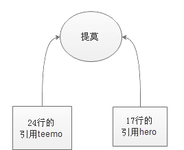


```java
public class Hero {
 
    String name; // 姓名
 
    float hp; // 血量
 
    float armor; // 护甲
 
    int moveSpeed; // 移动速度
 
    public Hero(String name, float hp) {
        this.name = name;
        this.hp = hp;
    }
 
    // 攻击一个英雄，并让他掉damage点血
    public void attack(Hero hero, int damage) {
        hero.hp = hero.hp - damage;
    }
 
    public static void main(String[] args) {
        Hero teemo = new Hero("提莫", 383);
        Hero garen = new Hero("盖伦", 616);
        garen.attack(teemo, 100);
        System.out.println(teemo.hp);
    }
 
}
```

#### 练习

在方法中，使参数引用指向一个新的对象

外面的引用是指向原来的对象？还是新的对象？

```java
public class Hero {
        
    String name; //姓名
        
    float hp; //血量
        
    float armor; //护甲
        
    int moveSpeed; //移动速度
     
    public Hero(){
         
    }
     
    public Hero(String name,float hp){
        this.name = name;
        this.hp = hp;
    }
 
    //复活
    public void revive(Hero h){
        h = new Hero("提莫",383);
    }
 
    public static void main(String[] args) {
        Hero teemo =  new Hero("提莫",383);
         
        //受到400伤害，挂了
        teemo.hp = teemo.hp - 400;
         
        teemo.revive(teemo);
         
        //问题： System.out.println(teemo.hp); 输出多少？ 怎么理解？
         
    }
      
}
```

#### 答案

### 包

包: **package**

把比较接近的类，规划在同一个包下

#### 把比较接近的类，规划在同一个包下

Hero,ADHero 规划在一个包，叫做charactor（角色）
Item,Weapon规划在另一个包下，叫做 property(道具)
在最开始的地方声明该类所处于的包名

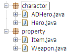

```java
package charactor; //在最开始的地方声明该类所处于的包名
public class Hero {
        
    String name; //姓名
        
    float hp; //血量
        
    float armor; //护甲
        
    int moveSpeed; //移动速度
     
}
```

#### 使用其他包下的类，必须import

使用同一个包下的其他类，直接使用即可
但是要使用其他包下的类，必须import

```java
package charactor;
 
//Weapon类在其他包里，使用必须进行import
import property.Weapon;
 
public class Hero {
        
    String name; //姓名
        
    float hp; //血量
        
    float armor; //护甲
        
    int moveSpeed; //移动速度
     
    //装备一把武器
    public void equip(Weapon w){
         
    }
        
}
```

#### 练习-包 

创建一个新的包charactor1,并且让[练习-治疗类](https://how2j.cn/k/class-object/class-object-overload/291.html#step2206)：Support 声明在这个包下

#### 答案

```java
package charactor1;

import charactor.Hero;
public class Support extends Hero{
    public Support(){}
    public  void heal(Support a){
        System.out.println(a.name+"对自己进行治疗");
    }
    public void heal(Support a,Hero b){
        System.out.println(a.name+"给英雄"+b.name+"加血");
    }
    public void heal(Support a,Hero b,float hp){
        System.out.println(a.name+"给英雄"+b.name+"加了"+hp+"点血");
    }
    public static void main(String[] args){
        Support a = new Support();
        a.name = "琴女";
        Hero b  = new Hero();
        b.name = "盖伦";
        a.heal(a, b,300);
    }
}
```

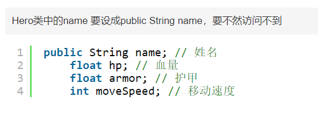

### 访问修饰符

成员变量有四种修饰符
**private** 私有的
**package**/friendly/default 不写
**protected** 受保护的
**public** 公共的

比如public 表示公共的

`public String name;`


而maxHP 没有修饰符即代表package/friendly/default

`float maxHP`

#### 类和类之间的关系

类和类之间的关系有如下几种:
以Hero为例
**自身：**指的是Hero自己
**同包子类：**ADHero这个类是Hero的子类，并且和Hero处于**同一个包下**
**不同包子类：**Support这个类是Hero的子类，但是在**另一个包下**
**同包类：** GiantDragon 这个类和Hero是**同一个包**，但是彼此**没有继承关系**
**其他类：**Item这个类，**在不同包**，也没有继承关系的类

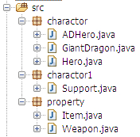

#### private 私有的

使用private修饰属性
自身：是可以访问的
同包子类：不能继承
不同包子类：不能继承
同包类：不能访问
其他包类：不能访问

**注：** 红色字体，表示不可行


```java
package charactor;
 
import property.Weapon;
 
public class Hero {
 
    //属性id是private的，只有Hero自己可以访问
    //子类不能继承
    //其他类也不能访问
    private int id;
     
    String name;
 
    float hp;
 
    float armor;
 
    int moveSpeed;
 
    public void equip(Weapon w) {
 
    }
 
}
```

#### package/friendly/default 不写

没有修饰符即代表package/friendly/default
float maxHP; 血量上限

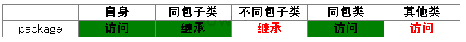

```java
package charactor;
 
import property.Weapon;
 
public class Hero {
    private int id;
 
    String name;
 
    // 无修饰符的属性 hp
    // 自己可以访问
 
    // 同包子类可以继承
    // 不同包子类不能继承
 
    // 同包类可以访问
    // 不同包类不能访问
    float hp;
 
    float armor;
 
    int moveSpeed;
 
    public void equip(Weapon w) {
 
    }
 
}String name;
 
// 无修饰符的属性 hp
// 自己可以访问
 
// 同包子类可以继承
// 不同包子类不能继承
 
// 同包类可以访问
// 不同包类不能访问
float hp;
 
float armor;
 
int moveSpeed;
 
public void equip(Weapon w) {
 
}
```

#### protected 受保护的

受保护的修饰符
protected float hp; 血量

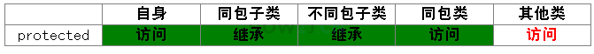

```java
package charactor;
 
import property.Weapon;
 
public class Hero {
    private int id;
 
    String name;
 
    // protected饰符的属性 hp
    // 自己可以访问
 
    // 同包子类可以继承
    // 不同包子类可以继承
 
    // 同包类可以访问
    // 不同包类不能访问
    protected float hp;
 
    float armor;
 
    int moveSpeed;
 
    public void equip(Weapon w) {
 
    }
 
}
```

#### public 公共的

公共的修饰符
public String name; 姓名
任何地方，都可以访问


```java
// public的属性 name
// 自己可以访问
 
// 同包子类可以继承
// 不同包子类可以继承
 
// 同包类可以访问
// 不同包类可以访问
public String name;
 
protected float hp;
 
float armor;
 
int moveSpeed;
 
public void equip(Weapon w) {
 
}
```

#### 总结

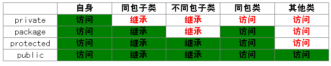

#### 使用总结

那么什么情况该用什么修饰符呢？
从作用域来看，public能够使用所有的情况。 但是大家在工作的时候，又不会真正全部都使用public,那么到底什么情况该用什么修饰符呢？

1. 属性通常使用private封装起来
2. 方法一般使用public用于被调用
3. 会被子类继承的方法，通常使用protected
4. package用的不多，一般新手会用package,因为还不知道有修饰符这个东西

再就是**作用范围最小原则**
简单说，能用private就用private，不行就放大一级，用package,再不行就用protected，最后用public。 这样就能把数据尽量的封装起来，没有必要**露出来的**，就不用**露出来**了

