文件上传靶机ak,好耶

<!-- more -->

# upload-labs

upload-labs源码地址：https://github.com/c0ny1/upload-labs

**补充：火狐抓本地包要把这里改成true**


## Pass-1-js检查

提示说是前端JS检查，有很多种方法

我列举几种

**方法一：**

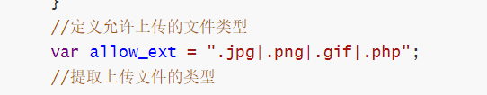

直接改前端源码，加上.php即可上传

**方法二：**

把php文件后缀改成jpg,png,gif中的一种，再burp抓包修改后缀

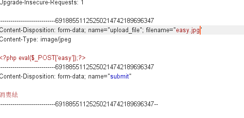

jpg改成php再放包即可

PHP一句话木马文件上传后就蚁剑直连即可

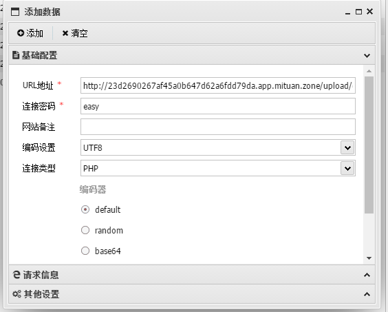

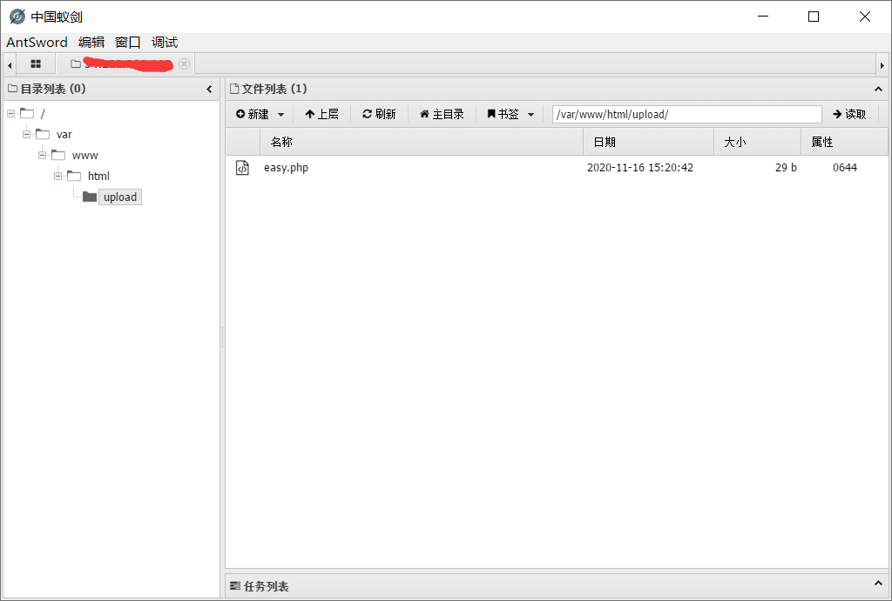

## Pass-2-MIME-Type

查看提示，本pass在服务端对数据包的MIME进行检查！

MIME-Type介绍：

MIME(Multipurpose Internet Mail  Extensions)多用途互联网邮件扩展类型。是设定某种扩展名的文件用一种应用程序来打开的方式类型，当该扩展名文件被访问的时候，浏览器会自动使用指定应用程序来打开。多用于指定一些客户端自定义的文件名，以及一些媒体文件打开方式。

仅仅判断content-type类型，因此上传easy.php抓包修改content-type为图片类型：image/jpeg、image/png、image/gif

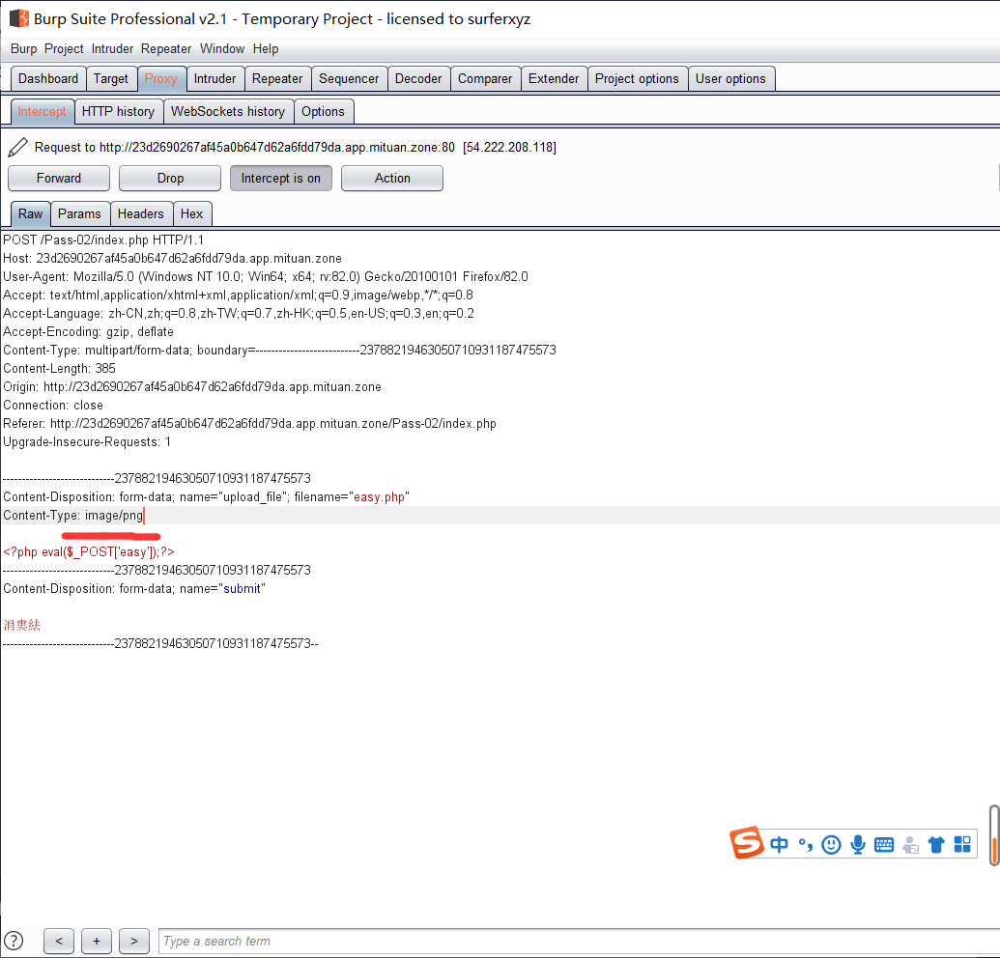

即可上传成功

## Pass-3-黑名单绕过

上传php的时候有个很明显的黑名单限制提示，尝试使用**php3,phtml**等绕过

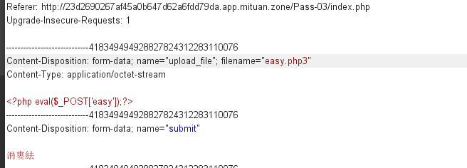

成功上传

## Pass-4-.htaccess绕过

不能上传php，但能上传php.jpg,php.asd，说明是黑名单限制，但是**php3,phtml**都被限制了

查看源码

```php
$is_upload = false;
$msg = null;
if (isset($_POST['submit'])) {
    if (file_exists(UPLOAD_PATH)) {
        $deny_ext = array(".php",".php5",".php4",".php3",".php2","php1",".html",".htm",".phtml",".pht",".pHp",".pHp5",".pHp4",".pHp3",".pHp2","pHp1",".Html",".Htm",".pHtml",".jsp",".jspa",".jspx",".jsw",".jsv",".jspf",".jtml",".jSp",".jSpx",".jSpa",".jSw",".jSv",".jSpf",".jHtml",".asp",".aspx",".asa",".asax",".ascx",".ashx",".asmx",".cer",".aSp",".aSpx",".aSa",".aSax",".aScx",".aShx",".aSmx",".cEr",".sWf",".swf");
        $file_name = trim($_FILES['upload_file']['name']);
        $file_name = deldot($file_name);//删除文件名末尾的点
        $file_ext = strrchr($file_name, '.');
        $file_ext = strtolower($file_ext); //转换为小写
        $file_ext = str_ireplace('::$DATA', '', $file_ext);//去除字符串::$DATA
        $file_ext = trim($file_ext); //收尾去空

        if (!in_array($file_ext, $deny_ext)) {
            $temp_file = $_FILES['upload_file']['tmp_name'];
            $img_path = UPLOAD_PATH.'/'.date("YmdHis").rand(1000,9999).$file_ext;
            if (move_uploaded_file($temp_file, $img_path)) {
                $is_upload = true;
            } else {
                $msg = '上传出错！';
            }
        } else {
            $msg = '此文件不允许上传!';
        }
    } else {
        $msg = UPLOAD_PATH . '文件夹不存在,请手工创建！';
    }
}
```

几乎所有可以绕过的后缀名都被限制了，但是唯独没有**.htaccess**，可以先上传一个.htaccess让所有文件解析为php，然后再上传一个图片马

htaccess文件是Apache服务器中的一个配置文件，它负责相关目录下的网页配置。通过htaccess文件，可以帮我们实现：网页301重定向、自定义404错误页面、改变文件扩展名、允许/阻止特定的用户或者目录的访问、禁止目录列表、配置默认文档等功能。

**.htaccess文件创建**

由于直接创建txt文档会显示必须键入文件名，所以可以采用cmd命令方式生成

```cmd
echo SetHandler application/x-httpd-php  > .htaccess
```


上传.htaccess文件再上传一个图片马即可，也可以上传写有木马的txt文件，txt文件也可被解析。

## Pass-5-大小写绕过

不能上传php，**.htaccess**但能上传php.jpg,php.asd，说明是黑名单限制

查看源码

```php
$is_upload = false;
$msg = null;
if (isset($_POST['submit'])) {
    if (file_exists(UPLOAD_PATH)) {
        $deny_ext = array(".php",".php5",".php4",".php3",".php2",".html",".htm",".phtml",".pht",".pHp",".pHp5",".pHp4",".pHp3",".pHp2",".Html",".Htm",".pHtml",".jsp",".jspa",".jspx",".jsw",".jsv",".jspf",".jtml",".jSp",".jSpx",".jSpa",".jSw",".jSv",".jSpf",".jHtml",".asp",".aspx",".asa",".asax",".ascx",".ashx",".asmx",".cer",".aSp",".aSpx",".aSa",".aSax",".aScx",".aShx",".aSmx",".cEr",".sWf",".swf",".htaccess");
        $file_name = trim($_FILES['upload_file']['name']);
        $file_name = deldot($file_name);//删除文件名末尾的点
        $file_ext = strrchr($file_name, '.');
        $file_ext = str_ireplace('::$DATA', '', $file_ext);//去除字符串::$DATA
        $file_ext = trim($file_ext); //首尾去空

        if (!in_array($file_ext, $deny_ext)) {
            $temp_file = $_FILES['upload_file']['tmp_name'];
            $img_path = UPLOAD_PATH.'/'.date("YmdHis").rand(1000,9999).$file_ext;
            if (move_uploaded_file($temp_file, $img_path)) {
                $is_upload = true;
            } else {
                $msg = '上传出错！';
            }
        } else {
            $msg = '此文件类型不允许上传！';
        }
    } else {
        $msg = UPLOAD_PATH . '文件夹不存在,请手工创建！';
    }
}
```

发现与上一关少了统一大小写

即没有`$file_ext = strtolower($file_ext); //转换为小写`这一行代码，所以用大小写绕过，上传**phP**之类的文件绕过即可

## Pass-6-空格绕过

查看源代码

```php
$is_upload = false;
$msg = null;
if (isset($_POST['submit'])) {
    if (file_exists(UPLOAD_PATH)) {
        $deny_ext = array(".php",".php5",".php4",".php3",".php2",".html",".htm",".phtml",".pht",".pHp",".pHp5",".pHp4",".pHp3",".pHp2",".Html",".Htm",".pHtml",".jsp",".jspa",".jspx",".jsw",".jsv",".jspf",".jtml",".jSp",".jSpx",".jSpa",".jSw",".jSv",".jSpf",".jHtml",".asp",".aspx",".asa",".asax",".ascx",".ashx",".asmx",".cer",".aSp",".aSpx",".aSa",".aSax",".aScx",".aShx",".aSmx",".cEr",".sWf",".swf",".htaccess");
        $file_name = $_FILES['upload_file']['name'];
        $file_name = deldot($file_name);//删除文件名末尾的点
        $file_ext = strrchr($file_name, '.');
        $file_ext = strtolower($file_ext); //转换为小写
        $file_ext = str_ireplace('::$DATA', '', $file_ext);//去除字符串::$DATA
        
        if (!in_array($file_ext, $deny_ext)) {
            $temp_file = $_FILES['upload_file']['tmp_name'];
            $img_path = UPLOAD_PATH.'/'.date("YmdHis").rand(1000,9999).$file_ext;
            if (move_uploaded_file($temp_file,$img_path)) {
                $is_upload = true;
            } else {
                $msg = '上传出错！';
            }
        } else {
            $msg = '此文件不允许上传';
        }
    } else {
        $msg = UPLOAD_PATH . '文件夹不存在,请手工创建！';
    }
}
```
发现其没有对首尾去除空格，于是我们可以用bp截断，然后再文件明后面添加空格进行绕过
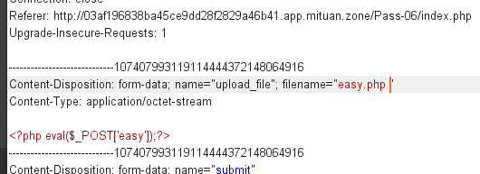

## Pass-7-点绕过

查看源码

```php
$is_upload = false;
$msg = null;
if (isset($_POST['submit'])) {
    if (file_exists(UPLOAD_PATH)) {
        $deny_ext = array(".php",".php5",".php4",".php3",".php2",".html",".htm",".phtml",".pht",".pHp",".pHp5",".pHp4",".pHp3",".pHp2",".Html",".Htm",".pHtml",".jsp",".jspa",".jspx",".jsw",".jsv",".jspf",".jtml",".jSp",".jSpx",".jSpa",".jSw",".jSv",".jSpf",".jHtml",".asp",".aspx",".asa",".asax",".ascx",".ashx",".asmx",".cer",".aSp",".aSpx",".aSa",".aSax",".aScx",".aShx",".aSmx",".cEr",".sWf",".swf",".htaccess");
        $file_name = trim($_FILES['upload_file']['name']);
        $file_ext = strrchr($file_name, '.');
        $file_ext = strtolower($file_ext); //转换为小写
        $file_ext = str_ireplace('::$DATA', '', $file_ext);//去除字符串::$DATA
        $file_ext = trim($file_ext); //首尾去空
        
        if (!in_array($file_ext, $deny_ext)) {
            $temp_file = $_FILES['upload_file']['tmp_name'];
            $img_path = UPLOAD_PATH.'/'.$file_name;
            if (move_uploaded_file($temp_file, $img_path)) {
                $is_upload = true;
            } else {
                $msg = '上传出错！';
            }
        } else {
            $msg = '此文件类型不允许上传！';
        }
    } else {
        $msg = UPLOAD_PATH . '文件夹不存在,请手工创建！';
    }
}
```

还是黑名单没有对后缀名进行去.操作利用Windows特性会自动去掉后缀名中最后的.可在后缀名中加"."绕过。即可构造**.php.**来绕过上传

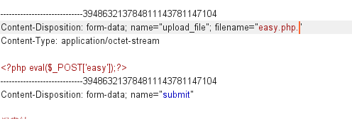


## Pass-8-::$DATA绕过

查看源代码

```php
$is_upload = false;
$msg = null;
if (isset($_POST['submit'])) {
    if (file_exists(UPLOAD_PATH)) {
        $deny_ext = array(".php",".php5",".php4",".php3",".php2",".html",".htm",".phtml",".pht",".pHp",".pHp5",".pHp4",".pHp3",".pHp2",".Html",".Htm",".pHtml",".jsp",".jspa",".jspx",".jsw",".jsv",".jspf",".jtml",".jSp",".jSpx",".jSpa",".jSw",".jSv",".jSpf",".jHtml",".asp",".aspx",".asa",".asax",".ascx",".ashx",".asmx",".cer",".aSp",".aSpx",".aSa",".aSax",".aScx",".aShx",".aSmx",".cEr",".sWf",".swf",".htaccess");
        $file_name = trim($_FILES['upload_file']['name']);
        $file_name = deldot($file_name);//删除文件名末尾的点
        $file_ext = strrchr($file_name, '.');
        $file_ext = strtolower($file_ext); //转换为小写
        $file_ext = trim($file_ext); //首尾去空
        
        if (!in_array($file_ext, $deny_ext)) {
            $temp_file = $_FILES['upload_file']['tmp_name'];
            $img_path = UPLOAD_PATH.'/'.date("YmdHis").rand(1000,9999).$file_ext;
            if (move_uploaded_file($temp_file, $img_path)) {
                $is_upload = true;
            } else {
                $msg = '上传出错！';
            }
        } else {
            $msg = '此文件类型不允许上传！';
        }
    } else {
        $msg = UPLOAD_PATH . '文件夹不存在,请手工创建！';
    }
}
```

黑名单限制，没有去除文件名后缀的`::$DATA`, 同样可以利用 windows 特性, 在后缀添加`::$DATA`即可绕过

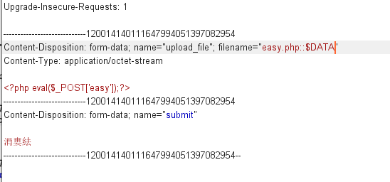


## Pass-9-点+空格+点绕过

查看源码

```php
$is_upload = false;
$msg = null;
if (isset($_POST['submit'])) {
    if (file_exists(UPLOAD_PATH)) {
        $deny_ext = array(".php",".php5",".php4",".php3",".php2",".html",".htm",".phtml",".pht",".pHp",".pHp5",".pHp4",".pHp3",".pHp2",".Html",".Htm",".pHtml",".jsp",".jspa",".jspx",".jsw",".jsv",".jspf",".jtml",".jSp",".jSpx",".jSpa",".jSw",".jSv",".jSpf",".jHtml",".asp",".aspx",".asa",".asax",".ascx",".ashx",".asmx",".cer",".aSp",".aSpx",".aSa",".aSax",".aScx",".aShx",".aSmx",".cEr",".sWf",".swf",".htaccess");
        $file_name = trim($_FILES['upload_file']['name']);
        $file_name = deldot($file_name);//删除文件名末尾的点
        $file_ext = strrchr($file_name, '.');
        $file_ext = strtolower($file_ext); //转换为小写
        $file_ext = str_ireplace('::$DATA', '', $file_ext);//去除字符串::$DATA
        $file_ext = trim($file_ext); //首尾去空
        
        if (!in_array($file_ext, $deny_ext)) {
            $temp_file = $_FILES['upload_file']['tmp_name'];
            $img_path = UPLOAD_PATH.'/'.$file_name;
            if (move_uploaded_file($temp_file, $img_path)) {
                $is_upload = true;
            } else {
                $msg = '上传出错！';
            }
        } else {
            $msg = '此文件类型不允许上传！';
        }
    } else {
        $msg = UPLOAD_PATH . '文件夹不存在,请手工创建！';
    }
}
```

黑名单限制，咋一看好像可以绕过的都被限制了，但是仔细看最后拼接的文件名是处理后的文件名，所以可以上传"1.php. ."，经过处理后的文件名就变成"1.php."，最后由于windows特性会将**“.”**自动去除来绕过

## Pass-10-双写绕过

看源代码

```php
$is_upload = false;
$msg = null;
if (isset($_POST['submit'])) {
    if (file_exists(UPLOAD_PATH)) {
        $deny_ext = array("php","php5","php4","php3","php2","html","htm","phtml","pht","jsp","jspa","jspx","jsw","jsv","jspf","jtml","asp","aspx","asa","asax","ascx","ashx","asmx","cer","swf","htaccess");

        $file_name = trim($_FILES['upload_file']['name']);
        $file_name = str_ireplace($deny_ext,"", $file_name);
        $temp_file = $_FILES['upload_file']['tmp_name'];
        $img_path = UPLOAD_PATH.'/'.$file_name;        
        if (move_uploaded_file($temp_file, $img_path)) {
            $is_upload = true;
        } else {
            $msg = '上传出错！';
        }
    } else {
        $msg = UPLOAD_PATH . '文件夹不存在,请手工创建！';
    }
}
```

`$file_name = str_ireplace($deny_ext,"", $file_name);`只对文件后缀名进行一次过滤，双写文件名绕过。

所以用双写绕过，构造**.pphphp**去除php后就变成**.php**

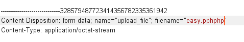

## Pass-11-00截断

看源代码

```php
$is_upload = false;
$msg = null;
if(isset($_POST['submit'])){
    $ext_arr = array('jpg','png','gif');
    $file_ext = substr($_FILES['upload_file']['name'],strrpos($_FILES['upload_file']['name'],".")+1);
    if(in_array($file_ext,$ext_arr)){
        $temp_file = $_FILES['upload_file']['tmp_name'];
        $img_path = $_GET['save_path']."/".rand(10, 99).date("YmdHis").".".$file_ext;

        if(move_uploaded_file($temp_file,$img_path)){
            $is_upload = true;
        } else {
            $msg = '上传出错！';
        }
    } else{
        $msg = "只允许上传.jpg|.png|.gif类型文件！";
    }
}
```
`$img_path = $_GET['save_path']."/".rand(10, 99).date("YmdHis").".".$file_ext;`     

白名单判断，但$img_path是直接拼接，因此可以利用%00截断绕过。

```php
//%00截断适用条件
PHP 版本 < 5.3.4
php.ini 中 magic_quotes_gpc=off
```

## Pass-12-00截断

看源代码

```php
$is_upload = false;
$msg = null;
if(isset($_POST['submit'])){
    $ext_arr = array('jpg','png','gif');
    $file_ext = substr($_FILES['upload_file']['name'],strrpos($_FILES['upload_file']['name'],".")+1);
    if(in_array($file_ext,$ext_arr)){
        $temp_file = $_FILES['upload_file']['tmp_name'];
        $img_path = $_POST['save_path']."/".rand(10, 99).date("YmdHis").".".$file_ext;

        if(move_uploaded_file($temp_file,$img_path)){
            $is_upload = true;
        } else {
            $msg = "上传失败";
        }
    } else {
        $msg = "只允许上传.jpg|.png|.gif类型文件！";
    }
}
```

`$img_path = $_GET['save_path']."/".rand(10, 99).date("YmdHis").".".$file_ext;`

`$img_path = $_POST['save_path']."/".rand(10, 99).date("YmdHis").".".$file_ext;`

对比发现save_path参数由原来的GET方式传递变成了POST方式传递

还是使用00截断，但不能再使用%00截断, 因为%00截断在 GET 中被 url 解码之后是空字符，但是在 POST 中%00不会被 url 解码, 所以通过burp修改hex值为00进行截断

## Pass-13-图片马

可以看到关卡要求使用图片马

可以使用以下CMD命令制作图片马

```cmd
copy 1.jpg /b + 1.php /a shell.jpg
```

然后直接上传即可

直接访问图片并不能把图片当做PHP解析，因此还需要利用文件包含漏洞（）

```php
##include.php
<?php
/*
本页面存在文件包含漏洞，用于测试图片马是否能正常运行！
*/
header("Content-Type:text/html;charset=utf-8");
$file = $_GET['file'];
if(isset($file)){
    include $file;
}else{
    show_source(__file__);
}
?>
```

## Pass-14-getimagesize()-图片马

发现多了一个getimagesize函数，getimagesize就是个获取图片信息的文件。同样我们也可以通过上面的方法绕过,也成功解析

## Pass-15-exif_imagetype()-图片马

发现开启了php_exif模块检测文件信息
用上面的文件包含依然可以解析图片

## Pass-16-二次渲染绕过

参考：[upload-labs之pass 16详细分析](https://xz.aliyun.com/t/2657#toc-13)


## Pass-17-条件竞争

看源码

```php
$is_upload = false;
$msg = null;

if(isset($_POST['submit'])){
    $ext_arr = array('jpg','png','gif');
    $file_name = $_FILES['upload_file']['name'];
    $temp_file = $_FILES['upload_file']['tmp_name'];
    $file_ext = substr($file_name,strrpos($file_name,".")+1);
    $upload_file = UPLOAD_PATH . '/' . $file_name;

    if(move_uploaded_file($temp_file, $upload_file)){
        if(in_array($file_ext,$ext_arr)){
             $img_path = UPLOAD_PATH . '/'. rand(10, 99).date("YmdHis").".".$file_ext;
             rename($upload_file, $img_path);
             $is_upload = true;
        }else{
            $msg = "只允许上传.jpg|.png|.gif类型文件！";
            unlink($upload_file);
        }
    }else{
        $msg = '上传出错！';
    }
}
```

这里是先move_uploaded_file函数将上传文件临时保存，再进行判断，如果不在白名单里则unlink删除，在的话就rename重命名，所以这里存在条件竞争。

可以使用条件竞争进行绕过

我们上传的文件是有缓存的，move_uploaded_file(a,b)就是把a移到b，所以move_uploaded_file($temp_file, $upload_file)就是把缓存移动到UPLOAD_PATH . ‘/’ . $file_name，紧接着会判断我们的文件的后缀了，如果不是规定的后缀就会被unlink(删除)。

条件竞争就是我们不断传上去php木马文件，在被移动到UPLOAD_PATH . ‘/’ . $file_name之后，在没有来得及被unlink处理之前去访问这个文件。

用burp抓包开启两个intruder模块，一个用于重复上传，另一个用于重复访问。

因为没有什么参数需要爆破，只是需要重复发起请求，所以payload设置为Null payloads,设置访问次数5000次，线程50个

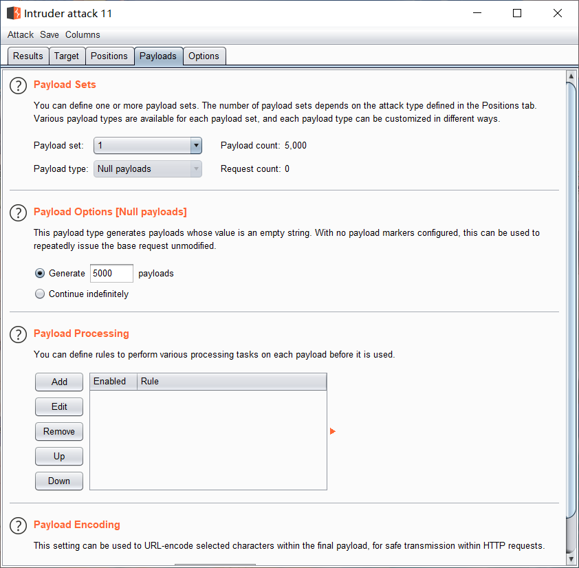

最后发现好几个成功

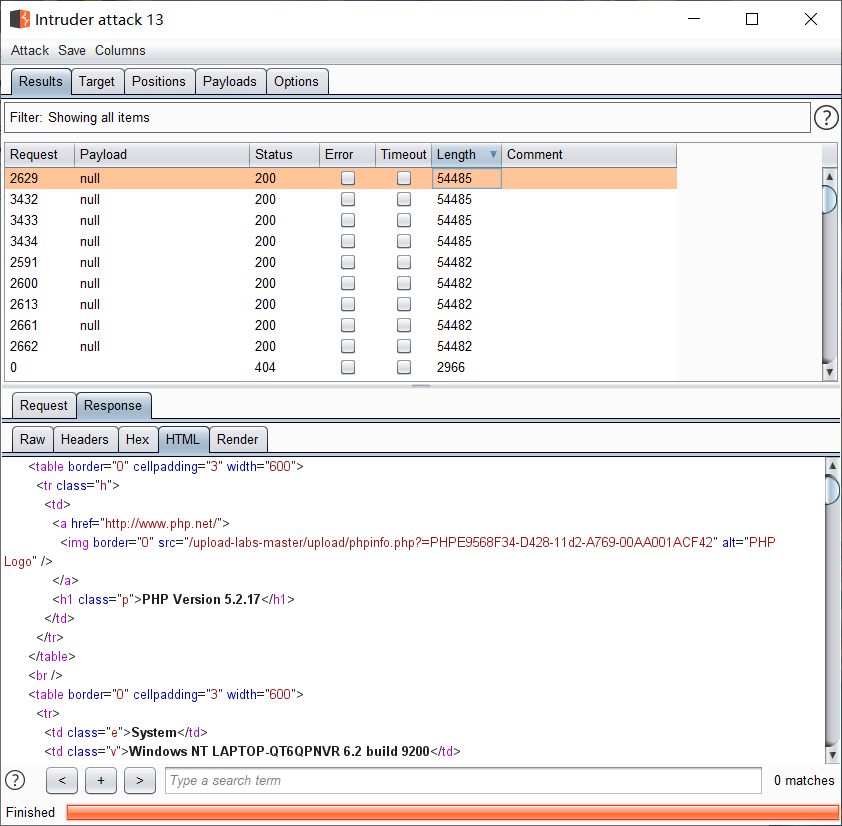

**PS：之前本地一直竞争不过，然后把电脑弄卡就轻轻松松成功了，就离谱**

## Pass-18-条件竞争

这里先将上传的文件保存（move函数），再rename重命名一下。所以也存在条件竞争，绕过方法和上面Pass-17差不多
不过这题对文件后缀名做了白名单判断，然后会一步一步检查文件大小、文件是否存在等等，因此可以通过不断上传图片马，由于条件竞争可能来不及重命名，从而上传成功。

## Pass-19-/.绕过

看源代码

```php
$is_upload = false;
$msg = null;
if (isset($_POST['submit'])) {
    if (file_exists(UPLOAD_PATH)) {
        $deny_ext = array("php","php5","php4","php3","php2","html","htm","phtml","pht","jsp","jspa","jspx","jsw","jsv","jspf","jtml","asp","aspx","asa","asax","ascx","ashx","asmx","cer","swf","htaccess");

        $file_name = $_POST['save_name'];
        $file_ext = pathinfo($file_name,PATHINFO_EXTENSION);

        if(!in_array($file_ext,$deny_ext)) {
            $temp_file = $_FILES['upload_file']['tmp_name'];
            $img_path = UPLOAD_PATH . '/' .$file_name;
            if (move_uploaded_file($temp_file, $img_path)) { 
                $is_upload = true;
            }else{
                $msg = '上传出错！';
            }
        }else{
            $msg = '禁止保存为该类型文件！';
        }

    } else {
        $msg = UPLOAD_PATH . '文件夹不存在,请手工创建！';
    }
}
```

move_uploaded_file会忽略掉文件末尾的/.
所以可以构造save_path=1.php/.,这样file_ext值就为空，就能绕过黑名单，而move_uploaded_file函数忽略文件末尾的/.可以实现保存文件为.php。最后通过文件包含访问

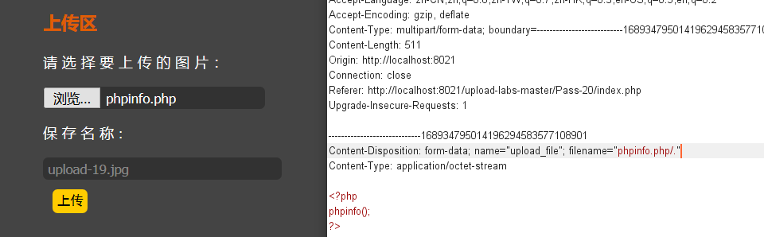

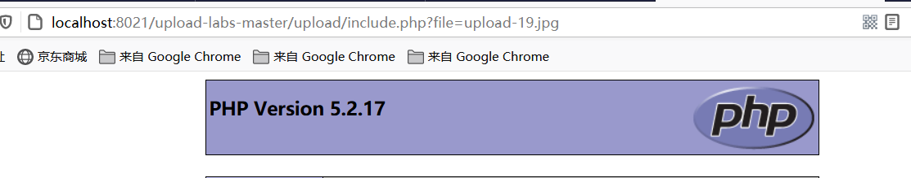

后面发现，将保存名字加上**/.**就行了

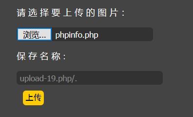

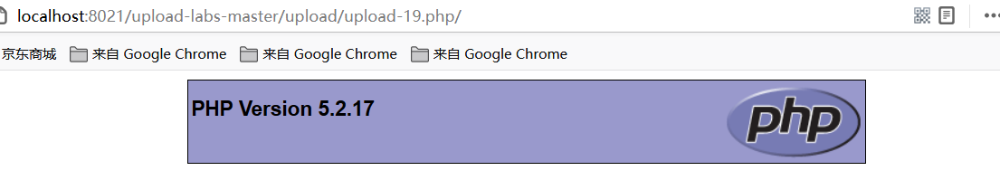


## Pass-20-数组+/.绕过

查看源码

```php
$is_upload = false;
$msg = null;
if(!empty($_FILES['upload_file'])){
    //检查MIME
    $allow_type = array('image/jpeg','image/png','image/gif');
    if(!in_array($_FILES['upload_file']['type'],$allow_type)){
        $msg = "禁止上传该类型文件!";
    }else{
        //检查文件名
        $file = empty($_POST['save_name']) ? $_FILES['upload_file']['name'] : $_POST['save_name'];
        if (!is_array($file)) {
            $file = explode('.', strtolower($file));
        }

        $ext = end($file);
        $allow_suffix = array('jpg','png','gif');
        if (!in_array($ext, $allow_suffix)) {
            $msg = "禁止上传该后缀文件!";
        }else{
            $file_name = reset($file) . '.' . $file[count($file) - 1];
            $temp_file = $_FILES['upload_file']['tmp_name'];
            $img_path = UPLOAD_PATH . '/' .$file_name;
            if (move_uploaded_file($temp_file, $img_path)) {
                $msg = "文件上传成功！";
                $is_upload = true;
            } else {
                $msg = "文件上传失败！";
            }
        }
    }
}else{
    $msg = "请选择要上传的文件！";
}
```

$file为数组的话，就不用经过explode处理再变成数组，我们直接上传数组的话，增加了我么的控制性。
end($file)会经过后缀名检测，所以数组最后一个一定是白名单中的后缀。
$file_name = reset($file) . ‘.’ . $file[count($file) - 1];通常$file[count($file) - 1]和end($file)都指向数组最后一个元素，但是在这里如果这样，那么上传上去的将只能是图片,所以我们可以抓包这样修改

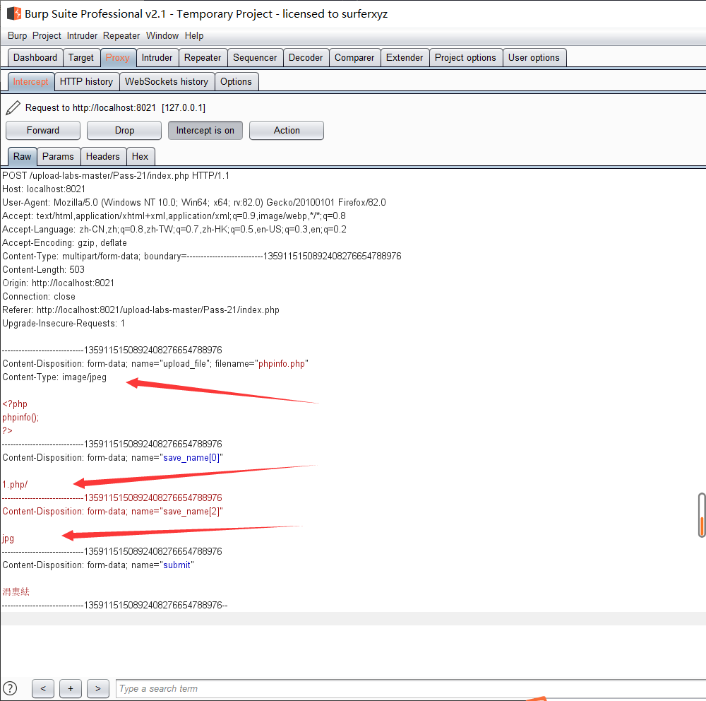

成功

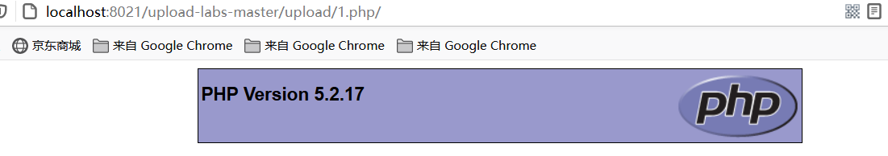

陆陆续续做了几天，upload-labs这个靶场到这来算是完成了，还是学到了挺多东西的，比如文件上传的简单绕过，简单木马的制作等等。

作者水平不足，有很多写的不好的地方敬请谅解。