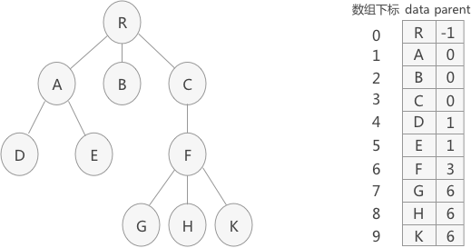
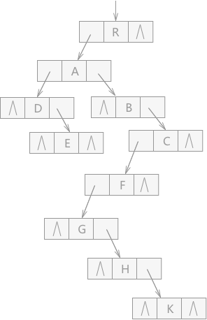
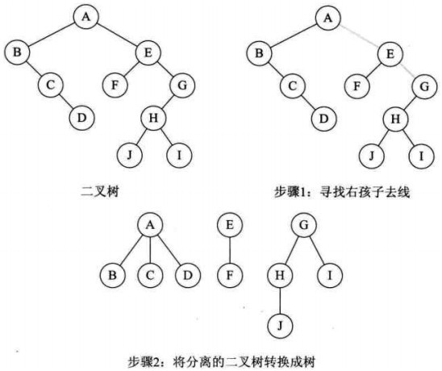

期末复习大二上（更新完），大二下（在更了，在更了）


<!-- more -->

<a href="/2021/01/24/how-to-build-your-site/">模电</a>


# 电子技术基础

## 选择题


## 填空题


这是电压串联正反馈


## 大题（部分应该是考选择）学会这里就够了，概念什么的就看造化了

### 第一章直流电路


### 第二章暂态分析


### 第四章模拟集成运算放大器


### 第五章半导体二极管及稳流电压


### 第六章晶体三极管及其放大


### 第九章负反馈放大电路

看填空题


## 直流电路

### 关联参考方向

关联：P=UI

非关联：P=-UI

关联和非关联有相对性


**两个，关联和非关联**


一般说的电压源电流源都是理想状态下的


### 基尔霍夫定律（KCL和KVL）


KCL:节点流出电流之和等于流入电流之和

KVL:任何闭合回路绕行一周各支路的电压代数和恒等于为0

### 等效电路

等效是指外电路等效，内部结构不一定一样

**电阻等效**

​	串联等效，并联等效，串并联等效

**电源等效**

​	电压源串联等效，电流源并联等效，电压源与元件并联等效（可去掉元件），电流与元件串联等效（可去掉元件）

### 节点点位分析法

### 叠加定理

在多个源的电路中，让其中一个源单独工作，其余电源置零

### 戴维南定理

## 暂态分析


# 汇编

本人菜鸡

别骂了别骂了

## 1.基本概念

**汇编语言与机器语言有什么关系？**
机器语言是一种数字语言，人难以理解
汇编语言采用助记符描述指令，如ADD,CALL等指令，人易理解些
一般来说，汇编指令同机器指令有一一对应的关系

```
int Y;											Mov eax , Y
int X =  Y + 4 ;								Add eax , 4
												Mov x  , eax
```

## 2.IA-32处理器体系结构

```
Ø 了解微机的结构

Ø 掌握IA32处理器的基本执行环境，掌握各寄存器的作用

Ø 理解指令的运行过程

Ø 掌握IA-32处理器有3种基本的操作模式，特别是保护模式与实模式（包括地址计算等）

Ø 了解其它内容
```

 

## 3.汇编语言基础

```
Ø 理解汇编语言的基本要素，能写出完整的汇编程序

Ø 理解汇编程序转换为可执行程序的全过程

Ø 掌握配置VC6的方法

Ø 掌握汇编数据定义方法、符号常量的定义方法

Ø 理解Intel处理器所使用的小端顺序，并能灵活运用。
```


## 4 .数据传送寻址和算术运算

```objectivec
r8			8位寄存器:AH,AL,…DH,DL
r16			16位寄存器AX,BX,CX,DX,SI,DI,SP,BP
r32			32位寄存器，上列中加前缀E
reg			任意通用寄存器
sreg		16位段寄存器CS,DS,SS,ES,FS,GS
imm8		8位立即数，字节
Imm16,32	16位立即数，字;32位立即数,双字
imm			任意立即数
r/m8		8位操作数，8位寄存器或者字节内存
r/m16,32	16位，32位寄存器或内存单元
mem			内存操作数
```

```objectivec
mov				把一个字节或字的操作数从源地址传送至目的地址 
    mov eax,0				;eax=00000000h
    
movzx			零拓展，再传送,用于无符号数
    mov bx,0a=A69Bh			
    movzx eax,bx			;bx=0000A69Bh
    
movsz			符号拓展，再传送，用于有符号数
    mov ax,10001111b		;ax=1111111110001111b        
        
//LAHF    标志寄存器传送,把标志装入AH.  
//SAHF    标志寄存器传送,把AH内容装入标志寄存器.         
        
inc		加1
dec		减1
sub		减法
add		求和
        add a,b			a=a+b
       	sub a,b			a=a+b
        加减法会影响标志位
        
neg		转换成补码，按位取反再+1
        
有符号数与无符号数溢出的判断方法
有符号数最高位为符号位，0为正数，1为负数，所以一个字节八位（2^8=256），却只能表示绝对值为7位以内的数（2^7=128，-128~127包含0）。
有符号数溢出会先溢出到符号位，导致正数变负数的情况，符号标志位由0置1.
无符号数没有符号位，溢出代表其大小无法存储数据，直接溢出标志位 置1        
        
offset	返回数据标号的偏移地址，以字节为单位。
ptr     重写一个操作数的大小类型
        num1 dword 12345678h
        mov ax,num1 ;这个不被允许
        mov ax,word ptr num1 ;这就可以
type    返回按字节计算的变量的单个元素的大小
lenthof 返回操作数的元素个数       
sizeof	返回操作数所占的字节数个数
        
//align    将变量的位置按指定的大小对齐
//label    插入一个标号，并定于大小
            //val1 label word

间接寻址
            array byte 10h,20h,30h	;
            mov esi,offset array	
            mov	al,[esi]			;al=10h
            inc esi
            mov al,[esi]			;al=20h
变址寻址            
            array byte 10h,20h,30h	;
            mov esi,0	
            mov	al,array[exi]			;al=10h
            mov al,array[esi+1]			;al=20h
变址寻址比例因子
            array word 10h,20h,30h	;
            mov esi,0	
            mov	al,array[exi]			;al=10h
            mov esi,1*type array
            mov al,array[esi]			;al=20h
            mov esi,2
            mov al,array[esi*type array]			;al=30h

jmp			无条件跳转
                
loop		循环，把ECX的值-1再与0比较，等于0不跳转，不等于0则跳转
```

## 5.过程

```objectivec
push	入栈 esp-4,要压入的32位值压入esp指向的内存
pop		出栈 esp+4

pushfd	把32位的标志寄存器压栈
popfd 	出
pushad	把8个通用32位寄存器压栈
popad 	出

过程定义
	exam1 proc (uses eax,ebx)
	…………
	ret
	exam1 endp
过程调用
	call exam1

call   	调用过程
		把eip压栈（即当前call指令的下一条指令的地址），然后将过程名所在地址赋给eip，相当于跳转到过程名所在的代码处。
ret		从栈中取出32位值，赋给eip

uses	保护寄存器
	uses eax    相当于  push eax  pop eax

```

## 6.条件处理

```
and		与，相当于合取	把源操作数和目的操作数对各二进制位按位相与，结果存到目的操作数中	
or		或，析取
xor		相同为0，不同为1
not		对操作数取反

cmp		对两个操作数作相减运算，不修改操作数，但会影响标志位,跟着条件跳转使用
test	将两操作数按位执行相与操作，结果不存到目的操作数，但标志寄存器中的标志位体现结果的属性。
      test a,b   => and a,b    a&b=0    zf=1

//clc		将CF清0
//stc		将CF置1

数字1与数字符号1，对于后者存在计算机中使用的是它的ASCII代码31h
A	41h
a   61h

特定标志位跳转
jz为零跳转ZF=1
jnz
jc进位跳转CF=1
jnc
jo溢出跳转OF=1
jno
js有符号跳转SF=1
jns
jp偶校验跳转PF=1
jnp

je相等跳转
jne不相等跳转
jcxz cx=0跳转
jecxz ecx=0跳转
jrcxz rcx=0跳转
    
无符号数比较跳转(a在b前面，a是大于，e表示等于)
ja大于跳转（leftnum>rightnum）
jnbe不小于等于跳转
jae大于等于跳转
jnb不小于跳转

jb小于跳转
jnae不大于等于跳转
jbe小于等于跳转
jna不大于跳转

有符号数比较跳转(G在L前面，G是大于，E表示等于)
JG大于跳转（leftnum>rightnum）
JNLE不小于等于跳转
JGE大于等于跳转
JNL不小于

JL小于跳转
JNGE不大于等于
JLE小于等于
JNG不大于

loopz/loope
ecx不等于0并且ZF标志位为1时跳转，即与LOOP指令不同的地方就是要同时判别ZF标志位
ZF=1，其他和loop一样
loopnz/loopne
ZF=0，其他和loop一样
```

## 7.整数算术指令

```
SHL逻辑左移（无符号）
SHR逻辑右移
SAL算术左移（有符号）
SAR算术右移
ROL循环左移
ROR循环右移
RCL带进位的循环左移
RCR带进位的循环右移
//SHLD	双精度左移
//SHRD	双精度右移
    
MUL(无符号乘法)
	被乘数		乘数		乘积
	AL		reg/mem8	AX
	AX		reg/mem16	DX:AX
	EAX		reg/mem32	EDX:EAX
IMUL(有符号乘法)
	单操作数
	如果结果的高一半不是低一半的符号扩展，OF，CF置位
	双操作数
	两个操作数相乘，结果存到第一个操作数中，如果第一个操作数存不下结果，OF、CF置位。
	三操作数
	第二、三两个操作数相乘，结果存到第一个操作数中如果第一个操作数存不下结果，OF、CF置位
DIV(无符号除法)
	被除数			除数		商		余数
	AX			reg/mem8	AL		AH	
	DX:AX		reg/mem16	AX		DX
	EDX:EAX		reg/mem32	EAX		EDX
IDIV(有符号除法)
	与无符号除法几乎一样，但是进行除法前要对被除数进行符号拓展
	CBW字节转字 AL拓展到AH
	CWD字转双字 AX拓展到DX
	CDQ双字转四字 EAX拓展到EDX
	
拓展加减法
ADC带进位加法
SBB带借位减法


（无需了解调整指令）
算术调整指令（第一个字母A，ASCALL调整/D,十进制调整，第二个字母A表示调整）
AAA
AAS
AAD
AAM
DAA
DAS
```


## 8.高级过程

```
LEA		返回间接操作数的地址
INVOKE	call指令的增强版，支持堆栈参数传递
	Invoke DumpMem,offset array,lengthof array
	这条指令的实际效果(指令顺序与语言选项有关)
	Push lengthof array
	Push offset array
	Call DumpMem

//ENTER 为方便建立堆栈框架的指令
	 ENTER 8,0      Push ebp 
					Mov ebp , esp
					Sub esp , 8
//LEAVE   与ENTER配合
	LEAVE			Mov esp,ebp
					Pop ebp
//LOCAL		可定义全局变量
			Local var1:byte 定义一个名为var1的字节变量
			Local v1:dword,v2:byte 定义了两个变量
			Local arr[10]:dword  定义数组
//PROTO		声明过程原型

Ø 掌握堆栈框架(Stack Frame)的使用：栈框架的建立，栈的清理，要求能画出栈在调用一个过程中的变化情况；

Ø 理解通过栈传递参数的原理，能结合EBP来计算参数的位置

Ø 理解C调用约写与stdcall调用约定的不同点与相同点

Ø 理解如何在过程中使用局量变量

Ø 掌握LEA指令

Ø 了解ENTER、LEAVE指令

Ø 了解Local伪指令

Ø 掌握invoke伪指令的使用，理解它是如何转换为call指令的。

Ø 了解proto伪指令。
```


## 9.串操作

```
CLD DF=0
		  DS:SI 源串段寄存器 :源串变址.  
          ES:DI 目标串段寄存器:目标串变址.  
          CX 重复次数计数器.  
          AL/AX 扫描值.  
          D标志   0表示重复操作中SI和DI应自动增量; 1表示应自动减量.  
          Z标志   用来控制扫描或比较操作的结束.  
MOVS    串传送.(相当于mov [edi],[esi])( MOVSB 传送字符. MOVSW 传送字. MOVSD 传送双字. )  
CMPS    串比较.(相当于cmp [esi],[edi])( CMPSB 比较字符. CMPSW 比较字. )  
SCAS    串扫描.把AL或AX的内容与目标串作比较,比较结果反映在标志位.  
LODS    装入串.把源串中的元素(字或字节)逐一装入AL或AX中.( LODSB 传送字符. LODSW 传送字.    LODSD 传送双字. )  
STOS    保存串.是LODS的逆过程.  
REP         当CX/ECX<>0时重复.(<> == != ) 
REPE/REPZ   当ZF=1或比较结果相等,且CX/ECX<>0时重复.  
REPNE/REPNZ 当ZF=0或比较结果不相等,且CX/ECX<>0时重复.  
REPC        当CF=1且CX/ECX<>0时重复.  
REPNC       当CF=0且CX/ECX<>0时重复.  

基址变址寻址
.data
  arr word 1000h,2000h,3000h
.code
  mov ebx , offset arr
  mov esi , 2
  mov ax , [ebx + esi]  ;ax = 2000h
  mov ecx , 4
  mov ax , [ebx + ecx] ; ax = 3000h

相对基址变址寻址
mov ecx , tableB[ebx,eax*2]
了解比例因子
mov al , [eax + ebx * 4]
1,2,4,8
```


## 10.结构和宏

```objectivec
定义结构
    结构名   struct
	各域的声明
	结构名 ends

Ø 本章内容未讲，无需复习。
```


## 一、数据传输指令 

网上抄的，别骂了别骂了 

它们在存贮器和寄存器、寄存器和输入输出端口之间传送数据.

### 1. 通用数据传送指令


```objectivec
MOV     传送字或字节.  
MOVSX   先符号扩展,再传送.
MOVZX   先零扩展,再传送.  
PUSH    把字压入堆栈.  
POP     把字弹出堆栈.  
PUSHA   把AX,CX,DX,BX,SP,BP,SI,DI依次压入堆栈.  
POPA    把DI,SI,BP,SP,BX,DX,CX,AX依次弹出堆栈.  
PUSHAD  把EAX,ECX,EDX,EBX,ESP,EBP,ESI,EDI依次压入堆栈.  
POPAD   把EDI,ESI,EBP,ESP,EBX,EDX,ECX,EAX依次弹出堆栈.  
BSWAP   交换32位寄存器里字节的顺序  
XCHG    交换字或字节.(至少有一个操作数为寄存器,段寄存器不可作为操作数)  
CMPXCHG 比较并交换操作数.(第二个操作数必须为累加器AL/AX/EAX)  
XADD    先交换再累加.(结果在第一个操作数里)  
XLAT    字节查表转换.----BX指向一张256字节的表的起点,AL为表的索引值(0-255,即0-FFH);返回AL为查表结果.([BX+AL]->AL)  
```

### 2. 输入输出端口传送指令.


```undefined
IN      I/O端口输入. ( 语法: IN   累加器,    {端口号│DX} )  
OUT     I/O端口输出. ( 语法: OUT {端口号│DX},累加器 )输入输出端口由立即方式指定时,    其范围是 0-255; 由寄存器 DX 指定时,其范围是    0-65535.  
```

### 3. 目的地址传送指令.


```cpp
LEA     装入有效地址.例: LEA DX,string ;把偏移地址存到DX.  
LDS     传送目标指针,把指针内容装入DS.例: LDS SI,string   ;把段地址:偏移地址存到DS:SI.  
LES     传送目标指针,把指针内容装入ES.例: LES DI,string   ;把段地址:偏移地址存到ES:DI.  
LFS     传送目标指针,把指针内容装入FS.例: LFS DI,string   ;把段地址:偏移地址存到FS:DI.  
LGS     传送目标指针,把指针内容装入GS.例: LGS DI,string   ;把段地址:偏移地址存到GS:DI.  
LSS     传送目标指针,把指针内容装入SS.例: LSS DI,string   ;把段地址:偏移地址存到SS:DI.  
```

### 4. 标志传送指令.


```undefined
LAHF    标志寄存器传送,把标志装入AH.  
SAHF    标志寄存器传送,把AH内容装入标志寄存器.  
PUSHF   标志入栈.  
POPF    标志出栈.  
PUSHD   32位标志入栈.  
POPD    32位标志出栈.  
```

##  二、算术运算指令


```objectivec
ADC     带进位加法.  
INC     加 1.  
AAA     加法的ASCII码调整.  
DAA     加法的十进制调整.  
SUB     减法.  
SBB     带借位减法.  
DEC     减 1.  
NEG     求反(以    0 减之).  
CMP     比较.(两操作数作减法,仅修改标志位,不回送结果).  
AAS     减法的ASCII码调整.  
DAS     减法的十进制调整.  
MUL     无符号乘法.结果回送AH和AL(字节运算),或DX和AX(字运算),  
IMUL    整数乘法.结果回送AH和AL(字节运算),或DX和AX(字运算),  
AAM     乘法的ASCII码调整.  
DIV     无符号除法.结果回送:商回送AL,余数回送AH, (字节运算);或 商回送AX,余数回送DX, (字运算).  
IDIV    整数除法.结果回送:商回送AL,余数回送AH, (字节运算);或 商回送AX,余数回送DX, (字运算).  
AAD     除法的ASCII码调整.  
CBW     字节转换为字. (把AL中字节的符号扩展到AH中去)  
CWD     字转换为双字. (把AX中的字的符号扩展到DX中去)  
CWDE    字转换为双字. (把AX中的字符号扩展到EAX中去)  
CDQ     双字扩展. (把EAX中的字的符号扩展到EDX中去)  
```

## 三、逻辑运算指令


```php
AND     与运算.  
OR      或运算.  
XOR     异或运算.  
NOT     取反.  
TEST    测试.(两操作数作与运算,仅修改标志位,不回送结果).  
SHL     逻辑左移.  
SAL     算术左移.(=SHL)  
SHR     逻辑右移.  
SAR     算术右移.(=SHR)  
ROL     循环左移.  
ROR     循环右移.  
RCL     通过进位的循环左移.  
RCR     通过进位的循环右移.  
          以上八种移位指令,其移位次数可达255次.  
          移位一次时, 可直接用操作码. 如 SHL AX,1.  
          移位>1次时, 则由寄存器CL给出移位次数.  
          如 MOV CL,04   SHL AX,CL  
```

##  四、串指令 


```xml
          DS:SI 源串段寄存器 :源串变址.  
          ES:DI 目标串段寄存器:目标串变址.  
          CX 重复次数计数器.  
          AL/AX 扫描值.  
          D标志   0表示重复操作中SI和DI应自动增量; 1表示应自动减量.  
          Z标志   用来控制扫描或比较操作的结束.  
MOVS    串传送.( MOVSB 传送字符. MOVSW 传送字. MOVSD 传送双字. )  
CMPS    串比较.( CMPSB 比较字符. CMPSW 比较字. )  
SCAS    串扫描.把AL或AX的内容与目标串作比较,比较结果反映在标志位.  
LODS    装入串.把源串中的元素(字或字节)逐一装入AL或AX中.( LODSB 传送字符. LODSW 传送字.    LODSD 传送双字. )  
STOS    保存串.是LODS的逆过程.  
REP         当CX/ECX<>0时重复.  
REPE/REPZ   当ZF=1或比较结果相等,且CX/ECX<>0时重复.  
REPNE/REPNZ 当ZF=0或比较结果不相等,且CX/ECX<>0时重复.  
REPC        当CF=1且CX/ECX<>0时重复.  
REPNC       当CF=0且CX/ECX<>0时重复.  
```

## 五、程序转移指令

### 1. 无条件转移指令 (长转移)


```objectivec
JMP         无条件转移指令  
CALL        过程调用  
RET/RETF    过程返回.  
```

### 2. 条件转移指令      (短转移,-128到+127的距离内)( 当且仅当(SF XOR OF)=1时,OP1<OP2 )


```bash
JA/JNBE     不小于或不等于时转移.  
JAE/JNB     大于或等于转移.  
JB/JNAE     小于转移.  
JBE/JNA     小于或等于转移.  
    以上四条,测试无符号整数运算的结果(标志C和Z).  
JG/JNLE     大于转移.  
JGE/JNL     大于或等于转移.  
JL/JNGE     小于转移.  
JLE/JNG     小于或等于转移.  
    以上四条,测试带符号整数运算的结果(标志S,O和Z).  
JE/JZ       等于转移.  
JNE/JNZ     不等于时转移.  
JC          有进位时转移.  
JNC         无进位时转移.  
JNO         不溢出时转移.  
JNP/JPO     奇偶性为奇数时转移.  
JNS         符号位为 "0" 时转移.  
JO          溢出转移.  
JP/JPE      奇偶性为偶数时转移.  
JS          符号位为 "1" 时转移.  
```

### 3. 循环控制指令(短转移)


```undefined
LOOP            CX不为零时循环.  
LOOPE/LOOPZ     CX不为零且标志Z=1时循环.  
LOOPNE/LOOPNZ   CX不为零且标志Z=0时循环.  
JCXZ            CX为零时转移.  
JECXZ           ECX为零时转移.  
```

### 4. 中断指令


```undefined
INT         中断指令  
INTO        溢出中断  
IRET        中断返回  
```

### 5. 处理器控制指令


```objectivec
HLT         处理器暂停,  直到出现中断或复位信号才继续.  
WAIT        当芯片引线TEST为高电平时使CPU进入等待状态.  
ESC         转换到外处理器.  
LOCK        封锁总线.  
NOP         空操作.  
STC         置进位标志位.  
CLC         清进位标志位.  
CMC         进位标志取反.  
STD         置方向标志位.  
CLD         清方向标志位.  
STI         置中断允许位.  
CLI         清中断允许位.  
```

##  六、伪指令


```ruby
DW          定义字(2字节).  
PROC        定义过程.  
ENDP        过程结束.  
SEGMENT     定义段.  
ASSUME      建立段寄存器寻址.  
ENDS        段结束.  
END         程序结束.  
```

##  七、处理机控制指令：标志处理指令


```objectivec
CLC     进位位置0指令  
CMC     进位位求反指令  
STC     进位位置为1指令  
CLD     方向标志置1指令  
STD     方向标志位置1指令  
CLI     中断标志置0指令  
STI     中断标志置1指令  
NOP     无操作  
HLT     停机  
WAIT    等待  
ESC     换码  
LOCK    封锁  
```

## 浮点运算指令集 

### 一、控制指令(带9B的控制指令前缀F变为FN时浮点不检查，机器码去掉9B)----


```rust
FINIT                 初始化浮点部件                  机器码  9B DB E3  
FCLEX                 清除异常                         机器码  9B DB E2  
FDISI                 浮点检查禁止中断                 机器码  9B DB E1  
FENI                  浮点检查禁止中断二            机器码  9B DB E0  
WAIT                  同步CPU和FPU                    机器码  9B  
FWAIT                 同步CPU和FPU                    机器码  D9 D0  
FNOP                  无操作                          机器码  DA E9  
FXCH                  交换ST(0)和ST(1)                机器码  D9 C9  
FXCH ST(i)            交换ST(0)和ST(i)                机器码  D9 C1iii  
FSTSW ax              状态字到ax                       机器码  9B DF E0  
FSTSW   word ptr mem  状态字到mem                      机器码  9B DD mm111mmm  
FLDCW   word ptr mem  mem到状态字                      机器码  D9 mm101mmm  
FSTCW   word ptr mem  控制字到mem                      机器码  9B D9 mm111mmm  
  
FLDENV  word ptr mem  mem到全环境                      机器码  D9 mm100mmm  
FSTENV  word ptr mem  全环境到mem                      机器码  9B D9 mm110mmm  
FRSTOR  word ptr mem  mem到FPU状态                    机器码  DD mm100mmm  
FSAVE   word ptr mem  FPU状态到mem                    机器码  9B DD mm110mmm  
  
FFREE ST(i)           标志ST(i)未使用                   机器码  DD C0iii  
FDECSTP               减少栈指针1->0 2->1             机器码  D9 F6  
FINCSTP               增加栈指针0->1 1->2             机器码  D9 F7  
FSETPM                浮点设置保护                       机器码  DB E4  
```

### 二、数据传送指令 


```csharp
FLDZ                  将0.0装入ST(0)                  机器码  D9 EE  
FLD1                  将1.0装入ST(0)                  机器码  D9 E8  
FLDPI                 将π装入ST(0)                    机器码  D9 EB  
FLDL2T                将ln10/ln2装入ST(0)             机器码  D9 E9  
FLDL2E                将1/ln2装入ST(0)                机器码  D9 EA  
FLDLG2                将ln2/ln10装入ST(0)             机器码  D9 EC  
FLDLN2                将ln2装入ST(0)                  机器码  D9 ED  
  
FLD    real4 ptr mem  装入mem的单精度浮点数             机器码  D9 mm000mmm  
FLD    real8 ptr mem  装入mem的双精度浮点数             机器码  DD mm000mmm  
FLD   real10 ptr mem  装入mem的十字节浮点数             机器码  DB mm101mmm  
  
FILD    word ptr mem  装入mem的二字节整数              机器码  DF mm000mmm  
FILD   dword ptr mem  装入mem的四字节整数              机器码  DB mm000mmm  
FILD   qword ptr mem  装入mem的八字节整数              机器码  DF mm101mmm  
  
FBLD   tbyte ptr mem  装入mem的十字节BCD数            机器码  DF mm100mmm  
  
FST    real4 ptr mem  保存单精度浮点数到mem             机器码  D9 mm010mmm  
FST    real8 ptr mem  保存双精度浮点数到mem             机器码  DD mm010mmm  
  
FIST    word ptr mem  保存二字节整数到mem              机器码  DF mm010mmm  
FIST   dword ptr mem  保存四字节整数到mem              机器码  DB mm010mmm  
  
FSTP   real4 ptr mem  保存单精度浮点数到mem并出栈      机器码  D9 mm011mmm  
FSTP   real8 ptr mem  保存双精度浮点数到mem并出栈      机器码  DD mm011mmm  
FSTP  real10 ptr mem  保存十字节浮点数到mem并出栈      机器码  DB mm111mmm  
  
FISTP   word ptr mem  保存二字节整数到mem并出栈           机器码  DF mm011mmm  
FISTP  dword ptr mem  保存四字节整数到mem并出栈           机器码  DB mm011mmm  
FISTP  qword ptr mem  保存八字节整数到mem并出栈           机器码  DF mm111mmm  
  
FBSTP  tbyte ptr mem  保存十字节BCD数到mem并出栈     机器码  DF mm110mmm  
  
FCMOVB                ST(0),ST(i) <时传送              机器码  DA C0iii  
FCMOVBE               ST(0),ST(i) <=时传送             机器码  DA D0iii  
FCMOVE                ST(0),ST(i) =时传送             机器码  DA C1iii  
FCMOVNB               ST(0),ST(i) >=时传送             机器码  DB C0iii  
FCMOVNBE              ST(0),ST(i) >时传送              机器码  DB D0iii  
FCMOVNE               ST(0),ST(i) !=时传送            机器码  DB C1iii  
FCMOVNU               ST(0),ST(i) 有序时传送        机器码  DB D1iii  
FCMOVU                ST(0),ST(i) 无序时传送        机器码  DA D1iii  
```

### 三、比较指令  


```undefined
FCOM                  ST(0)-ST(1)                      机器码  D8 D1  
FCOMI                 ST(0),ST(i)  ST(0)-ST(1)         机器码  DB F0iii  
FCOMIP                ST(0),ST(i)  ST(0)-ST(1)并出栈   机器码  DF F0iii  
FCOM   real4 ptr mem  ST(0)-实数mem                      机器码  D8 mm010mmm  
FCOM   real8 ptr mem  ST(0)-实数mem                      机器码  DC mm010mmm  
  
FICOM   word ptr mem  ST(0)-整数mem                      机器码  DE mm010mmm  
FICOM  dword ptr mem  ST(0)-整数mem                      机器码  DA mm010mmm  
FICOMP  word ptr mem  ST(0)-整数mem并出栈               机器码  DE mm011mmm  
FICOMP dword ptr mem  ST(0)-整数mem并出栈               机器码  DA mm011mmm  
  
FTST                  ST(0)-0                          机器码  D9 E4  
FUCOM  ST(i)          ST(0)-ST(i)                      机器码  DD E0iii  
FUCOMP ST(i)          ST(0)-ST(i)并出栈                   机器码  DD E1iii  
FUCOMPP               ST(0)-ST(1)并二次出栈             机器码  DA E9  
FXAM                  ST(0)规格类型                    机器码  D9 E5  
```

###  四、运算指令 


```undefined
FADD                  把目的操作数 (直接接在指令后的变量或堆栈缓存器) 与来源操作数 (接在目的操作数后的变量或堆栈缓存器)  相加，并将结果存入目的操作数  
FADDP  ST(i),ST       这个指令是使目的操作数加上 ST  缓存器，并弹出 ST 缓存器，而目的操作数必须是堆栈缓存器的其中之一，最后不管目的操作数为何，经弹出一次后，目的操作数会变成上一个堆栈缓存器了  
FIADD                 FIADD 是把 ST   加上来源操作数，然后再存入 ST 缓存器，来源操作数必须是字组整数或短整数形态的变数  
  
FSUB                  减  
FSUBP  
FSUBR                 减数与被减数互换  
FSUBRP  
FISUB  
FISUBR  
  
FMUL                  乘  
FMULP  
FIMUL  
  
FDIV                  除  
FDIVP  
FDIVR  
FDIVRP  
FIDIV  
FIDIVR  
  
FCHS                  改变 ST 的正负值  
  
FABS                  把 ST  之值取出，取其绝对值后再存回去。  
  
FSQRT                 将 ST  之值取出，开根号后再存回去。  
  
FSCALE                这个指令是计算 ST*2^ST(1)之值，再把结果存入 ST 里而 ST(1)   之值不变。ST(1)  必须是在 -32768 到 32768 (-215 到 215 )之间的整数，如果超过这个范围计算结果无法确定，如果不是整数 ST(1)    会先向零舍入成整数再计算。所以为安全起见，最好是由字组整数载入到 ST(1) 里。  
  
FRNDINT               这个指令是把 ST 的数值舍入成整数，FPU    提供四种舍入方式，由 FPU 的控制字组(control    word)中的 RC 两个位决定  
                          RC    舍入控制  
                          00    四舍五入  
                          01    向负无限大舍入  
                          10    向正无限大舍入  
                          11    向零舍去  
```


# 信安数学基础（我大哥说有手就行）

**耗子尾汁**

完全剩余系：有n个元素

简化剩余系：最多n-1个


#### 

例如3的简化剩余系：2,4        或       1，5


# 离散数学

小道消息，懂得都懂


## 集合

交

并

补

差

环和

环积

## 数理逻辑

### 一些没想好放哪的概念

重言式（永真）:对应所有指派，命题公式均为真

矛盾式（永假）:对应所有指派，命题公式均为假

偶然式:不是永真，也不是永假

辖域：紧接于量词之后的最小子公式叫量词的辖域

**命题：陈述句**。是或真或假的断言

​	例如：今天下雨。√  	x+y>4 ×

​	明年十月一日是晴天。√无法确定真假，但也是命题

### 运算优先级及它们的真值表

优先级：┐，∧、∨，→，<->.

真值表：挺好记的，∧就是要全部是真才是真、∨有一个为真就是真，→前面真，后面假才是假，<->就是双向->记得->就行了

| p    | q    | p∧q  | p∨q  | p->q | p<->q |
| ---- | ---- | ---- | ---- | ---- | ----- |
| 0    | 0    | 0    | 0    | 1    | 1     |
| 0    | 1    | 0    | 1    | 1    | 0     |
| 1    | 0    | 0    | 1    | 0    | 0     |
| 1    | 1    | 1    | 1    | 1    | 1     |

p∧q :p并且q

 p∨q:p或q

 p->q :如果p，那么q

 p<->q:p等值于q

∀：任意

┐∀：不是所有

∃：存在

┐∃：并非存在

### 恒等式证明

**1.真值表法**  变元比较少的情况下常用。

**2.等值演算法**.基本恒等式和带入，替换规则。

**3.蕴含法** P<=>Q的充要条件为P=>Q且Q=>P.

**逻辑恒等式、永真蕴含式(书P9 - P10)**


永真蕴含式


### 主析取范式，主合取范式

将合取式称为积，将析取式称为和


利用真值表

1代表主析取范式

​	不带非表示1，带非表示0

0代表主合取范式Π（2，4，6），M2M4M6

​	带非表示1，不带表示0

### 推理规则


**“A(x)对y是自由的”含义**

**US：∀xA(x) => A(x)**

**ES（ES在US之前）：∃xA(x) => A(x)**

**EG：A(y) => ∃xA(x)**

**UG：A(x) => ∀xA(x)**

## 代数

### 代数运算

封闭性：给定集合S，若对S上的元素进行 ***** 运算，产生的象也在S中，则称集合S在 ***** 运算下是封闭的。

**二元运算要满足封闭性**

可交换，可结合，可分配

**左右幺元，左右零元**

逆元，与逆元密切相关的一个概念，**可约性**，可约不一定可逆

​	例：设 * 是集合S上的二元可结合运算，若a∈S是可逆的，则a是可约的。比如：(a ***** x=a ***** y)V(x ***** a=y ***** a)=>(x=y)

### 同态与同构

同构：即存在双射

​	两个代数同构，指它们在结构上完全一致，仅仅是元素与运算符的表示形式不同，运算性质，元素间的总体关系，即本质是一样的。

同态：

​	单（一）同态：h为单射（其余和同构相同）

​	满同态：h为满射（其余和同构相同）

​	自同态：A=A’（其余和同构相同）

​	自同构：A=A’，且h是同构，则称h是自同构


### 半群，独异点和群

半群：设V=<S, ***** >是一个代数系统， ***** 是一个二元运算，如果 ***** 运算是可结合的,即对于 ***** a,b,c ***** S,有a*(b*c)=(a*b)*c，则称V为半群。

​	即满足**封闭性，可结合**

独异点(**含幺半群**)：设V=<S, ***** >是半群，且V中有幺元，则称V是一个含幺半群，也称独异点。为强调幺元存在,有时将它写成<S, ***** ,1>。

​	即满足**封闭性，可结合，有幺元**


子半群：设V=<S, ***** >是半群，T ***** S，且对于 ***** 运算封闭，那么称<T, ***** >是半群<S, ***** >的子半群。

可交换半群(可交换独异点)：在半群(独异点)中，若运算是可交换的,则称此半群(独异点)为可交换半群(可交换独异点)。

循环独异点：设<S, ***** ,e>是独异点，若∃xg∈S，对∀xa ***** S,都有一个相应的h∈N使a=g^h。则称此独异点为循环独异点。并称元素g是此循环独异点的生成元。

群：设<G, ***** >是一个代数系统,二元运算 ***** 满足：
	①满足结合律。②幺元存在。③每个元素都有逆元。
	则<G, ***** >称为群。


有限群（基数称为阶数），无限群

可交换群

元素的阶：设<G, ***** >是一个群，且a∈G，如果存在正整数n,使an = e,则称元素a的阶是有限的，满足a^n = e的最小正整数n称为a的
阶。

置换群：记号**⚬**表示**左合成（从右到左）**，例如p1⚬p2，表示先进行p2置换，再进行p1置换

​          	记号**◇**表示**右合成（从右到左）**，例如p1◇p2，表示先进行p1置换，再进行p2置换

令


则左合成


令


则右合成


## 二元关系

### 一些概念

n元关系,空关系

设R是A到B的二元关系(即R∈A×B)，称A
为R的**前域**,B为R的**陪域**。
D(R)={x|∃y(<x,y>属于R)}叫作R的**定义域**(domain)。
R(R)={y|∃x(<x,y>∈R)}叫作R的**值域**(range)。

A上的二元关系R={<x,x>|任意x∈A}称为**相等关系**(恒等关系),记IA或EA

关系特性：

**自反**：每个结点点都存在自回路，关系图主对角线上元素均为1

**反自反**：每个结点点都**不**存在自回路，关系图主对角线上元素均为0

**对称**：只要有a到b的弧，就有b到a的弧，关系图关于主对角线对称

**反对称**：如果存在a到b的弧，就**不**存在b到a的弧

**传递**：若有a到b和b到c，则必有a到c


### 关系的合成运算

⑴关系的合成运算一般是不可交换的

(2)关系的合成运算是可结合的

(3)关系的合成运算对集合的**并**是可分配的


### 关系R的幂


**一个比较重要的定理**


### 关系的闭包运算

逆运算：设R是集合A到B的二元关系,关系R的逆(R的逆关系)是一个B到A上的二元关系

**r(R)：自反闭包；s(R)：对称闭包；t(R)：传递闭包**

**闭包就是满足自反(对称,传递)性的一个最小关系**

构成关系R闭包的基本方法：给R补充必要的序偶,使所得的新关系R具有自反(对称,传递)性

​	简单来说，随便搞


### 次序关系

偏序：若R具有性质：**自反的，反对称的，传递的**，则称R是A上的一个偏序关系，简称偏序。

**偏序集习惯上用哈斯(Ｈasse)图表示。**
哈斯图是一种简化的关系图：
①略去每个节点的自回路；②能用传递关系得出的边略去；③每条边都是向上画，并将箭头略去。(哈斯图的自反传递闭包就是关系图)


假定题目给了个A集合，B∈A，找B集合中的

最大元素：B集合中找，要和所有元素可比的最大的元素

最小元素：B集合中找，要和所有元素可比的最小的元素

极大元素：B集合中找，在最高层的，可以有多个

极小元素：B集合中找，在最低层的，可以有多个

上界：A集合找所有大于等于B集合元素的元素，要有可比性

下界：A集合找所有大于等于B集合元素的元素，要有可比性

最小上界(lub)：顾名思义

最大下界(glb)：顾名思义

拟序：若集合A上的二元关系R是**反自反的,反对称的，传递的,** 则称R是A上的拟序关系,简称拟序


线序：偏序关系中每两个元素都可以比较

良序：线序关系的每一非空子集都有最小元素

等价关系：如果集合A中的二元关系R是**自反的，对称的，传递的，**则称R是A上的一个等价关系。

模数等价（模同余）

划分：


概念真头大，还是例子好理解


## 图论

数据结构都会吧


### 正则图

如果每个结点的度数均为k，则该图称为k-正则图

**10个顶点的3-正则图**


### 概念：没错，又是我

任何图中，度数为奇数的结点必是偶数个。

子图：边点都能删

生成子图：只删边

导出子图：删点

补图：由G中所有结点和所有能使G成为完全图的添加边组成的图

图的同构：两图的结点和边分别存在着一一对应，且保持关联关系

​	同构**必要条件(证明不是同构)**:

​	(1) 结点数目相等；(2) 边数相等；(3) 度数相同的结点数目相等。


### 路径和回路

简单路径：边不重复的路径

基本路径：各点出现不超过一次的路径

简单回路：边不重复的回路

基本回路：各点出现不超过一次的回路

强连通，弱连通，最短路径

欧拉图：一笔画问题，平凡图是欧拉图。

哈密尔顿图：每个顶点只经过一次的回路

### 二部图

Km,n：上面m个顶点下面出度为n

​	**完全匹配，最大匹配**

无向图G作为二部图的充要条件是G中所有回路长度均为偶数。

# 数据结构

### 线性表

对于给定的n个元素，可以构造出的逻辑结构有**集合、线性、树、图**四种。


 一个算法具有5个特性：**_有穷_、_确定_、_可行_、_有0个或多个输入_和_有一个或多个输出_。**


对算法设计的4个要求是**_正确_、_可读_、_健壮_和_效率与低存储要求_**。


1、对线性表的基本操作有哪些？

答：

1、构造空线性表；

2、销毁线性表；

3、获取线性表表长；

4、判断线性表是否空表；

5、访问线性表中第i个元素；

6、获取线性表中第1个满足某关系的元素e的位置；

7、在线性表中第i个元素前（或后）插入新元素；

8、将线性表中第i个元素删除。

### 数组，栈，队列

8、表达式23+((12*3-2)/4+34*5/7)+108/9的后缀表达式是**_23 12 3*2-4/34 5*7/++108 9 /+_**。

**画树或者直接写  左根右→左右根**


13、设循环队列用数组A[1..M]表示，队首、队尾指针分别是FRONT和TAIL，判定队满的条件为**_(TAIL+1)%M==FRONT%M_。**

 

14、设Q[0..N-1]为循环队列，其头、尾指针分别为P和R，则队Q中当前所含元素个数为**_(R-P+N)%N_**。


设数组a[1..50,1..80]的基地址为2000，每个元素占2个存储单元，若以行序为主序顺序存储，则元素a[45,68]的存储地址为___9174__；若以列序为主序顺序存储，则元素a[45,68]的存储地址为___8788__。

**行：（44 * 80 + 67） * 2 + 2000= 9174         列：（67 * 50 +44） * 2 + 2000 = 8788**


18、n阶对称矩阵a满足a[i][j]=a[j][i],i,j=1..n,，用一维数组t[1..m]存储(按行向存储左下三角)时，t的长度为**_n(n+1)/2_**， 当


设矩阵A= 

（1）若将A视为对称矩阵，画出对其压缩存储的存储表；

（2）若将A视为稀疏矩阵，画出其三元表形式压缩存储表；

（3）若将A视为稀疏矩阵，画出A的十字链表结构。


（1）

| 2    | 0    | 0    | 0    | 3    | 0    | 4    | 0    | 0    | 0    |
| ---- | ---- | ---- | ---- | ---- | ---- | ---- | ---- | ---- | ---- |
|      |      |      |      |      |      |      |      |      |      |

（2）

| i    | 1    | 1    | 2    | 3    | 4    |
| ---- | ---- | ---- | ---- | ---- | ---- |
| j    | 1    | 4    | 3    | 2    | 1    |
| v    | 2    | 4    | 3    | 3    | 4    |

（3）


24、已知广义表A=(9，7，(8，10，(99))，12)，试用求表头和表尾的操作Head( )和Tail( )将原子元素99从A中取出来。

答：Head(Head(Tail(Tail(Head(Tail(Tail(A)))))))。

**head取头，返回单个元素(不带括号)，tail取尾（除头取的元素以外的其他元素），返回集合元素（带括号）**


### 树

#### 双亲表示法

取一块连续的内存空间，在存储每个结点的同时，各自都附加一个记录其父结点位置的变量。


在树结构中，除了树根外，每个结点都只有一个父结点（又叫“双亲结点”）。



#### 孩子表示法（邻接表）

将树中的每个结点的孩子结点排列成一个线性表，用链表存储起来。对于含有 n 个结点的树来说，就会有 n 个单链表，将 n 个单链表的头指针存储在一个线性表中，这样的表示方法就是孩子表示法。

> 如果结点没有孩子（例如叶子结点），那么它的单链表为空表。

例如，使用孩子表示法存储图 1 （A），存储效果如图 2：


图 2 孩子表示法


使用孩子表示法存储的树结构，正好和双亲表示法相反，适用于查找某结点的孩子结点，不适用于查找其父结点。可以将两种表示方法合二为一，存储效果如图 3：


#### 孩子兄弟表示法（二叉链）

使用链式存储结构存储普通树。链表中每个结点由 3 部分组成：


图 4 结点构成


其中孩子指针域，表示指向当前结点的第一个孩子结点，兄弟结点表示指向当前结点的下一个兄弟结点。


通过孩子兄弟表示法，普通树转化为了二叉树，所以孩子兄弟表示法又被称为“二叉树表示法”或者“二叉链表表示法”。

例如，用孩子兄弟表示法表示图 1 （A）的普通树，存储结果为：




1、已知一棵度为3的树有2个度为1的结点，3个度为2的结点，4个度为3的结点，则该树有______**12**__个叶结点。

**B:边数，N：结点数**

**n=b+1    n=n0+n1+n2+n3=n1+2*n2+3 *n3+1→ n=n2+2 *n3+1**        **3+2*4+1**


6、已知一棵二叉树的中序序列是DBEAFIHCG，后序序列是DEBHIFGCA，画出这棵二叉树。


中缀式a+b*3+4*(c-d)对应的前缀式为________，若a=1, b=2, c=3, d=4，则后缀式db/cc*a-b*+的运算结果为________。


 

14、设一棵二叉树的前序遍历序列为ABDFCEGH，中序遍历序列为BFDAGEHC

(1)画出这棵二叉树。

(2)画出这棵二叉树的后序线索树。

(3)将这棵二叉树转换成对应的树（或森林)

**线索树先写出序列，无左孩子就指向前驱，无右孩子就指向后继**

FDBGHECA


				

 

15、将下列由三棵树组成的森林转换为二叉树。


#### **树转换二叉树**

（1）加线。在所有兄弟结点之间加一条连线。

（2）去线。树中的每个结点，只保留它与第一个孩子结点的连线，删除它与其它孩子结点之间的连线。

（3）层次调整。以树的根节点为轴心，将整棵树顺时针旋转一定角度，使之结构层次分明。（注意第一个孩子是结点的左孩子，兄弟转换过来的孩子是结点的右孩子）


口诀：兄弟相连，长兄为父，孩子靠左。

核心：左孩子，右兄弟          

#### 森林转换二叉树

（1）把每棵树转换为二叉树。

（2）第一棵二叉树不动，从第二棵二叉树开始，依次把后一棵二叉树的根结点作为前一棵二叉树的根结点的右子树，用线连接起来。


#### **二叉树转树**

是树转换为二叉树的逆过程。还原结点A的孩子，结点A的左孩子开始，一直向右走，这些结点就是结点A的孩子，遇见顺序就是它们作为结点A孩子的顺序。

（1）加线。若某结点X的左孩子结点存在，则将这个左孩子的右孩子结点、右孩子的右孩子结点、右孩子的右孩子的右孩子结点…，都作为结点X的孩子。将结点X与这些右孩子结点用线连接起来。

（2）去线。删除原二叉树中所有结点与其右孩子结点的连线。

（3）层次调整。


 

#### **二叉树转森林**

假如一棵二叉树的根结点有右孩子，则这棵二叉树能够转换为森林，否则将转换为一棵树。在二叉树种A有右子树上向右的一连串结点都是A的兄弟，那么就把兄弟分离，A的每个兄弟结点作为森林中树的根结点。

（1）从根结点开始，若右孩子存在，则把与右孩子结点的连线删除。再查看分离后的二叉树，若其根结点的右孩子存在，则连线删除…。直到所有这些根结点与右孩子的连线都删除为止。

（2）将每棵分离后的二叉树转换为树。




**哈夫曼树编码，左0右1**

#### 哈夫曼树HT的存储结构的初态和终态

18、已知下列字符A、B、C、D、E、F、G的权值分别为3、12、7、4、2、8、11，试填写出其对应哈夫曼树HT的存储结构的初态和终态。

 

表18-1  HT初态

| 下标值 | 数据域 | weight | parent | lchild | rchild |
| ------ | ------ | ------ | ------ | ------ | ------ |
| 1      | A      | 3      | 0      | 0      | 0      |
| 2      | B      | 12     | 0      | 0      | 0      |
| 3      | C      | 7      | 0      | 0      | 0      |
| 4      | D      | 4      | 0      | 0      | 0      |
| 5      | E      | 2      | 0      | 0      | 0      |
| 6      | F      | 8      | 0      | 0      | 0      |
| 7      | G      | 11     | 0      | 0      | 0      |
| 8      |        | 0      | 0      | 0      | 0      |
| 9      |        | 0      | 0      | 0      | 0      |
| 10     |        | 0      | 0      | 0      | 0      |
| 11     |        | 0      | 0      | 0      | 0      |
| 12     |        | 0      | 0      | 0      | 0      |
| 13     |        | 0      | 0      | 0      | 0      |

 

表18-2  HT终态（书上的结果）

| 下标值 | 数据域 | weight | parent | lchild | rchild |
| ------ | ------ | ------ | ------ | ------ | ------ |
| 1      | A      | 3      | 8      | 0      | 0      |
| 2      | B      | 12     | 12     | 0      | 0      |
| 3      | C      | 7      | 10     | 0      | 0      |
| 4      | D      | 4      | 9      | 0      | 0      |
| 5      | E      | 2      | 8      | 0      | 0      |
| 6      | F      | 8      | 10     | 0      | 0      |
| 7      | G      | 11     | 11     | 0      | 0      |
| 8      |        | 5      | 9      | 1      | 5      |
| 9      |        | 9      | 11     | 4      | 8      |
| 10     |        | 15     | 12     | 3      | 6      |
| 11     |        | 20     | 13     | 7      | 9      |
| 12     |        | 27     | 13     | 2      | 10     |
| 13     |        | 47     | 0      | 11     | 12     |


### 图

7、在图G的邻接表表示中，每个顶点邻接表中所含的结点数（即该顶点的链表结点），对于无向图来说等于该顶点的**_度_**；对于有向图来说等于该顶点的**_出度_**。


8、在有向图的邻接矩阵表示中，计算第I个顶点入度的方法是**_第I列非零元的个数_**。


#### 图的邻接矩阵和邻接表

9、请用邻接矩阵和邻接表表示法画出下图G的存储结构。


邻接矩阵：

邻接表：


#### 深度优先遍历(DFS)和广度优先遍历(BFS)

**深度优先遍历(DFS)**　**在此我想用一句话来形容 “不到南墙不回头”。**

11、下面的邻接表表示一个给定的无向图，给出从顶点v4开始，对图用深度优先搜索法进行遍历时的顶点序列**_v4, v2, v1, v3, v5, v6_**；给出从顶点v4开始，对图用广度优先搜索法进行遍历时的顶点序列**_v4, v2, v3, v6, v1, v5_**。


图示为：

 

12、给出下图G：

（1）画出G的邻接表表示图；

（2）根据你画出的邻接表，以顶点1为根，画出G的深度优先生成树和广度优先生成树。


（1）邻接表表示图


（2）深度优先生成树为：


广度优先生成树为：


 

#### 最小生成树（普里姆算法和克鲁斯卡尔算法）

13、**Prim（普里姆）算法**适用于求**_稠密图_**的网的最小生成树；**Kruskal（克鲁斯卡尔）算法**适用于求**_稀疏图_**的网的最小生成树。

**Prim（普里姆）算法：从某点出发遍历周围最小权值的边，直到遍历完所有点，边连线不能形成环**

**Kruskal（克鲁斯卡尔）算法：从权值最小的边开始，一直遍历最小权值的边，直到遍历完所有点，边连线不能形成环**


16、在拓扑分类中，拓扑序列的最后一个顶点必定是_**出度为0**_的顶点。

**拓扑排列，从出度为零的点开始选择**

#### 最短路径（过程）

17、已知一图如下图所示：

（1）写出该图的两个拓扑排序（升序、降序）；

（2）以1为源点，4为终点，给出所有事件允许发生的最早时间和最晚时间，并给出关键路径；

（3）求顶点1到其余各顶点的最短路径。


（1）拓扑排序升序：1, 5, 6, 2, 7, 3, 8, 4；降序：1, 5, 6, 7, 8, 2, 3, 4

（2）关键路径

| 顶点 | 1    | 2    | 3    | 4    | 5    | 6    | 7    | 8    |
| ---- | ---- | ---- | ---- | ---- | ---- | ---- | ---- | ---- |
| Ve   | 0    | 30   | 50   | 65   | 10   | 17   | 25   | 35   |
| Vl   | 0    | 30   | 50   | 65   | 15   | 27   | 44   | 59   |

关键路径为1, 2, 3, 4

**（3）最短路径：**

 

| 顶点集          | D[2] | D[3] | D[4] | D[5] | D[6] | D[7] | D[8] | P[2] | P[3] | P[4] | P[5] | P[6] | P[7] | P[8] |
| --------------- | ---- | ---- | ---- | ---- | ---- | ---- | ---- | ---- | ---- | ---- | ---- | ---- | ---- | ---- |
| 1               | 30   | -1   | 60   | 10   | -1   | -1   | -1   | 1    | -1   | 1    | 1    | -1   | -1   | -1   |
| 1,5             | 25   | -1   | 60   |      | 17   | -1   | -1   | 5    | -1   | 1    |      | 5    | -1   | -1   |
| 1,5,6           | 20   | 33   | 60   |      |      | 25   | -1   | 6    | 6    | 1    |      |      | 6    | -1   |
| 1,5,6,2         |      | 33   | 60   |      |      | 25   | -1   |      | 6    | 1    |      |      | 6    | -1   |
| 1,5,6,2,7       |      | 31   | 28   |      |      |      | 35   |      | 7    | 7    |      |      |      | 7    |
| 1,5,6,2,7,4     |      | 31   |      |      |      |      | 35   |      | 7    |      |      |      |      | 7    |
| 1,5,6,2,7,4,3   |      |      |      |      |      |      | 35   |      |      |      |      |      |      | 7    |
| 1,5,6,2,7,4,3,8 | 20   | 31   | 28   | 10   | 17   | 25   | 35   | 6    | 7    | 7    | 1    | 5    | 6    | 7    |

注：1、表中未填项即是其上面那一项，因为已经找到了最短路径，故相应数组元素不再再修改；

2、未列D[1]和P[1]，值均为0，自己到自己。

 

18、已知一图如下图所示：

（1）写出该图的两个拓扑排序（升序、降序）；

（2）以0为源点，11为终点，计算出所有事件和活动的最早发生时间和最晚发生时间，并给出关键路径；

（3）求顶点1到其余各顶点的**最短路径**。

 


（1）拓扑排序升序：0, 1, 2, 3, 4, 5, 6, 7, 8, 9, 10, 11；降序：0, 3, 4, 8, 2, 7, 10, 1, 5, 6, 9, 11

（2）关键路径

| 顶点 | 0    | 1    | 2    | 3    | 4    | 5    | 6    | 7    | 8    | 9    | 10   | 11   |
| ---- | ---- | ---- | ---- | ---- | ---- | ---- | ---- | ---- | ---- | ---- | ---- | ---- |
| Ve   | 0    | 2    | 2    | 4    | 9    | 5    | 9    | 7    | 12   | 13   | 13   | 20   |
| Vl   | 0    | 4    | 2    | 5    | 10   | 7    | 9    | 9    | 13   | 13   | 14   | 20   |

关键事件：0, 2, 6, 9, 11

|      | a1   | a2   | a3   | a4   | a5   | a6   | a7   | a8   | a9   | a10  | a11  | a12  | a13  | a14  | a15  | a16  |
| ---- | ---- | ---- | ---- | ---- | ---- | ---- | ---- | ---- | ---- | ---- | ---- | ---- | ---- | ---- | ---- | ---- |
| Ee   | 0    | 0    | 0    | 2    | 2    | 2    | 4    | 4    | 9    | 5    | 9    | 7    | 7    | 12   | 13   | 13   |
| El   | 2    | 0    | 1    | 4    | 2    | 4    | 5    | 6    | 10   | 7    | 9    | 9    | 11   | 13   | 13   | 14   |

关键活动为：a2, a5, a11, a15

故关键路径为：0, 2, 6, 9, 11

**（3）最短路径**

| 顶点集 | 0    | 0,1  | 0,1,2 | 0,1,2,3 | 0,1,2,3, 5 | 0,1,2,3, 5,6 | 0,1,2,3, 5,6,7 | 0,1,2,3, 5,6,7,4 | 0,1,2,3, 5,6,7,4, 10 | 0,1,2,3, 5,6,7,4, 10,9 | 0,1,2,3, 5,6,7,4, 10,9,8 | 0,1,2,3, 5,6,7,4, 10,9,8,11 |
| ------ | ---- | ---- | ----- | ------- | ---------- | ------------ | -------------- | ---------------- | -------------------- | ---------------------- | ------------------------ | --------------------------- |
| D[1]   | 2    |      |       |         |            |              |                |                  |                      |                        |                          | 2                           |
| D[2]   | 2    | 2    |       |         |            |              |                |                  |                      |                        |                          | 2                           |
| D[3]   | 4    | 4    | 4     |         |            |              |                |                  |                      |                        |                          | 4                           |
| D[4]   | -1   | -1   | -1    | 9       | 9          | 9            | 9              |                  |                      |                        |                          | 9                           |
| D[5]   | -1   | 5    | 5     | 5       |            |              |                |                  |                      |                        |                          | 5                           |
| D[6]   | -1   | -1   | 9     | 9       | 7          |              |                |                  |                      |                        |                          | 7                           |
| D[7]   | -1   | -1   | 7     | 7       | 7          | 7            |                |                  |                      |                        |                          | 7                           |
| D[8]   | -1   | -1   | -1    | -1      | -1         | -1           | -1             | 12               | 12                   | 12                     |                          | 12                          |
| D[9]   | -1   | -1   | -1    | -1      | -1         | 11           | 11             | 11               | 11                   |                        |                          | 11                          |
| D[10]  | -1   | -1   | -1    | -1      | -1         | -1           | 10             | 10               |                      |                        |                          | 10                          |
| D[11]  | -1   | -1   | -1    | -1      | -1         | -1           | -1             | -1               | 16                   | 16                     | 16                       | 16                          |
| P[1]   | 0    |      |       |         |            |              |                |                  |                      |                        |                          | 0                           |
| P[2]   | 0    | 0    |       |         |            |              |                |                  |                      |                        |                          | 0                           |
| P[3]   | 0    | 0    | 0     |         |            |              |                |                  |                      |                        |                          | 0                           |
| P[4]   | -1   | -1   | -1    | 3       | 3          | 3            | 3              |                  |                      |                        |                          | 3                           |
| P[5]   | -1   | 1    | 1     | 1       |            |              |                |                  |                      |                        |                          | 1                           |
| P[6]   | -1   | -1   | 2     | 2       | 5          |              |                |                  |                      |                        |                          | 5                           |
| P[7]   | -1   | -1   | 2     | 2       | 2          | 2            |                |                  |                      |                        |                          | 2                           |
| P[8]   | -1   | -1   | -1    | -1      | -1         | -1           | -1             | 4                | 4                    | 4                      |                          | 4                           |
| P[9]   | -1   | -1   | -1    | -1      | -1         | 6            | 6              | 6                | 6                    |                        |                          | 6                           |
| P[10]  | -1   | -1   | -1    | -1      | -1         | -1           | 7              | 7                |                      |                        |                          | 7                           |
| P[11]  | -1   | -1   | -1    | -1      | -1         | -1           | -1             | -1               | 10                   | 10                     | 10                       | 10                          |

注：本表是纵向计算，与书上相同。


### 查找


### 排序


1.希尔排序：选择增量，并排序，比如5,2,1         基数排序：使用队列，从最低位起，按关键字的不同值将序列中的记录分配到RADIX个队列中

2.**选择排序**和**归并排序**不受关键字**个数**影响

3.稳定算法：**直接插入，冒泡，归并和基数** 排序


**直接插入排序**

```c
//核心代码	
	for(i=1;i<N;i++)
	{
		temp=a[i];
		for(j=i-1;j>=0;j--)
		{
			if(a[j]>temp)
			a[j+1]=a[j]; 
            
			else
			break;
	
		} 
			a[j+1]=temp;
	}

```

**冒泡排序：即沉底或者冒头**


```c
for(i=0;i<N-1;i++)
{
	for(j=0;j<N-i-1;j++)
	{
		if(a[j]>a[j+1])
		{
			temp=a[j];
			a[j]=a[j+1];
			a[j+1]=temp;
		}
	}
}
```
选择排序

```c
for(i=0;i<N;i++)
{
	for(j=i+1;j<N;j++)
	{
		if(a[j]<a[i])
		{
			temp=a[j];
			a[j]=a[i];
			a[i]=temp;
		}
	}
}
```


# JAVA

### 题目

```
程序不能选择忽略事件。   错

java 不能重写在超类中定义的静态方法

构造方法可以是静态的

数组中的元素可以不是是基元数据类型。比如指针,结构体型

在Java 1.8中，“检查异常”必须在程序中处理。

Java允许创建不规则数组，即Java多维数组中各行的列数可以不同。( )

一个Java类可以不能有多个父类。

声明为final的方法不能在子类中被覆盖。

一个非抽象类不可以有选择地实现接口的部分抽象方法。    要实现所有，抽象类才能有选择

受保护的数据或方法可以由任何包中的子类访问。

受保护的数据或方法不可以由不同包中的任何类访问

元注解不能用于注解Java程序中的类的成员方法。

final类可以有实例，不能拓展

子类和父类可以不在一个包中

如果方法中发生必检异常，则必须捕获该异常或在其方法头中声明该异常。

在Java程序中，不能使用protected来修饰一个类。

抽象类是不能实例化的。

类及其属性、方法可以同时有一个以上的修饰符来修饰。

private 修饰的成员变量或方法的可见范围为当前类。 没有权限修饰符修饰的成员变量或方法的可见范围为当前包。 
protected 修饰的成员变量或方法的可见范围是当前包及该类的子类，即可以被同一个包、该类的子类（可以不同包）的方法访问。 
public修饰的成员变量或方法可以被所有包中所有类中的方法访问

java应用程序经过编译后会产生一个以（.class ）为扩展名的字节码文件,Java应用程序源文件的扩展名为(java )。

Java应用程序由若干个类所构成,这些类可以在一个源文件中,也可以分布在若干个源文件中,其中必须有一个源文件含有主类。

sizeof不是java关键字

abstract修饰抽象类抽象方法，抽象类一定要被继承，抽象方法一定要被重写

自动转换次序.byte->short->int->long->float->double

定义合法标识符规则：
 （1）由26个英文字母大小写，0-9 ，_或 $ 组成
 （2）数字不可以开头。
 （3）不可以使用关键字和保留字，但能包含关键字和保留字
 （4）Java中严格区分大小写，长度无限制
 （5）标识符不能包含空格

class表示___类;类对象__; *.class表示___类文件___; *.java表示__java文件___; java文件编译后是___class;类__文件


A.构造方法的主要作用是完成对类的对象的初始化工作
B.构造方法的返回类型只能是void型，即在方法名前加void    错
C.一般在创建新对象时，系统会自动调用构造方法
D.构造方法是类的一种特殊方法，它的方法名必须与类名相同

一个Java文件中可以定义有多个class声明，并且类名称可以与文件名称同名

(1)final类不能实现任何接口。
(2)public接口可以被任何一个类实现。
(3)友好类和它所实现的接口必须在一个包里。
(4)如果一个类和友好接口在同一个包里，就允许它实现该接口。  13错


```

### 代码

```java
switch(变量){

　　　　　　case 值:要执行的语句;break;

　　　　　　…

　　　　　　default:要执行的语句;

　　　　}

	Scanner num=new Scanner(System.in);

	nextLine（）方法返回的是Enter键之前的所有字符，它是可以得到带空格的字符串的。

	next（）会自动消去有效字符前的空格，只返回输入的字符，不能得到带空格的字符串。
    （简单点说，next我只要字，nextLine我啥都要）
    
1.十进制转成二进制

	String s = Integer.toBinaryString(n)  //将十进制数转成字符串，例如n=5 ，s = "101"

2.将字符串转成整形

	int a = Integer.valueof("1002");  //当然s只能是数字类的字符串

或者

	int a = Integer.parseInt("1002");

3.将整形转成字符串
	String s = String.valueof(1025);  直接转成了

 

4.将整形转成十六进制的数

String s = Integer.toHexString(18);   //输出结果12

1	isLetter()
是否是一个字母
2	isDigit()
是否是一个数字字符
3	isWhitespace()
是否是一个空白字符
4	isUpperCase()
是否是大写字母
5	isLowerCase()
是否是小写字母
6	toUpperCase()
指定字母的大写形式
7	toLowerCase()
指定字母的小写形式
8	toString()
返回字符的字符串形式，字符串的长度仅为1
    
    
    private String value;
	value=value.toUpperCase();//转大写


	private  String word;
	word=word.substring(0,1).toUpperCase()+word.substring(1).toLowerCase();
	//首字母大写，其他小写
	word.substring(0,1)//0开始到1分隔
        
        String s=sc.next();  输入11:20
		
		String x[]=s.split(":");//通过":"分隔字符串,x[0]="11",x[1]="20"
		int a=Integer.parseInt(x[0]);
		int b=Integer.parseInt(x[1]);

	System.out.printf("The BMI is %.4f",BMI);//保留四位小数
```

```
 //异常
 public static void main(String[] args) {
    Scanner sc = new Scanner(System.in);
    while (sc.hasNext()) {
        String choice = sc.next();
        try {
            if (choice.equals("number"))
                throw new NumberFormatException();
            else if (choice.equals("illegal")) {
                throw new IllegalArgumentException();
            } else if (choice.equals("except")) {
                throw new Exception();
            } else
            break;
        }
        /*这里放置你的答案*/
        catch(NumberFormatException e) {
        	System.out.println("number format exception");
        	System.out.println(e);
        }
        catch(IllegalArgumentException e) {
        	System.out.println("illegal argument exception");
        	System.out.println(e);
        }
        catch(Exception e) {
        	System.out.println("other exception");
        	System.out.println(e);
        }
    }//end while
    sc.close();
}
 
 
```


```java


DAY_01
1.Java源代码（通过javac编译为）->字节码文件->执行并运行结果
2.DOS 运行JAVA常见错误：
文件名被隐藏——隐藏已知类型的扩展名 这个√取消
javac +文件名+扩展名	java+类名 不带扩展名
3.
path环境变量配置作用：
程序执行需要使用外部指令javac,但是javac指令仅仅能在JDK安装目录
下的bin目录下使用。而程序开发的时候，不能将源代码写入JDK的安装目录
，因此需要将源程序保存到任意位置的指定目录
classpath作用：
设定为class文件的目录，使classpath目录中的.class可以在任意目录运行

DAY_02
4.关键字全部小写	goto和const是保留字
5.包其实就是文件夹，用于把相同类名进行区分
类或者接口：每个单词首字母大写 方法变量：从第二个单词开始首字母大写
文档注释/** **/
6.8421码 是bcd一种
7.!!!
byte b1 =3,b2 = 4,b;
b=b1+b2;//类型提升，将byte转化为Int类型
b=3+4;//常量相加，先把结果计算出来，然后再转为对应类型
XJad:将.class文件反编译为java文件
8.计算机中数据运算都是补码进行的
获取int a = 130二进制->做截取，截成byte->已知补码求原码
其中第三步：
补码 10000010->反码 10000001 -> 原码 11111110
由此byte 130 为-126
9.看程序写结果
字符和一个整数相加，println('a'+1) = 97+1=98
字符串数据和其他数据做+，这个+是字符串连接符

DAY_03 _04
1.&有false则false | 有true则true ^(异或) 相同为false
2.Alt+/自动填充函数
3.println("")里头可以输出汉字
Scanner in  =new Scanner(System.in);
System.out.println("echo:"+in.nextline());
System.out.println("2+3="+(2+3）);
4.ctrl+/ 注释代码或解开注释
5.System.out.println("100-"+in.nextInt()+"="+(100-nextInt()));要输入两次
6.return 不是结束循环，而是结束方法

DAY _05
1.数组逆序（元素对调）
返回值类型 void！！！（无需返回，void返回的就是数组地址）
for(int x=0; x<arr.length/2;x++){
	int temp = arr[x];
	arr[x] = arr[arr.lenght-1-x];
	arr[arr.length-1-x] = temp;
}
2.final int 常量定义
3.void类型 没有明确的返回值 直接输出
不能够输出调用 赋值调用 因为println不能是空类型
4.数组初始化有动态、静态两种方式，只能任选其一：
	动态：int[] arr = new int [3]  
	静态：int[]arr ={}  new可以看成是为arr分配地址
5.栈：存放局部变量
	栈的特点：用完即释放
堆：堆放所有new出来的东西
堆的特点：每个都有地址值 都有初始值 使用完毕变成垃圾，没有立即回收，会在空闲时回收
Array Index Out of Bound Exception:数组索引越界
Null Pointer Exception:空指针异常 

DAY_06
1、二维数组 定义格式 
推荐：数据类型 [][] 数组名 = new 数据类型[m][n]
其他：数据类型 数组名[][] = new 数据类型[m][n]
          数据类型[] 数组名[] = new 数据类型[m][n]
2.一个java文件中写两个类：一个基本的类，一个测试类
	在测试类（含主函数）中编译Java文件，会将该类所涉及的所有类都编译成class
	报错实参形参长度不同，一定是没有给一定数量的参数或者压根没有给参数
3.main 方法储存在栈里头，然后在堆里储存类的代码，最后调用在方法区的方法

DAY_07
1.成员变量与局部变量的区别
	成员变量在类中方法外 局部变量在定义中或方法声明上
	成员变量在堆内存，局部变量在栈内存
	成员变量随着对象的创建而存在，局部变量随着方法调用存在
	成员变量有默认初始化值，局部变量必须定义赋值然后才能使用
2.类型包括基本数据类型、引用类型（数组、类、接口）
  形式参数的改变直接影响实际参数（如果是引用类型的话）
  方法里头调用一个类，此时传进去的是类的地址
3.匿名对象：没有名字的对象 可以作为实际参数传递
  new student.show()不适合多次调用，用完被垃圾回收器回

DAY_08
1.在同一个文件夹下，类定义在一个文件还是两个文件下相同
2.构造代码块在构造函数之前执行，且出现在类中的成员位置
局部代码块用于限定变量的声明周期 静态代码块与构造代码块类似，只是用static修饰了
构造代码块只需要在代码外面有一个大括号，在一个类中代码无法在成员变量的位置直接执行
例如：class demo{ System.out.println(100) public demo(){}}中的输出是无法执行的
3.开发的原则：低耦合，高内聚 耦合：类与类之间的关系 内聚：自己完成事件的能力
4.子类不能继承父类的私有变量和私有方法，即只能继承父类所有非私有的成员
5.举例输出子类局部、成员、继承的父类变量
public void show(){
	int num = 30;
	System.out.println(num);
	System.out.println(this.num);
	System.out.println(super.num);
}
this()调用本类成员变量的构造方法，super()调用父类的构造方法 同理，super.方法，this.方法
6.子类所有构造方法默认会访问父类的【空参数】构造方法 子类初始化之前一定要先完成父类的初始化
7.父类如果只有一个含参构造函数，那么默认的无参构造函数会消失
因此要在父类加入一个无参构造函数；或者使用super()调用父类的含参构造函数
或者通过this()调用一个访问了父类构造方法的成员方法 而且this super必须在第一个语句上
8.public void call(String name){
	super.call(name);
	······；
}方法的重写	子类不能访问权限比父类更低 比如不可以子类为void 父类为public
父类用静态方法，子类也必须用静态方法重写

Day 09:
1、final 可以修饰类、方法、变量，此时父类的功能不能被覆盖
最终类不能被继承 final的方法 叫覆盖、重写、复写
final修饰基本类型：值不能发生改变 修饰引用类型：引用地址不能发生改变
2、多态：有继承关系、有方法重写、有父类引用指向子类对象
子类可以访问父类的变量，但是父类不能访问子类的变量 多态中成员变啦领编译运行看左边
成员方法的编译看左边，运行看右边
弊端：不能使用子类特有的功能
向下转型：把 Zi z = (Zi) f f能转化为zi
3、抽象类具有构造方法，但是不能实例化
4、接口没有构造方法 接口方法不能有主体

ctrl shitf f 格式化 ctrl shitf o 导包
Integer.toHexString 整数转为十六进制
public String toString(){
	return 
}

DAY 12
1、字符串一旦被赋值，就不能改变 String s 值不能变，但是引用s可以变
2、String s = new String("hello")创建2个对象,String s = "hello"创建1个对象
3、== 比较引用对象，是比较地址，equals默认是地址，但是String改写后 判断内容相等
4、字符串相加：如果是变量，先开空间再拼接，如果是常量，先加然后在常量池寻找 
有就返回
5、字符串内容为空 String s  = "",字符串对象为空 String s = null
6、boolean equals() 比较字符串内容是否相同，区分大小写
boolean equalsIgnoreCase() 比较自妇产内容是否相同，忽略大小写
boolean contains() 判断大字符串中是否包含小字符串
boolean startsWith() 判断字符串是否以某个指定的字符串开头
boolean isEmpty() 判断字符串是否为空
7、byte [] getBytes 把字符串转换为字节数组
char [] toCharArray() 把字符串转换为字符数组
static String valueof(char[] chs) 把字符数组转换为字符串
string.toLowerCase() 把字符串转成小写
compareTo 函数 按字典顺序比较两个字符串
8、Arrays.toString（arr）把arr转成字符串 Arrays.sort(arr)数组排序 
Integer.toString(number)  String s = "" + number String.valueof(number) int->String
String->Int: str.intValue()  Integer.parseInt(a)
9、Integer.toBinaryString()十进制转到二进制 Integer.toOctalString() 转到八进制
十进制转到其他进制： Integer.toString(num，rad)
其他进制转到十进制：Integer.parseInt("num",rad)
10、try{
	可能出现的问题
	}catch（异常名 变量比如：ParseException e）{
	针对问题的处理
System.out.println(e.getMessage());
	}（finally{
	释放资源
	}）
11、Exception e 所有异常的父类 simpleDateFormat("yyyy-MM-dd HH:MM:ss")
12、如果要自己写一个异常类 需要继承自Exception 或者 继承自RuntimeException


字符串考点
spllit方法 抽象类不能实例化 异常处理机制 数组的定义 
回文 二进制 三角函数 随机数 栈、队列 
```


# 数据库

### 题目

一个数据模型至少需要描述数据的静态特征、动态特征和（ **完整性约束** ）三项内容。


(**DB** )是长期存储在计算机内的有组织、可共享的数据集合。 


关于关系，下列说法中正确的是
**Ⅰ.关系中的每一个属性都是不可再分解的**
**Ⅱ.关系中不允许出现取值完全相同的元组**
**Ⅲ.可以不考虑关系中各元组的顺序**
**Ⅳ.可以不考虑关系中各属性的顺序**


对现实世界进行第一层抽象的模型，称为（）模型；对现实世界进行第二层抽象的模型，称为（）模型。 **概念，结构/逻辑**


在E-R图中，用来表示属性的图形是（    ） **椭圆形** 


SQL语言中用（ **rollback**）语句实现事务的回滚

触发器是一种特殊类型的存储过程，它不同于存储过程。


视图和表不一样，不是在物理上存在的一种数据库对象。


在SQL语言中的视图VIEW是数据库的（ **外模式**） 。

下列关于关系数据库的操作特点的说法，正确的是
    A. 需要指明操作的要求和操作的实现过程
    **B. 需要指明操作的要求，但不需要指明操作的实现过程    √**
    C. 需要指明操作的实现过程，但不需要指明操作的要求
    D. 对操作要求和操作实现过程都不需要指明


下述对出生日期进行比较的表达式中，正确的是
    A. 出生日期 >‘1980/1/1’


从一个表中筛选数据向另一个已经存在的表添加所用的命令是（ **INSERT…SELECT**    ）。


若要在基本表中增加一列CN（课程名），可用（ **alter table s add (cn char(8))** ）


查找表结构用以下哪一项（  **DESC**）


 在SQL Server中，在表中添加一个新列的正确SQL语句是 **B. ALTER TABLE ADD 新列名 数据类型**


数据类型Numeric(10,4)表示的数据是 **小数点后边有4位数字，小数点前边有6位数字**


TRUNCATE TABLE相当于无条件的DELETE FROM


数据库的( **完整性**)是 指数据的正确性和相容性。


数据模型的三要素是**数据结构、数据操作和数据完整性约束**


数据模型的三要素  **数据结构 ，完整性约束，数据操纵**


二维表结构是**关系数据库采用的组织层数据模型**


文件系统具有的数据独立性是(.**设备独立性** )。


### 概念

```
事务
	（1）原子性：整个事务中的所有操作，要么全部完成，要么全部不完成，不可能停滞在中间某个环节。事务在执行过程中发生错误，会被回滚（Rollback）到事务开始前的状态，就像这个事务从来没有执行过一样。
   （2）一致性：在事务开始之前和事务结束以后，数据库的完整性约束没有被破坏。
   （3）隔离性：隔离状态执行事务，使它们好像是系统在给定时间内执行的唯一操作。如果有两个事务，运行在相同的时间内，执行 相同的功能，事务的隔离性将确保每一事务在系统中认为只有该事务在使用系统。这种属性有时称为串行化，为了防止事务操作间的混淆，  必须串行化或序列化请 求，使得在同一时间仅有一个请求用于同一数据。
   （4）持久性：在事务完成以后，该事务所对数据库所作的更改便持久的保存在数据库之中，并不会被回滚。

删除操作
drop:
	视图，表table,列column
delete
	
```


1. from 
2. join 
3. on 
4. where 
5. group by(开始使用select中的别名，后面的语句中都可以使用)
6.  avg,sum.... 
7. having 
8. select 
9. distinct 
10. order by
11. limit 
    从这个顺序中我们不难发现，所有的 查询语句都是从from开始执行的，在执行过程中，每个步骤都会为下一个步骤生成一个虚拟表，这个虚拟表将作为下一个执行步骤的输入。 


**第一步：**首先对from子句中的前两个表执行一个笛卡尔乘积，此时生成虚拟表 vt1（选择相对小的表做基础表）。 
**第二步：**接下来便是应用on筛选器，on 中的逻辑表达式将应用到 vt1 中的各个行，筛选出满足on逻辑表达式的行，生成虚拟表 vt2 。
**第三步：**如果是outer join 那么这一步就将添加外部行，left outer jion 就把左表在第二步中过滤的添加进来，如果是right outer join 那么就将右表在第二步中过滤掉的行添加进来，这样生成虚拟表 vt3 。

**第四步：**如果 from 子句中的表数目多余两个表，那么就将vt3和第三个表连接从而计算笛卡尔乘积，生成虚拟表，该过程就是一个重复1-3的步骤，最终得到一个新的虚拟表 vt3。 

**第五步：**应用where筛选器，对上一步生产的虚拟表引用where筛选器，生成虚拟表vt4，在这有个比较重要的细节不得不说一下，对于包含outer join子句的查询，就有一个让人感到困惑的问题，到底在on筛选器还是用where筛选器指定逻辑表达式呢？on和where的最大区别在于，如果在on应用逻辑表达式那么在第三步outer join中还可以把移除的行再次添加回来，而where的移除的最终的。举个简单的例子，有一个学生表（班级,姓名）和一个成绩表(姓名,成绩)，我现在需要返回一个x班级的全体同学的成绩，但是这个班级有几个学生缺考，也就是说在成绩表中没有记录。为了得到我们预期的结果我们就需要在on子句指定学生和成绩表的关系（学生.姓名=成绩.姓名）那么我们是否发现在执行第二步的时候，对于没有参加考试的学生记录就不会出现在vt2中，因为他们被on的逻辑表达式过滤掉了,但是我们用left outer join就可以把左表（学生）中没有参加考试的学生找回来，因为我们想返回的是x班级的所有学生，如果在on中应用学生.班级='x'的话，left outer join会把x班级的所有学生记录找回（感谢网友康钦谋__康钦苗的指正），所以只能在where筛选器中应用学生.班级='x' 因为它的过滤是最终的。 

**第六步：**group by 子句将中的唯一的值组合成为一组，得到虚拟表vt5。如果应用了group by，那么后面的所有步骤都只能得到的vt5的列或者是聚合函数（count、sum、avg等）。原因在于最终的结果集中只为每个组包含一行。这一点请牢记。 

**第七步：**应用cube或者rollup选项，为vt5生成超组，生成vt6. 
**第八步：**应用having筛选器，生成vt7。having筛选器是第一个也是为唯一一个应用到已分组数据的筛选器。 
**第九步：**处理select子句。将vt7中的在select中出现的列筛选出来。生成vt8. 

**第十步：**应用distinct子句，vt8中移除相同的行，生成vt9。事实上如果应用了group by子句那么distinct是多余的，原因同样在于，分组的时候是将列中唯一的值分成一组，同时只为每一组返回一行记录，那么所以的记录都将是不相同的。 

**第十一步：**应用order by子句。按照order_by_condition排序vt9，此时返回的一个游标，而不是虚拟表。sql是基于集合的理论的，集合不会预先对他的行排序，它只是成员的逻辑集合，成员的顺序是无关紧要的。对表进行排序的查询可以返回一个对象，这个对象包含特定的物理顺序的逻辑组织。这个对象就叫游标。正因为返回值是游标，那么使用order by 子句查询不能应用于表表达式。排序是很需要成本的，除非你必须要排序，否则最好不要指定order by，最后，在这一步中是第一个也是唯一一个可以使用select列表中别名的步骤。 

**第十二步：**应用top选项。此时才返回结果给请求者即用户。 


### 一些语句

```sql
between 30 and 40


case
when 订单状态='1' then '等待出库'
when 订单状态='2' then '已发货'
when 订单状态='3' then '已完成'
end


substring(姓名,1,1)		//从第1个字符开始 只截取之后的1个字符


select distinct 城市		//去重复
from 购物者


create proc prc_score
@sno char(10)
as
begin
select sname as 姓名,avg(grade) as 平均分数
from S,SC
where s.sno=sc.sno
and s.sno=@sno
group by sname
end

exists!!!
if not exists(select * from tuser where uid=@uid)
select '-1'
else
if not exists(select * from tuser where upwd=@upwd)
select '-2'
   else
     select   '0'


```

