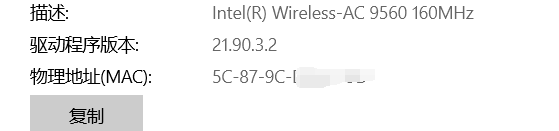
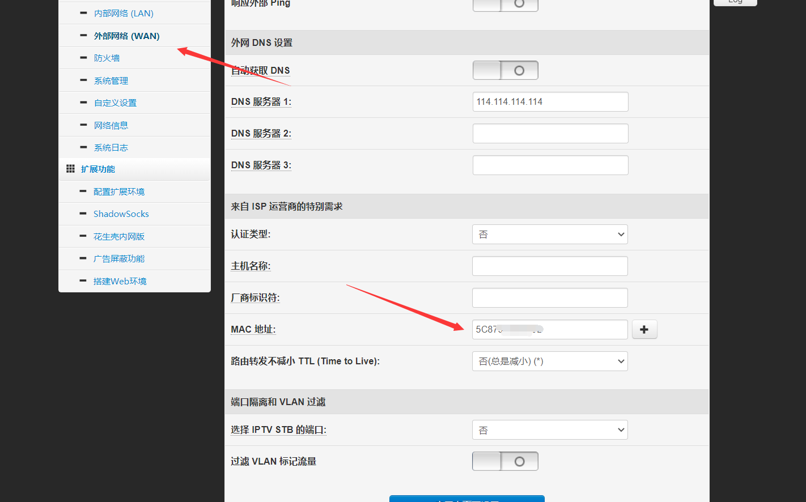
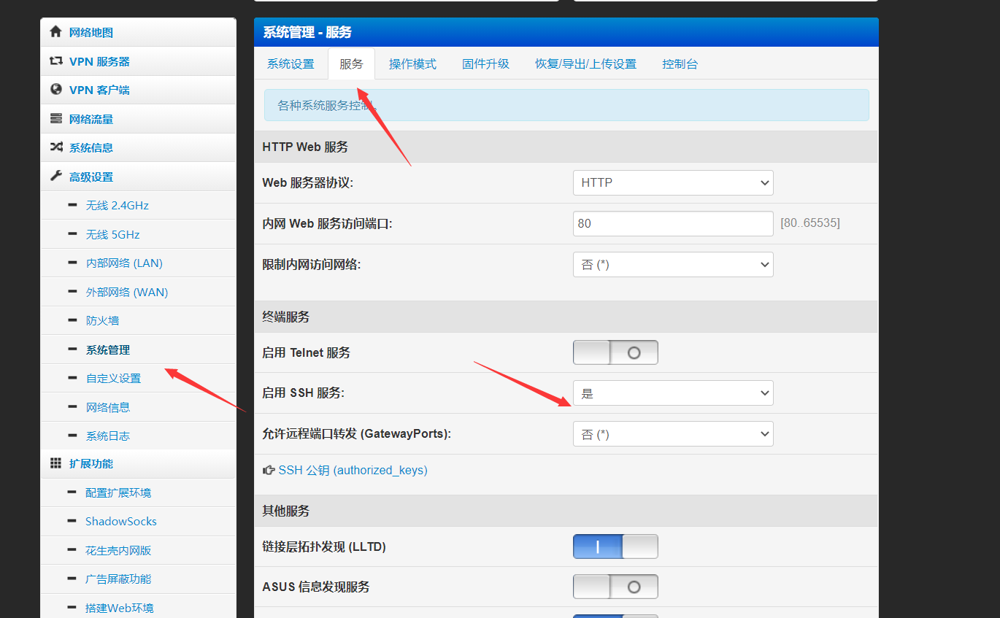
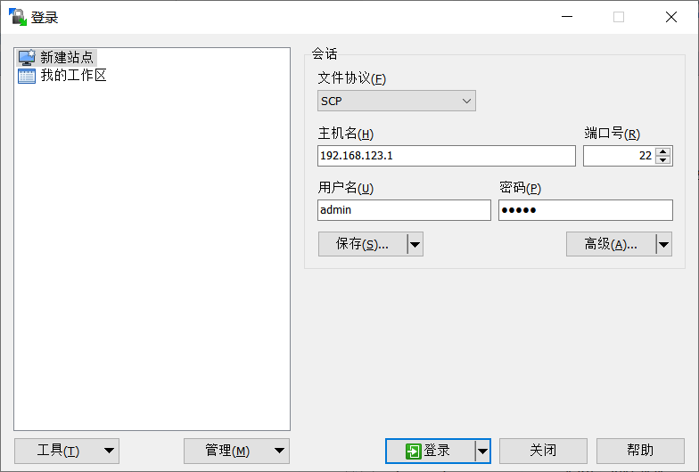
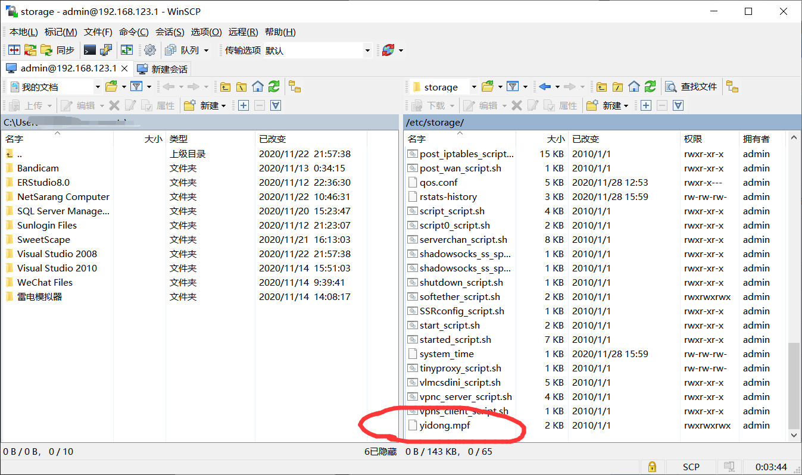
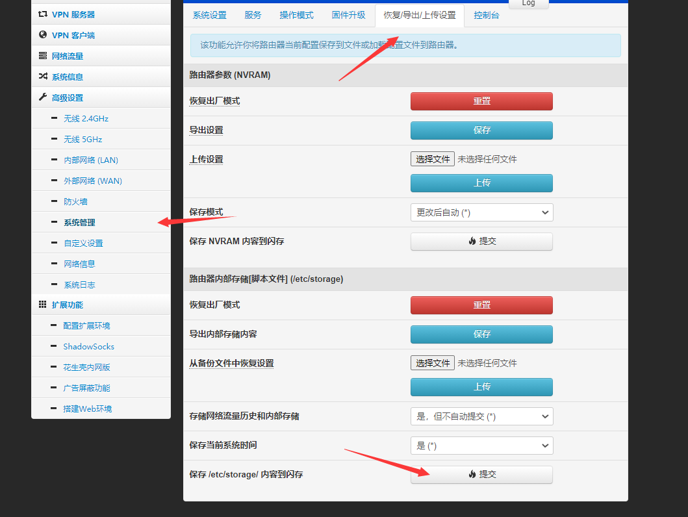
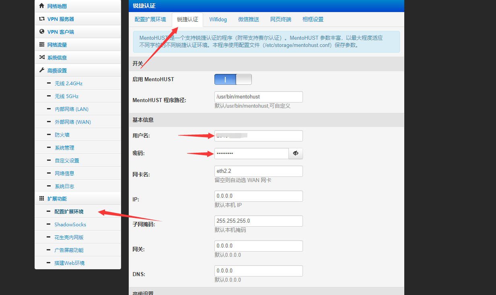
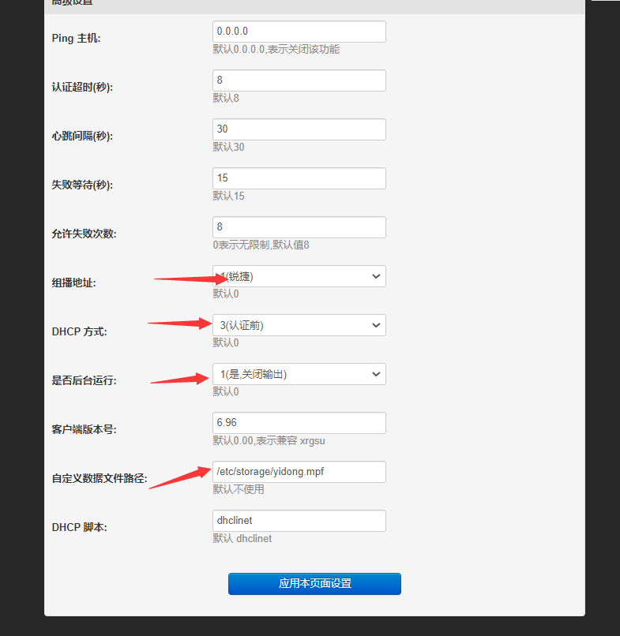
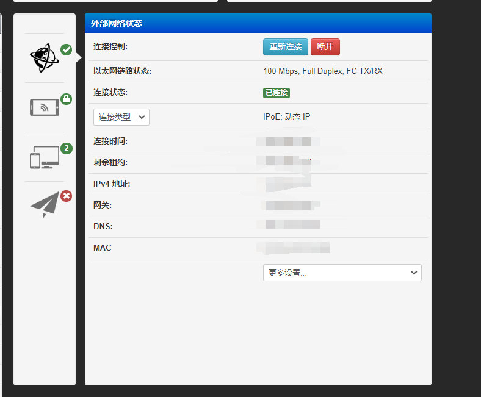

帮舍友破解了学校的联通校园网，我只能说：

锐捷，有手就行

<!-- more -->

## 认证原理

原理很简单，就是把官方的认证放到路由器上，用路由器伪装自己的电脑登录账号，然后再把网络分享出来。学校的校园网客户端一般都是不给开热点的，主要是为了多卖多恰钱，懂得都懂。

## 老毛子认证过程

### !!!一共就这下年4个步骤按照顺序来就肯定可以用

##### 刷好老毛子固件

##### 伪装mac,伪装成你的电脑

##### 打开ssh, 把mpf文件传进起来

PS:mpf文件就是抓官方认证程序的认证的通讯协议的一个文件
这里传一个成都信息工程大学的mpf文件还有抓包软件[cuit的移动, 电信, 联通的mpf认证文件](http://file.skywang.fun/mpf抓包软件以及CUIT的mpf文件.7z)

##### 输入账号密码连接.

## 操作流程

#### 伪装Mac

首先用自己的电脑插上网线，连接上客户端，查看mac地址

然后进入老毛子的后台，在这个位置伪装

#### 打开ssh, 把mpf文件传进起来

这里我用的是WINSCP,选择SCP模式主机名字就是路由器后台地址，用户名密码就是后台登录的用户名密码

连接上后把抓包到的MPF文件传到/etc/storage这个目录

之前已经附上成都信息工程大学的移动还有联通的mpf文件, 以及一个抓包软件, 不同学校的同学自己抓就行了

然后进路由器后台，保存一下

## 输入账号密码连接

输入账号密码

然后下面这么设置（这是成都信息工程大学的设置方法，其他的学校DHCP设置可能要改）

然后小地球亮了就是连接好了

