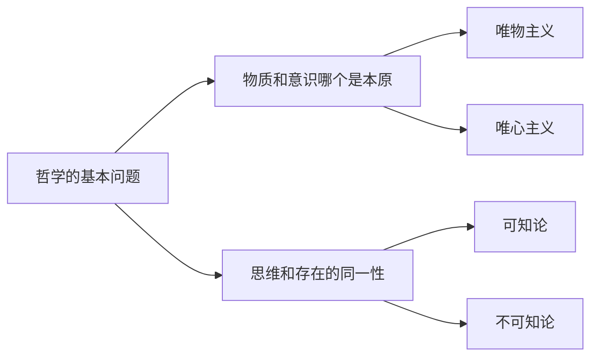
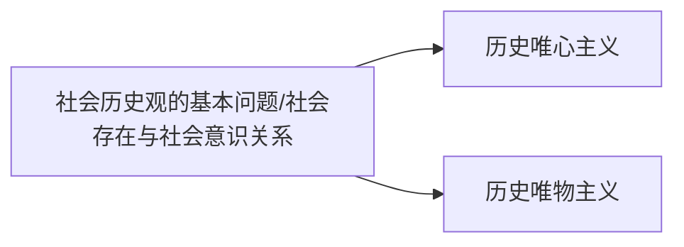
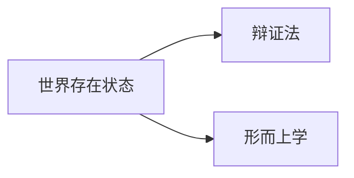
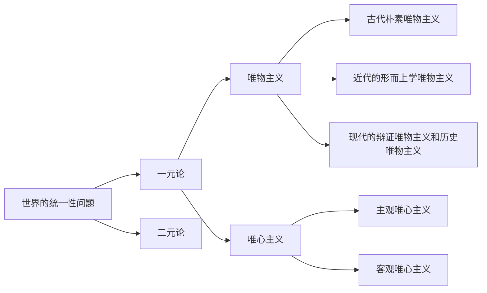

##  **绪论** **马克思主义是关于工人阶级和人类解放的学科**

1**、关于马克思主义的产生**

**马克思主义产生的时间**：19 世纪 40 年代中期

**马克思主义的客观历史条件**-----资本主义得到迅速发展及其内在矛盾的尖锐化，以及马克思主义作为独立的政治力量登上历

史舞台（阶级基础）

**马克思主义产生的直接理论来源**：德国的古典哲学、英国的古典政治经济学、英法空想社会主义学说

**马克思主义产生的自然科学基础**：细胞学说、能量守恒和转化定律和达尔文生物进化论的自然科学的三大发现

**马克思主义产生的主观条件**：马恩的崇高理想、勤奋好学、理论联系实际的学风，使他们两人成为马克思主义的创始人。

2**、关于马克思主义的自身理论**

**马克思主义的三大组成部分**：马克思主义哲学、马克思主义政治经济学和科学社会主义内在统一整体

**马克思主义的广义理解**：包括创始人在内及其继承者-----列宁主义、中国的毛泽东思想和中国特色社会主义理论体系（包括邓小平理论、

‘三个代表’重要思想和科学发展观）

**马克思主义的科学内涵**：

第一、马克思主义是马克思、恩格斯共同创立的。

第二、马克思主义不仅包括它的创始人马克思、恩格斯的理论，而且包括它的继承人的理论，特别 是列宁、毛泽东、邓小

平等人的理论。 

第三、在基本观点、基本立场、基本方法、价值取向等方面与马克思、恩格斯创立的理论前后相继、一脉相承，在本质上相

一致的。 

第四、马克思主义的各个组成部分是一个具有内在逻辑联系的科学体系。

**马克思主义的理论特征**: 以实践为基础的科学性和革命性的统一。

**马克思主义的理论品质**：与时俱进

**马克思主义的社会理想**：实现共产主义，（最高理想）。

**中国近期的共同理想和最高理想的关系**：**最高理想与共同理想:注意理解把握要点，二者的关系**：

马克思主义最高的社会理想，就是推翻资本主义、实现共产主义，实现共产主义是长期的远大的理想；建设中国特色社会主

义是全国各族人民的共同理想，相对于最高理想来说，共同理想是近期的具体理想。

 最高理想与共同理想，既相互区别又相互联系，二者是辩证统一的关系。首先，共同理想是实现最高理想的必经阶段和必要

基础。其次，实现共同理想，必须坚持以最高理想为根本方向。（简答）

3**、关于如何对待马克思主义**

把马克思主义当作行动的指南,反对教条主义;明确学习马克思主义的目的（第一、树立正确的世界观、人生观、价值观。第

二、掌握认识世界和改造世界的伟大工具。第三、全面提高人的素质。

）；坚持学习马克思主义的根本方法----理论联系实际。

## **马克思主义哲学部分（第一章**----**第三章）**

### **第一章** **物质世界及其发展规律**

1**，关于哲学的含义及哲学的基本问题：**

**哲学的含义**：哲学是系统化、理论化的世界观的理论体系；是世界观、方法论和价值观的统一。

**哲学的基本问题**：思维和存在关系问题,哲学的基本问题有二方面内容：第一是何者为第一，它是划分唯物主义和唯心主义

的唯一标准；第二是两者有无统一性，它是划分可知论和不可知论的唯一标准。

哲学发展的二个基本派别；唯物主义和唯心主义；它们的历史形态分别为：唯物主义经历了朴素唯物主义、形而上学唯物主

义和辩证唯物主义和历史唯物主义三个形态；唯心主义则有二种形式：主观唯心主义和客观唯心主义。

**思维和存在或意识和物质的关系问题**

在唯物主义和唯心主义的对立中，又交织着辩证法和形而上学的对立。辩证法和形而上学的对立从属于唯物主义和唯心主义
的对立。
在世界的本质问题上一元论和二元论、唯物主义和唯心主义的对立
世界的本质问题，实质上是世界的统一性问题。

2**、马克思主义的物质观：**

第一、它指出物质是不依赖于意识的客观实在，同唯心主义划清了界限。

第二、它指出物质是可以被人们认识的，同不可知论划清了界限。

第三、它指出客观实在性是一切物质的共性，克服了旧唯物主义物质观的局限性。

3**、马克是主义的运动观**

**物质与运动不可分原理**：物质离不开运动（相反是形而上学）；运动也离不开物质（相反是唯心主义）

**相对静止的重要意义**：

第一、只有承认相对静止，才能理解事物的多样性，区分开不同的事物。第二、只有承认相对静止，才能认识事物分化的条

件和生命现象的产生。第三、只有承认相对静止，才能理解绝对运动。

**事物是绝对运动和相对静止的辩证统一**（只承认静止不承认绝对运动是形而上学；只承认运动不承认相对静止时相对主义诡

辩论）

4**、马克思主义的时空观：**

**时空的哲学含义和特点**：

时间是物质运动的持续性、顺序性。时间的特点是一维性。空间是物质运动的广延性和伸张性。物质的空间特性通常以两种

形式表现出来：体积、空间位置。空间的特点是三维性。时间和空间是内在统一不可分离的（四维时空概念）。

**时空与运动着的物质不可分离**:

时间和空间是运动着的物质的存在方式，时间和空间与运动着的物质不可分离，世界上既没有脱离时间和空间运动的物质，

也没有脱离物质运动的时间和空间。

**时空的客观性；时空的绝对、无限、与时空的相对、有限的含义和和关系**：

时间和空间既是绝对的、无限的，又是相对的、有限的，是绝对和相对、无限和有限的统一。

绝对性、无限性：时间上无始无终，在空间上无边无际。

相对性、有限性：每一具体事物在时间上有始有终，在空间上有边有际。

时间和空间的绝对性、无限性与相对性、有限性是不可分割的，通过时间和空间的相对性、有限性，去认识、把握其绝对

性、无限性。

5**、马克思主义的实践观：**

**实践的含义**：实践是主体能动地改造和探索客体的社会性的客观物质活动。

**实践的三个基本特点**：第一、客观性。从根本上与唯心主义实践观划清界限。第二、自觉能动性。从根本上与旧唯物主义实

践观划清界限。第三、社会历史性。同唯心主义实践观划清界限，又同旧唯物主义实践观以及实用主义实践观区别开来。

**实践的三种基本形式**：第一、物质生产实践。第二、处理社会关系的实践。第三、科学实验。其他一些实践形式（教育实

践、医疗实践、艺术实践）

**人生活于其中的世界是与人的实践相联系的物质世界**: 

,第一、人的实践活动与自然界的二重化。第二、社会历史是人们的实践活动创造的。第三、实践是人的存在方式。

**社会生活在本质上是实践的**：

第一、劳动实践是人类和人类社会产生的决定性环节 第二、物质生产实践是人类社会得以存在的基础。

第三、实践活动是推动社会发展的动力。

6**、唯物辩证法的体系**

**二个特征：**

**（**1**）联系：**联系的客观普遍性；联系的多样化

联系是指事物之间以及事物内部诸要素之间的相互影响、相互作用和相互制约的关系。

事物之间的联系时客观的，联系是普遍的。联系的普遍的性是指：世界上任何事物都不能孤立地存在，都与周围的其他

事物处于相互联系之中；每一事物内部各个要素也不能孤立地存在，都是与其他要素相互联系的；整个世界不是各种孤立的

事物的机械堆积，而是由无数相互联系的事物构成的统一整体。

具体联系又是复杂多样的，事物联系的主要形式有：直接联系与间接联系、内部联系与外部联系、本质联系与非本质联系、

必然联系与偶然联系，等等。

**（**2**）发展**：发展的实质是新陈代谢的运动和变化

发展是指事物一种特殊的运动变化—上升性、前进性的运动变化，即事物由低级到高级、由简单到复杂的不断更替的运动变

化过程。发展的实质是新事物的产生和旧事物的灭亡。

新事物必然战胜旧事物的原理（新事物的含义及其理由）：

新事物是指符合事物发展规律、具有强大生命力和远大前途的事物。旧事物是指丧失了其存在的必然性、日趋灭亡的事物。

新事物必然战胜旧事物，是由新旧事物的本质特点和事物发展的辩证本性决定的：

1.新事物符合事物发展的必然趋势。 2.新事物优越于旧事物。

3.社会历史领域内，人民群众是社会群众创造者和绝对力量，新事物是社会上先进的、富有创造力的人们创造性活动的产

物，它从根本上符合广大人民群众的利益和要求，能够得到广大人民群众的拥护和支持。它必然战胜旧事物。

（3）两种对立的发展观：

1.联系观点和孤立观点的对立。 2.发展变化观点和静止不变观点的对立。 3.承认事物内部矛盾和否认事物内部矛盾的对立。

唯物辩证法与形而上学的根本对立和斗争焦点在于是否承认矛盾是事物发展的动力。

**三大规律：**

**（**1**）对立统一规律：**

对立统一规律亦称矛盾规律，其基本内容是：任何事物都包含着矛盾；矛盾双方既统一又斗争；由此推动事物运动变化发展。

辩证矛盾的含义：

矛盾是指事物内部两方面之间既对立又统一的关系，也就是事物内部两方面之间既相互排斥又相互联系的关系。简言之，矛盾就是对立统

一。

**矛盾的两种基本属性及其关系**：

矛盾双方的对立和统一这两重关系决定了矛盾具有两种基本属性，即同一性和斗争性。

*矛盾的同一性是指矛盾双方相互联系、相互吸引的性质。它包括两方面的含义。

第一、矛盾双方相互依存。第二、矛盾双方相互贯通。它主要表现为以下两种情形：其一是矛盾双方的相互渗透或相互包含。其二是矛盾

双方在**一定条件下**相互转化的趋势。

*矛盾的斗争性是指矛盾双方相互排斥、相互对立的性质。矛盾的斗争性具有无限多样的表现形式.

矛盾的同一性和斗争性是既相互区别，又相互联结的:

首先，基本属性不同，在矛盾运动中所处的地位是不同的。矛盾的同一性是相对的，矛盾的斗争性是绝对的。矛盾同一性的相对性是指它

的条件性。矛盾斗争性的绝对性是指它的无条件性（无论在任何条件下矛盾双方都会有斗争）。

其次，矛盾的同一性和斗争性又是相互联结、不可分离的。一方面，同一性不能脱离斗争而存在，没有斗争就没有同一性。另一方面，斗

争性寓于同一性之中，没有同一性也没有斗争性。

矛盾的同一性和斗争性相互联结的关系，要求我们在分析和处理矛盾时，必须在对立中把握同一，在同一中把握对立。

**矛盾是如何推动事物发展的**：

事物发展的动力和源泉是事物的内部矛盾。矛盾的同一性在事物发展中的作用主要表现在：

第一、矛盾双方相互依存，使事物保持相对稳定性，为事物的存在和发展提供必要的前提。

第二、矛盾双方互相从对方吸取有利于自身的因素而得到发展。 第三、矛盾的同一性规定着事物发展的基本趋势。

矛盾的斗争性在事物发展中的作用主要表现在：

第一、在事物量变过程中，斗争推动着矛盾双方的力量对比和相互关系发生变化，为质变做准备。第二、在事物质变过程中，斗争突破事

物存在的限度，促成矛盾的转化，实现事物的质变。

在事物的发展过程中，矛盾的同一性和斗争性都有重要作用，但都不能孤立地起作用，只有二者始终结合在一起才能成为事物发展的动

力。

**内因和外因的关系**：

第一、**内因**是事物发展变化的**根据**，是第一位的原因。第二、**外因**是事物发展变化的**条件**，是第二位的原因。在**一定情况**下，**外因**对事

物的发展甚至**起决定性**作用。第三、外因通过内因而起作用。矛盾的普遍性和特殊性的辩证关系：

矛盾是普遍存在的：无处不在，无时不有。矛盾的普遍性原理，矛盾的普遍性也就是矛盾的共性。矛盾的不同就是矛盾的特殊性。

矛盾的特殊性原理具有重要的方法论意义。**分析矛盾的特殊性就是坚持具体问题具体分析**。一方面，**分析矛盾的特殊性是正确认识事物**

**的基础**。另一方面，**分析矛盾的特殊性是正确解决矛盾的关键**。（“一把钥匙开一把锁”）具体问题具体分析是马克思主义的活的灵

魂。

矛盾的普遍性和特殊性的关系和意义，也就是共性与个性、一般与个别的关系，它们是辩证统一的。

第一、矛盾普遍性与特殊性是**互相联结**的。一方面，普遍性存在于特殊性之中，另一方面，特殊性中包含着普遍性。如果割裂了特殊性

与普遍性的联系，就会导致“白马非马”的诡辩命题。一般就是普通，个别就是特殊。

第二、矛盾普遍性与特殊性是**互相区别**的。一般（普通）比个别（特殊）更普遍、深刻，个别比一般更丰富、具体。

第三、矛盾普遍性与特殊性在**一定条件下**可以**互相转化**。 

*矛盾普遍性与特殊性辩证关系的原理，是矛盾问题的精髓。

*矛盾普遍性和特殊性辩证关系的原理，是我们坚持马克思主义普遍真理同中国具体实际相结合，建设**中国特色社会主义**的理论基础。

矛盾发展的不平衡性原理（主要矛盾和次要矛盾及矛盾的主要方面和次要方面的关系）

矛盾发展的不平衡性是矛盾特殊性的重要表现。它主要表现为两种情形：一种是主要矛盾和次要矛盾的不平衡；另一种是矛盾的主要方面

和次要方面的不平衡。

主要矛盾和次要矛盾的关系是：首先，二者相互影响、相互作用。其次，主要矛盾和次要矛盾的地位不是一成不变的，它们在一定条件下

可以相互转化。

主要矛盾和次要矛盾关系的原理，对于社会主义现代化建设具有重要意义。我们在集中力量抓经济建设的同时，还必须注意解决好其他社

会矛盾，坚持一系列“两手抓”的方针，一手抓物质文明建设，一手抓精神文明建设；一手抓改革开放，一手抓打击犯罪；一手抓经济建

设，一手抓民主法制；等等。只有这样，才能实现经济、政治、文化、社会全面协调可持续发展。

矛盾的主要方面和次要方面的关系是：首先，矛盾的主要方面和次要方面是相互制约、相互作用的。其次，矛盾的主要方面和次要方面的

地位不是固定不变的，在一定条件下可以相互转化，随着矛盾双方主次地位的转化，事物的性质也就发生了变化。

主要矛盾和次要矛盾、矛盾的主要方面和次要方面关系的不平衡性的原理：

要求我们在实际工作中坚持两点论和重点论的统一。我国坚持以经济建设为中心和一系列“两手抓”的方针，认识我国社会主义现代化建

设的形势要分清主流和支流，既要抓住主流、坚定信心，又不忽略支流，都是坚持两点论和重点论统一的具体表现。

**（**2**）质量互变规律：**

质量度的含义及其掌握度的意义：

质是指一事物**区别**于他事物的**内在规定**性。**质是事物的内在规定，属性是质的外在表现**。**属性**是一事物和他事物**发生联系时表现出来的**

**质**。

量是指事物存在和发展的规模、程度、速度等可以用数量表示的规定性，以及事物构成成分在空间上的排列组合。

任何事物都是质和量的统一体。

*度是指事物保持自己质的数量限度(或范围、幅度)，它体现着质和量的统一。

*掌握事物的度具有重要的意义：

在认识上，只有把握了事物的度，注意决定质的数量限度，才能**准确地认识事物的质。**在实践上，**坚持适度原则。**防止“过”或“不

及”。“注意分寸”、“掌握火候”、“适可而止”、“过犹不及”等等，都是要求在实践中**坚持适度原则**。

量变与质变的辩证关系和意义：

***量变和质变是辩证统一的**: （论述题）

第一、量变是质变的必要准备，质变离不开量变。第二、质变是量变的必然结果。第三、量变和质变相互渗透。一方面，质变体现和巩固

量变的成果，另一方面，在总的量变过程中有阶段性和局部性的部分质变。

量变和质变是辩证统一的，割裂二者的统一，就会导致激变论或庸俗进化论。激变论只承认质变，否认量变。激变论在社会政治上表现为

冒险主义。庸俗进化论只承认量变，否认质变。社会政治上表现为改良主义。

*质量互变规律要求我们在社会主义建设和改革过程中，把远大的理想和目标同有步骤、分阶段地踏实苦干、稳步前进的精神结合起来，

反对急躁冒进、急于求成。否则会欲速则不达，得到事与愿违的结果。

**（**3**）否定之否定规律：**

肯定和否定的关系：

任何事物内部都包含着肯定和否定两个方面。肯定方面是指事物中维持其存在的方面，即肯定这一事物是它自身而不是他物的方面。否定

方面是指事物中促使其灭亡的方面，即破坏现存事物使它转化为他物的方面。任何事物都是肯定方面和否定方面的统一体。

*肯定和否定是事物内部两个相反的方面，它们又是辩证统一的：一方面，肯定和否定相互依存。另一方面，肯定和否定相互渗透。

***唯物辩证法的否定观集中体现了马克思主义哲学批判的、革命的本质。**辩证否定观的内容和意义：

第一、辩证的否定是**事物的自我否定**，即通过事物内部矛盾而进行的对自身的否定。

第二、辩证的否定具有**两个重要特点**：其一否定是**事物发展**的环节。其二否定是**事物联系**的环节。

第三、作为**发展环节和联系环节之统一**的辩证否定是**扬弃**（既克服又保留）。

对于中国传统文化：除去糟粕，吸取精华。对于外国文化，要采取有分析、有选择、有批判。

否定之否定规律的基本内容是：

事物的发展经过两次辩证的否定，由肯定阶段到否定阶段，再到否定之否定阶段，从而使事物的发展表现为螺旋式上升和波浪式前进的过

程。否定之否定规律揭示了事物的发展是前进性和曲折性的统一。

否定之否定规律揭示事物的总趋势和具体道路是前进和曲折的统一：

*否定之否定规律揭示了事物发展的总趋势是前进的、上升的。否定之否定规律揭示了事物发展的具体道路是曲折的。如果割裂了二者的

统一，会导致循环论和直线论的错误。

*把握否定之否定规律，坚持事物的发展是前进性和曲折性统一的原理，对我们正确认识社会主义现代化建设事业具有重要意义.首先，要

坚信社会主义的前途是光明的,其次,要准备走曲折的路。

**五对范畴：**

原因与结果、必然与偶然、可能与现实、内容与形式、本质与现象（五对范畴的共性：都体现对立统一的关系；各自的个性）：

**（一）原因与结果：**

*原因和结果的联系是事物或现象之间引起和被引起的联系。引起某种现象的现象就是原因，被某种现象所引起的现象就是结果。

因果联系的一个显著特点是：原因在先，结果在后。因果联系是引起和被引起的关系。**原因和结果之间的关系是对立统一关系**。首先，

原因和结果是对立的。其次，原因和结果又是统一的。表现在：第一、原因和结果相互依存。第二、原因和结果在一定条件下相互转化

【摩擦-生热-燃烧-爆炸】。第三、原因和结果是相互作用的【生产力与生产关系】。

**（二）必然性和偶然性**

必然性和偶然性是事物联系和发展中两种不同的趋势。**必然性是指事物联系和发展过程中确定不移的、不可避免的趋势**。

**必然性与本质和规律是同等程度的概念**。**偶然性**是指事物联系和发展过程中**不确定的趋势**。

**必然性和偶然性之间的关系是对立统一关系。**

*掌握必然性和偶然性辩证关系的原理具有重要意义：

首先，因为偶然性是受必然性支配的，按必然规律办事，不要被偶然现象所迷惑。其次，因为必然性是通过大量偶然性表现

出来的，偶然性是必然性的表现形式和补充，所以我们应当抓住偶然性提供的机遇，揭示偶然现象背后隐藏的必然性，重视

偶然性。此外，偶然性对事物的发展有重要的影响作用，我们决不能忽视偶然性。

**（三）可能性和现实性**

必然性通过偶然性为自己开辟道路时，要经历由可能到现实的转化过程。

现实性是指包含内在根据的、合乎必然性的存在，是客观事物和现象种种联系的综合。

可能性是包含在现实事物中、预示事物发展前途的种种趋势、潜在的尚未实现的东西。

**（四）内容和形式**

*内容是指构成事物一切要素的总和，即事物的各种内在矛盾以及由这些矛盾所决定的事物的特性、成分、运动过程和发展的趋势等的总

和。形式是指把内容诸要素统一起来的结构或表现内容的方式。内容与形式的关系是对立统一、相互作用的关系。

**（五）本质和现象**

本质是指事物的**根本性质**以及组成事物基本要素的**内在联系**。现象是指事物的**表面特征**以及这些特征的**外部联系**。有些现象与本质是一

致的，通常叫真相；有些现象与本质似乎不一致，这种情况通常叫作假相。**假象同真相一样，也是客观存在的。因而不能把它同主观上**

**的错觉混为一谈**。真相反应本质，假象也反应本质。

7**、关于规律**

规律的含义和特点：

规律就是物质运动发展过程中本质的、必然的、稳定的联系。

规律具有两个特点。第一、客观性。第二、普遍性。

自然规律是在自然界各个领域起作用的规律，是自然界中的物质运动发展过程中本质的、必然的、稳定的联系。

社会发展是有规律的自然历史过程（自然规律与社会规律的区别和共性）：

区别：自然规律是通过自然界各种盲目的力量相互作用实现的，它是自发地起作用，不需要人的参与。社会发展规律是通过人们的自觉活

动实现的。

共同性：社会的发展同自然界一样，也是客观的、有规律的辩证发展过程。

第一、**在社会领域**，**人们的自觉活动虽然都是有目的、有意识的**，**但人们的自觉活动相互作用、相**

 **互冲突**，形成不以他们的主观意志为转移的**客观过程**。

第二、支配人们自觉活动的**思想动机**是由**社会物质生活条件**决定的，**而社会物质生活条件的变化是** 

 **有规律的。**

第三、**人们的自觉活动受着客观物质条件的制约，不能自由地选择生产力和生产关系**。8**、马克思主义的意识论：**

意识的起源（二点）：

**首先****，意识是自然界长期发展的产物****。自然界的长期演化和发展包括如下三个阶段：**

第一、从无生命物质的反应特性到生物的刺激感应性。

第二、从低等生物的刺激感应性到动物的感觉和心理。（专门反映外界刺激的感觉器官和神经系统）。

第三、从动物的感觉和心理到人类意识的产生。（人脑）

**其次，****意识是社会性劳动的产物****。**

意识不仅是自然界长期发展的产物，而且是社会的产物，社会性劳动在意识产生过程中起着**决定性**的作用。

第一、劳动使猿脑变为人脑，为意识的产生提供了物质器官。

第二、劳动产生了语言，为意识的内容提供了物质外壳。社会性劳动是意识的物质器官和物质外壳形成和完善的基础，是由动物心理发展

到人类意识的决定性力量。

意识的本质（三点）：

第一、意识是人脑的机能，人脑是意识的物质器官。（必要条件）

第二、意识是客观世界的主观映像（意识形式），是人脑对客观世界的反映（意识内容）。意识是主观性和客观性的统一。

第三、意识是社会的产物。

意识的能动作用（意识对物质的发作用）：

辩证唯物主义认为，物质与意识的关系是：物质决定意识，物质第一性，意识第二性；意识对物质又具有能动的反作用。坚持物质决定意

识，就坚持了唯物论；同时又承认意识的能动作用，就坚持了辩证法。物质决定意识和意识的能动作用是辩证的统一。

意识的能动性（即意识的能动作用的含义及其主要表现：四点）：

意识的能动性（即主观能动性）是指意识能动地反映世界和通过实践改造世界的能力和作用。

意识的能动性主要表现在以下四个方面：

第一、意识活动具有目的性和计划性。（具有超前性和预见性）（人建造房屋与蜜蜂建造蜂房）。

第二、意识活动具有主动创造性。（普通）

第三、意识对于人的生理活动具有一定影响作用。（特殊）

第四、意识能通过指导实践改造客观物质世界。这是意识的能动性最突出的表现。★

发挥主观能动性（即意识的作用）与尊重客观规律的关系：

要正确发挥人的主观能动性，必须正确处理主观能动性和客观规律性的关系。尊重客观规律和发挥主观能动性是辩证统一的。

第一、尊重客观规律是正确发挥主观能动性的前提。

第二、认识和利用规律又必须充分发挥人的主观能动性。

*尊重客观规律和发挥主观能动性辩证统一的原理，具有重要的现实意义：在社会主义现代化建设和各项工作中，把高度的实践热情、创

新精神与科学的求实态度结合起来。

###  **第二章 认识的本质及其规律（认识论）**

1**、实践对认识的决定作用（即实践是认识的基础）表现为四点：来源、动力、标准和目的：**

马克思主义哲学把实践观引入到认识中来，克服了以往唯物论在认识论上的局限性，认识实践的观点是辩证唯物主义认识论之第一的基本

的观点，实践是认识的基础，从而引起了认识论的革命。马克思主义哲学认为实践对认识具有决定性的作用，具体表现如下：

1.实践是认识的来源

实践是沟通主题和客体的桥梁，而能使主体和客体相互接触、相互作用的唯一途径就是实践。（微观）

人的认识能力和作为认识结果的知识，都只能来源于实践。

强调实践是认识和知识的唯一源泉，并不否认可以从他人和书本获得知识。书本上的知识，仍然是从实践中得来的。（宏观）

2.实践是认识发展的动力（如何推到认识发展的动力）

第一、社会实践不断提出新的需要、新的研究课题，推动认识的发展。

第二、社会实践为认识不断提供新的经验和新的观察、研究的物质手段。

第三、社会实践推动人的思维能力的发展。人们在实践中不仅改造客观世界而且也改造着 自身的认识能力。

3.为什么实践是检验认识真理性的唯一标准(P118-119)

这是由真理的本性和实践的特点所决定的。第一、**是不是真理就是要判明认识与认识对象是否相一致、相符合，主观真理论者无例外地**

**都是从主观认识范围去解决这个问题**；实践是人的主观见之于客观的活动，它能把主观认识与客观实际联系起来加以对照，来确定认识

与认识对象是否相一致、相符合，从而使认识得到检验。第二、**唯有实践才具有直接现实性品格**。通过实践把思想、理论在现实中实现

出来，人们通过把变成现实的东西同原来观念、思想加以对照，从而判明这个思想、观念是否正确，使认识得到检验。

4.实践是认识的目的

认识世界的目的在于改造世界，实践是认识的源泉、动力、标准和最终目的，这些都是实践对认识决定作用的具体表现。2**、认识主体、客体、及其关系：**

认识主体：

第一、认识主体的含义。认识主体是指认识和实践活动的承担者，是处于一定社会关系中从事实践活动和认识活动的现实的、具体的人。

第二、认识主体的性质和特点。首先，人作为认识主体具有**自然的物质基础**。人具有自然属性。其次，认识主体不仅具有自然的物质基

础，具有**社会历史性**。再次，认识主体具有**能动性**。[突出特点]

第三、认识主体的结构。人是唯一能担当起认识主体的存在物，这个存在物具有自身的结构，它分为个体、群体和人类整体诸层次。**作**

**为认识主体的人类整体的认识能力是无限的，这种性质同客观世界的无限性正好一致。**

认识客体：

第一、认识客体的含义和构成。认识客体是指人的实践活动和认识活动所指向的对象。构成认识客体的内容主要有**自然客体、社会客体**

**和精神客体**。（**精神客体是指成为人们认识对象的精神活动和精神产品**；自然客体指自然界；社会客体指人类社会；）

第二、认识客体的性质和特点：**认识客体具有客观实在性、对象性**。

主体和客体的关系:(选择)

认识的主体和客体是一对矛盾的两个方面，它们之间存在着既对立又统一的辩证关系。二者又是同一的，即相互依存、相互作用，并在一

定条件下相互转化。具体说来，它们的关系表现如下：

第一、主体和客体的**实践关系**。它是指主体与客体之间改造和被改造的关系，主体作用于客体，就是对客体的改造，也就是实践。 实践

关系是一切其他关系的前提和基础，也是主体和客体之间的首要的基本关系，没有实践关系，其他任何关系都无从谈起。

第二、主体和客体的**认识关系**。它是指主体与客体之间反映和被反映的关系。

第三、主体和客体的**相互作用**。主体的能动作用，客体的制约作用。

一切实践只有在主体能动性和客体制约性统一的基础上，才是成功的实践。这个实践过程也是主体客体化和客体主体化的过程。

3**、马克思主义关于认识的本质及其和唯心主义、不可知论和旧唯物主义在认识本质问题上的区别（三个区别）：**

**认识的真正本质是在实践中主体对客体的能动反映，这是马克思主义哲学对认识本质的科学揭示**。马克思主义的认识论同唯心主义认识

论、不可知论从根本上区别了开来，而且也同旧唯物主义认识论划清了界限。

第一、**唯物论的反映论与唯心论的认识论的对立**。在哲学上有两条对立的认识路线：一条是从物到感觉和思想的路线；一条是从感觉和

思想到物的路线。

一切唯物论的认识论都是反映论，旧唯物主义未能从根本上解决认识的本质问题。

唯心主义认为同人的直接经验没有任何关系，这就是唯心论的先验论。这种认识论对认识活动进行了很多探索和研究，不可能正确解决认

识的本质问题。

第二、**可知论与不可知论的对立。**唯物主义哲学对这个问题的回答都是肯定的，现实世界是可知的。有些唯心主义哲学家，对这个问题

也给了肯定的回答，如黑格尔。但他同唯物主义所主张的可知论是有根本区别的。

哲学上的不可知论是指那些认为世界不可认识或不能彻底认识的哲学认识论。在欧洲近代哲学中有两位典型代表人物，一位是英国的休

谟，另一位是德国哲学家康德。

不可知论是一种错误的、消极的理论，它怀疑人的认识能力，不承认人类知识的客观性，对人类的进步和发展起着消极的作用。实践的观

点彻底批驳了不可知论以及哲学上的一切其他怪论。

第三、**辩证唯物论的能动的反映论与旧唯物论的机械的反映论的对立**。在认识论上，唯物论都是反映论，这种反映论**不懂得实践，不懂**

**得辩论法。**

辩证唯物论是对这种唯物论的发展和超越，它把实践观引进到认识论中来，并把认识论与辩证法结合起来，科学地揭示了认识的本质，把

认识看作是主体在实践中能动的反映客体的过程，从而使得辩证唯物论的反映成为能动的革命的反映论。

**认识的过程是反映与创造的统一，这是辩证唯物论的反映论的能动性的突出表现，也是区别于机械唯物论反映论的根本标志**。

认识的本质 是在实践基础上主体对客体的能动反映。（唯心主义不承认反映，主张先验论；不可知论不承认能真实反映，主张不可知；

旧唯物主义不承认是能动反映，主张是直观反映）。

4**、认识的辩证运动过程** （二次飞跃）：

第一次是从感性认识到理性认识（或是从实践到认识）两者关系和飞跃的条件：

感性认识和理性认识的辩证关系（简答题）

感性认识和理性认识是认识的两个阶段，它们既相互区别、又相互联系，它们之间存在着对立统一的关系。

第一、感性认识与理性认识的区别。感性认识是对事物表面的、直接的、具体的、个别特性的反映，因而是不深刻的、片面的认识；理性

认识是对事物本质的、间接的、全体的、概括的反映，因而是深刻的、全面的、相对稳定的认识。

第二、感性认识与理性认识的联系。表现在以下几个方面：其一、理性认识依赖于感性认识；在认识论上坚持了唯物论。其二、感性认识

有待于发展到理性认识；认识论上坚持了辩证法。

其三、感性认识和理性认识相互渗透；一方面，感性认识中有理性认识；另一方面，理性认识中包含感性的成分。在人的实际认识过程中

既没有纯粹的感性认识，也没有纯粹的理性认识。**感性、理性认识是不可分割的，如果将二者割裂开，就会犯经验论或唯理论的错误**。经验论者片面强调感性经验的重要性、唯理论者则

走向另一个极端，认为感性经验是靠不住的。都犯了片面性的毛病，都是错误的。**在实际工作中，经验论和唯理论是经验主义和教条主**

**义的认识论根源**。

感性认识向理性认识的飞跃要具备两个条件：第一，必须有正确的思维方法和正确途径。‘去粗取精、去伪存真、由此及彼、由表及

里’。第二、感性材料应是丰富的、全面的，而不是零散不全的。

第二次是从理性认识到实践：原因和条件：

从理性认识到实践（简答题）**认识世界和改造世界的统一是马克思主义哲学的特点和优点。**

实践是认识的目的。实践是经验理性正确与否的唯一标准。

认识由感性上升到理性，这只是认识运动的一半，还要实现由理性认识向实践的飞跃。

认识的这次飞跃比第一次飞跃具有更加重大的意义。这是因为：

第一、只有经过这一次飞跃，才能把理论用于指导实践，实现对客观世界的改造。

第二、只有经过这一次飞跃，使理性认识再回到实践中去，使之得到检验、丰富和发展。

认识的辩证运动规律及其意义：

认识的有限性是指每个时代的人每一次具体的认识是有限的，认识的无限性是指整个人类无止境的世代更替的认识是无限的。每个时代的

人的每一次具体的认识，由于受主客观条件的限制，都是有限的；整个人类无止境的世代更替的认识，则具有无限性。整个人类认识的无

限性，存在于每个时代的人认识的有限性中，并通过无数有限性的认识而得到实现。所以认识的有限性和认识的无限性是辩证统一的。

规律：毛泽东指出：‘实践、认识、再实践、再认识，这种形式，循环往复以至无穷，而实践和认识之每一循环的内容，都比较地进到高

一级的程度、螺旋式的上升运动，这就是认识运动反正得总规律。

**意义：**首先、主观和客观、认识和实践的统一是**具体的**。这是指特定的主体在具体的实践中的主观认识与特定的客观实际的相一致、相

符合。（一定时代下）

其次、主观和客观、认识和实践的统一是**历史的、变化发展的**。这是指认识也实践的统一是变动的，随着实践的发展，认识也应跟着实

践的发展而发展。（与时俱进）

5**、马克思主义的真理观**

真理和谬误的辩证关系（内容真理的含义）：

在实践中，主体对客体的反映有两种情形：一种是主体正确地反映了客体，一种是主体歪曲地反映了客体。正确地反映客体的认识就是真

理，歪曲地反映客体的认识就是谬误。

真理和谬误是认识运动中既对立又统一的两个方面。它们的对立表现在相互排斥、相互否定上。 

真理与谬误的统一表现为它们之间的相互依存和相互转化。

在一定条件下，可以相互转化。这是因为任何真理都是具体的，都有与之相符的特定的对象、时间、和范围，一旦离开这个对象，超出特

定的时间和范围，真理就会变成谬误，真理便会变成错误。谬误也可能转化为真理，这是指当人们把超出特定对象、时间和范围的认识进

行纠正，使之重新与对象、时间和范围相符合，这时谬误就变成了真理。

真理的客观性及其二点含义：作为正确认识的真理具有多种属性，最重要是真理的客观性、绝对性和相对性。

真理的客观性（固有规律）；真理的客观性有两个含义：

其一、真理的客观性就是承认认识的内容来自客观实际又符合客观实际。事物及其规律本身并不就

 是真理；真理属于认识范围。

其二、真理的客观性是指检验真理的标准是客观的。验证真理的标准只能是实践。

 主观的真理是根本不存在的。唯物主义承认客观真理。唯心主义否认客观真理。

真理的绝对性和真理相对性的辩证关系及其意义（真理的绝对性和相对性是一个真理的两个方面，不是两个不同的真理）：

真理既是绝对的，又是相对的，是绝对性和相对性的统一。真理的绝对性和相对性具有如下关系：

第一、真理的绝对性和相对性相互依存。

第二、真理的绝对性和相对性互相包含、互相渗透：一方面，任何相对真理中都包含着绝对真理的颗粒；另一方面，绝对真理通过相对真

理表现出来，无数相对真理的总和构成绝对真理。

第三、相对真理向绝对真理转化。

真理是绝对的，同时又是相对的，具有相对性，通常把真理的相对性称作“**相对真理**”。真理的相对性有两个含义：第一、真理性的认

识在**广度**上是有限的，是受一定条件制约的，它需要进一步扩展。第二、真理性的认识在**深度**上是有限的，是受一定条件制约的。

意义：在哲学上有两种对待二者关系的错误态度，即相对主义和绝对主义。相对主义不承认在相对真理中包含绝对真理的成分和颗粒，实

际上就是否认客观真理的存在；绝对主义否认真理的相对性，否认真理是一个过程，从而导致把人的认识僵化。都是真理问题上的片面

性，都是错误的。

把握真理的绝对性和相对性相统一的原理，对于我们正确对待马克思主义有重要意义。马克思主义是真理，它也是绝对性和相对性的统

一。它正确地反映了自然、社会和思维发展的普遍规律，因而具有绝对性的一面。但是，它又没有穷尽一切事物及其规律，需要随着社会

实践的发展而发展，因而又具有相对性的一面。正因为马克思主义真理具有绝对性，所以我们必须坚持它并以它作为我们的指导思想；又

因为它具有相对性，所以我们又必须在实践中丰富它、发展它。既坚持又发展，才是对待马克思主义的正确态度。

实践是检验真理的唯一标准真理标准问题上的两种错误观点(选择题)

第一种，提出用伟人、**圣人之言**作为衡量真理的标准。这些都是主观真理论者在真理标准问题上的表现。第二种，实用主义哲学提出的

“**有用即真理**”。 是一种非常错误的观点：第一、真理的检验是关于认识与认识对象是不是一致的问题，这与真理是不是具有效用是不

同的两个问题；第二、真理是有用的，但有用的未必就是真理；第三、会使得真理的标准变得极为不确定，也就失去了标准的意义。

实践标准唯一性的理由（实践是检验真理的唯一标准是有真理的本性和实践的特点作决定的）：

马克思主义哲学把实践观引进到认识论中来，提出实践是检验认识是否具有真理性的唯一标准。

第一、**是不是真理就是要判明认识与认识对象是否相一致、相符合，主观真理论者无例外地都是从主观认识范围去解决这个问题**；而马

克思主义哲学提出实践标准，实践是人的主观见之于客观的活动，它能把主观认识与客观实际联系起来加以对照，来确定认识与认识对象

是否相一致、相符合，从而使认识得到检验。

第二、**唯有实践才具有直接现实性的品格**。通过实践把思想、理论在现实中实现出来，人们通过把变成现实的东西同原来的观念、思想

加以对照，从而判明这个思想、观念是否正确，使认识得到检验。

实践标准和逻逻辑证明的关系（实践标准的唯一性和逻辑证明的辅助性）：

坚持实践是检验真理的唯一标准，并不否认逻辑证明在认识和探索真理中的作用。但逻辑证明的但逻辑证明的这种作用并不表明它是检验

真理的标准，更不能用逻辑证明取代实践标准。

实践标准本身的辩证性（确定和不确定的统一）：

**实践标准既是确定的、绝对的**，**又是不确定的、相对的**，**是确定性与不确定性、绝对性与相对性的统一。这就是在真理标准问题上坚持**

**了辩证法。**

实践标准的绝对性、确定性是指：

第一、认识是否是真理，只有通过实践来检验，此外再无别的检验真理的办法。

第二、人的实践和人的认识都是有限和无限的统一，实践能够对人类的一切认识作出检验。

实践标准的相对性、不确定性是指：

第一、任何实践总是一定历史条件下的具体的实践，都是有局限性的，因而它不可能完全证实或驳倒现有的一切认识。

第二、实践对真理的检验具有反复性。许多认识的真理性往往不是经过实践的一次检验就能被证实或驳倒，而是要经过多次反复检验，才

能被证实或驳倒。

真理的价值

真理和价值的对立和统一关系 ：

研究认识是否与对象相一致、相符合，这是真理问题；**研究这种相一致、相符合的认识有什么用**，能满足人的什么样需要，这就是**价值**

**问题**。真理与价值也是认识过程中必须正确处理的一对矛盾。

真理与价值的对立是指真理和价值的不同。真理体现的是认识与认识对象的关系，是认识与对象相一致、相符合；**而价值是指外物对人**

**需要的满足，表示某物具有对人有用或使人愉快的属性**。由此不难看出，真理和价值是有区别的，不可混为一谈。

关系：真理与价值又是不可分的，又有统一的一面，表现在：第一、真理能够指导社会实践，人们通过在真理指导下的实践，成功地改造

世界，以这种实践的成果来满足人的需要，这就是真理所表现出来的价值属性。第二、真理与正确的价值观相一致，正确的价值观是在真

理指导下形成的。

真理的功能（三点）：

第一、真理具有指导实践的功能。第二、真理具有再认识的功能。第三、真理具有教育的功能。具有强大的激励功能。

6**、马克思主义认识论与党的思想路线的关系**

党的思想路线的内容：

党的思想路线是一切从实际出发，理论联系实际，实事求是，在实践中检验真理和发展真理。”

邓小平曾把这一思想路线简要地概括为“实事求是”。**马克思主义哲学认识论**是这条思想路线的理论基础；而**党的思想路线**则是马克思

主义哲学认识论在实际中的具体运用。

党的思想路线与马克思主义哲学认识论是统一的，具体表现如下：

第一、党的思想路线坚持了一切从实际出发的原则。第二、党的思想路线坚持了理论联系实际的原则。第三、“实事求是”是党的思想路

线的核心，也是马克思主义哲学的精髓，它充分地体现了马克思主义认识论的根本原则。第四、党的思想路线坚持了实践是检验真理的唯

一标准。党的思想路线是一个整体，是指导我们党各项工作的认识路线。

马克思主义认识论与党的思想路线的关系：

我们**党的群众路线**是：一切为了群众，一切依靠群众，从群众中来，到群众中去。马克思主义哲学认识论是群众路线的理论基础。毛泽

东讲的是群众路线执行的过程，“从群众中来”就是从实践到认识的过程，“到群众中去”就是从认识到实践的过程，“从群众中来，到

群众中去”不断循环往复的过程，也就是实践—认识—实践不断循环往复的过程，这表明群众路线同马克思主义哲学认识论是完全一致

的，是马克思主义哲学认识论在实际工作中的运用。在新的历史时期，仍然要坚持党的群众路线。

###  **第三章 人类社会及其发展规律** 

1、**历史观的基本问题** 

是社会存在和社会意识的关系问题（划分历史唯物主义和历史唯心主义的唯一标准）社会存在和社会意识的关系问题之所以是历史观的基本问题，主要是因为：首先，社会存在和社会意识这对范畴，它们包括了人类社会的

一切物质现象和精神现象。其次，社会存在和社会意识的关系问题，是划分历史唯物主义和历史唯心主义的根本标准。再次，社会存在和

社会意识的关系问题，也是人们在实践中的重大问题。

2**、社会存在决定社会意识**

社会存在的三个方面：地理环境、人口因素和生产方式

地理环境的含义及其在社会发展中的作用和局限性：

地理环境是指人类生存和发展所依赖的诸种自然条件的总和，它由大气圈、水圈、岩石圈构成，适合生物生存的范围叫生物圈。地理环境

是人们的物质生活的必要条件之一，地理环境对人类生存的作用有两个方面：第一、地理环境是人类生存的场所。第二、地理环境为人类

提供生活资料和生产建设的资源。

地理环境必然影响社会的发展。这种影响作用主要表现在两个方面：第一、地理环境通过对生产的影响，加速或延缓社会的发展。第二、

地理环境还可以通过对军事、政治的影响，在一定程度上制约不同国家社会的发展。

地理环境虽然对社会发展起制约和影响作用，但对社会发展不起主要的决定作用。

人口因素的含义及其在社会发展中的作用和局限性：

所谓人口因素，是一个包括人口数量、质量、密度、构成、人口的发展、人口分布和迁移、人口的自然变动和社会变动等各种因素的综合

范畴。

人口因素对社会发展起着制约和影响作用。主要表现在以下两个方面：第一、一定数量的人口是社会物质生产的必要前提。第二、人口状

况能加速或延缓社会的发展。

在社会发展的不同时期，人口状况对社会发展有不同的影响。只有与物质生产相适应的人口状况，才最有利于促进社会的发展。人口因素

不是社会发展中起决定作用的因素，因为它不能决定社会制度的性质和社会制度的更替，而且它受到物质生产的制约。

人口问题是我国现代化建设中一个十分严重的问题，突出表现为人口数量多，老龄化趋势和出生婴儿男女比例失调。

生产方式的定义及其在社会发展中的决定作用表现（四点）简答题：

生产方式是人类借以向自然界谋取必需的生活资料的方式，包括生产力和生产关系两个方面，是特定的生产力和生产关系的统一。生产方

式在社会发展中起决定作用，主要表现在以下几个方面：

第一、生产方式或生产活动是人类从动物界分离出来的根本动力和人类区别于动物的根本标志。

第二、生产方式或生产活动是人类和人类社会得以存在和发展的基础。

第三、生产活动是形成人类一切社会关系的基础。在生产关系的基础上，形成了整个人类社会。

第四、生产方式决定社会制度的性质和社会制度的更替。

社会意识的含义及其划分：

社会意识指社会的精神生活过程，它具有复杂而精微的结构，由诸多因素和层次构成。从反映社会存在的程度和特点来看，社会意识包括

社会心理和思想体系；各种思想体系由于对经济基础的关系不同和反映社会存在的方式不同，可以分为意识形态和非意识形态两类；从社

会意识主体的范围来看，可以分为个体意识和群体意识

1．社会心理和思想体系

社会心理是社会意识的低级层次；思想体系是社会意识的高级层次，亦称社会意识形式。

2．意识形态和非意识形态

属于意识形态范围的思想体系，包括政治思想、法律思想、道德、宗教、艺术、哲学和绝大部分社会科学，它们是上层建筑的重要组成部

分，反映特定的经济基础并为之服务，在阶级社会里具有一定的阶级性。属于非意识形态范围的思想体系，包括自然科学、语言学、逻辑

学等，它们不是特定经济基础的反映，其自身没有阶级性，可以一视同仁地为各个阶级和各种经济基础服务。

3．个体意识和群体意识： 个体意识即社会成员的个人意识，群体意识是指各种社会群体的意识。

社会存在和社会意思的辩证关系：

所谓社会存在决定社会意识，是指社会意识是社会存在的反映，社会意识依赖于社会存在。主要表现在以下三个方面：

第一、社会意识的内容来源于社会存在。

第二、社会意识随着社会存在的发展变化而发展变化。

第三、社会意识受反映者(意识主体)的立场、观点、方法的影响和制约，而反映者的立场、观点、方法是由人们在社会存在中的地位决定

的。

2．社会意识反作用于社会存在

社会意识对社会存在的反作用，指社会意识这种精神力量，在一定条件下可以反作用于社会存在，转化为物质力量，影响社会发展的进

程。社会意识对社会存在的反作用**表现为两种情况**：先进的或正确的社会意识对社会存在的发展起积极的推动作用，促进社会向前发

展；落后的或错误的社会意识对社会存在的发展起消极的阻碍作用，延缓社会的发展进程。社会意识对社会存在的反作用，必须通过人民

群众的实践活动。

社会意识相对独立性的含义及其五点表现：

社会意识的相对独立性是指社会意识在反映社会存在、被社会存在所决定的同时，还具有自身的能动性和独特的发展规律，它的发展与社

会存在的发展并不总是保持着一致和平衡。社会意识的相对独立性主要表现在以下五个方面：

第一、社会意识与社会存在变化发展的**非完全同步性**；第二、社会意识与社会经济**发展水平具有不平衡性**；

第三、社会意识的发展具有**历史继承性**；

第四、社会意识各种形式之间**相互作用、相互影响**；

第五、社会意识对社会存在的反作用或称**能动性**，是**社会意识相对独立性的重要表现**。 

3**、生产力和生产关系的矛盾运动**

生产力的含义及其构成的四类要素：

生产力是人类利用自然、改造自然、从自然界获取物质资料的能力，**生产力范畴反映的是人与自然界的关系**。**现代生产力系统包括四类**

**要素**： 

（1）**独立的实体性因素。包括劳动者、劳动资料和劳动对象**。生产工具是劳动资料的主要内容，是生产力发展水平的主要标志。

劳动对象分为两大类：一类是天然存在的劳动对象；另一类是经过劳动加工的劳动对象（原料）。劳动资料和劳动对象合称生产资料。

（2）**运筹性的综合因素，包括分工协作、经济管理、预测决策等**。 

（3）**渗透性因素，主要指自然科学**。 

（4）**准备性因素，主要指教育**。

科学技术是第一生产力的三层含义：

邓小平提出“科学技术是第一生产力”的著名论断。主要有以下三层含义。

第一层含义**：**科学渗透于现代生产力系统的各类要素之中。

第二层含义：在现代化生产中，出现了“科学—技术—生产”的过程，使科学对物质生产具有了主 

 导作用和超前作用。

第三层含义：科学技术已经成为推动生产力发展的重大杠杆。首先，由科学技术因素造成的劳动生产率和经济增长率越来越高。其次，自

然科学从理论突破到新产品试制成功的周期日益缩短。再次，科学技术的广泛应用，使生产力的发展明显地呈现出加速度的趋势。

生产关系的含义及其包含的三项内容：

生产关系是指人们在物质生产过程中结成的**经济关系**。它包括三项内容：（1）生产资料的所有制形式；（2）人们在生产中的地位及其

相互关系（包括交换）；（3）产品的分配方式。

其中第一项生产资料所有制形式起决定的作用：

它是整个生产关系的基础，主要表现在以下几个方面：

第一、生产资料所有制形式是生产劳动得以进行的前提（起决定性的作用）。

第二、生产资料所有制形式决定整个生产关系的性质。

第三、生产资料所有制形式决定人们在生产中的地位及其相互关系。

第四、生产资料所有制形式决定产品的分配方式。

生产力和生产关系的辩证关系（**生产关系必须适合生产力性质的规律**）：

生产力决定生产关系，生产关系反作用于生产力，生产力和生产关系之间的矛盾运动，这三项内容构成生产关系必须适合生

产力性质的规律。

1．生产力决定生产关系

生产力和生产关系之间的矛盾是物质生产过程的内部矛盾，**其中生产力是矛盾的主要方面，生产关****系是矛盾的次要方面**，生产

力对生产关系起着决定作用、支配作用。这种决定作用表现在以下两个方面：

第一、生产力的性质决定生产关系的性质。

第二、生产力的发展决定生产关系的改变。

2．生产关系反作用于生产力

生产关系是具有巨大的反作用。这种反作用表现为两种情况：

第一、适合生产力性质和发展要求的先进的生产关系，促进生产力的发展；

第二、不适合生产力性质和发展要求的落后的生产关系，阻碍生产力的发展。

生产力决定生产关系，生产关系反作用于生产力，就是生产力和生产关系的辩证关系。

3．生产力和生产关系之间的矛盾运动

生产关系和生产力性质与发展要求之间这种由**基本适合—基本不适合—新的基础上的基本适合**，是一个川流不息、万古常新的循环过

程，每一次这样的循环，都把人类社会提高到一个新的阶段。

这条规律的现实意义：

生产关系必须适合生产力性质的规律，是无产阶级政党制定正确的路线、方针、政策的理论依据。正确理解和运用这个规律，对于我国正

在进行的改革开放和社会主义现代化建设，具有重大的指导意义。我国社会主义初级阶段实行以公有制为主体、多种所有制经济共同发展

的基本经济制度，就是以这一规律为理论依据的。

4**、经济基础和上层建筑的矛盾运动：**

经济基础和上层建筑的含义：经济基础是指一个社会中**占统治地位的生产关系**各个方面的总和，即生产资料所有制形式、各种不同的社会集团在生产中的**地位**及其**相**

**互关系**、**产品分配**方式三个方面的总和。

**人类社会有三个基本层次：生产力，生产关系（经济基础），上层建筑。**

上层建筑是与经济基础相对应的范畴，指社会的政治、法律、艺术、道德、宗教、哲学等意识形态以及与这些意识形态相适应的**政治法**

**律制度**和**设施的总和**，分为**政治上层建筑**和**观念上层建筑**两部分。

政治上层建筑与观念上层建筑之间既相互区别，又互相依赖、互相渗透、互相作用、互相转化。首先，**观念上层建筑决定政治上层建**

**筑**。其次，**政治上层建筑一旦形成**，又会成为一种强大的、既成的物质力量，**反过来影响观念上层建筑。**

经济基础和上层建筑的辩证关系（上层建筑必须适合经济基础发展要求的规律）：

上层建筑和经济基础之间这种由基本适合到基本不适合、再到新的基础上的基本适合，是一个川流不息、万古常新的循环过程，而每一次

这样的循环，都把人类社会推进到一个较高的阶段。

**上层建筑必须适合经济基础发展要求的规律，是无产阶级政党制定正确的路线、方针、政策的理论依据。正确理解和运用这个规律，对**

**于我国正在进行的经济体制改革和政治体制改革以及其他方面的改革，具有重大的指导意义**。 

5**、社会形态划分 及其根源：五种、三种、四种**

社会形态最基本的划分法有两种，一种是**经济**社会形态划分法，另一种是**技术**社会形态划分法。

五种社会形态划分法：**即原始社会、奴隶社会、封建社会、资本主义社会、共产主义社会（社会主义社会是它的第一阶段**）。

三种社会形态划分法：**把人类历史划分为人的依赖性社会、物的依赖性社会、个人全面发展的社会**三种依次更替的社会形态。形成**自然**

**经济社会、商品经济社会、产品经济社会**在历史上依次更替的三种社会形态。

技术社会形态划分法：以生产力和技术发展水平以及与此相适应的**产业结构**为标准划分社会形态。技术社会形态就是以生产力和技术发

展水平以及与此相适应的产业结构为标准划分的社会形态。

**渔猎社会—农业社会—工业社会—信息社会。**

6**、社会形态的发展是一个自然历史的过程：**

社会历史的发展和自然界发展一样，是一个客观的有规律的过程，考察社会历史可以做到和考察自然界那样做到精确（注意：这里的一样

是指有相同之处，不是指完全相同）

人类社会的发展或者说社会形态的演变也像自然界一样，是客观的、物质的、辩证的过程，具有不依人的意志为转移的客观规律性。同时

又应看到，人类的活动是有意识、有目的的。正是人类有意识、有目的的实践活动，构成了人类社会的历史，形成了人类社会历史的发展

规律。

社会历史规律不是别的，就是人的活动的规律。“只有把社会关系归结于生产关系，把生产关系归结于生产力的水平，才能有可靠的根据

把社会形态的发展看作自然历史过程。”（列宁）为什么呢？

第一、因为每一代人在社会上开始生活时，所遇到的都是现成的生产力和生产关系，任何人都不能自由地选择生产力和生产关系。

第二、人们不能自由地选择生产力和生产关系，这并不是说他们不可以按照自己的目的和需要去改变原有的生产力和生产关系。

第三、把社会关系归结于生产关系，把生产关系归结于生产力的水平，就是认为生产力决定生产关系，生产关系作为社会的经济基础又决

定上层建筑，这是历史发展中的唯物主义因果决定论，或称历史决定论。

7**、社会历史发展的决定性和选择性的一致及其表现（三点）：**

社会历史发展的决定性是指社会历史有规律性；社会历史发展的选择性是指社会历史发展又是社会主体的人的选择和结果。

两者的一致性及其表现：

社会历史发展的决定性是指历史决定论，社会历史发展的选择性是指主体选择的作用。承认历史决定论和承认主体选择的作用是一致的、

不矛盾的。

首先，在历史决定论看来，纯粹的必然性只存在于逻辑中。[价格、价值]

其次，在历史决定论看来，社会规律所揭示的社会过程之间的联系，不是单值对应的线性因果联系，而是多值的、或然的、非线性的因果

联系。

再次，每一种可能性的实现，又会有多种多样的形式，即各种具体的模式和途径。

8**、社会形态发展的统一性和多样性的含义和表现：**

社会形态发展的统一性是指各国发展的普遍性；社会形态发展的多样性是指各国发展的差别性。各自表现：

社会形态发展的统一性，是指各国历史发展过程所具有的共同性、普遍性。这种统一性表现在纵向和横向两个方面。这种统一性表现在纵

向和横向两个方面。以五种社会形态划分为例，社会形态发展的纵向统一性。社会形态发展的横向统一性，具有大致相同的生产力发展水

平，大致相同的生产关系体系，大致相同的上层建筑。

所谓社会形态发展的统一性，是指各国历史发展过程所具有的共同性、普遍性不同国家和民族的历史发展具有不同的特点，在经济、政

治、文化发展上都有自己民族的特色，

社会形态发展的多样性主要表现在以下几个方面：

第一、处于同一社会形态的不同国家和民族的历史具有各自的特点。

第二、各个国家在不同的社会形态中所具有的典型意义不同。

第三、人类社会由较低社会形态向较高社会形态转变时，不同国家和民族采取的过渡形式各有特点。

第四、有些国家和民族由于特殊的社会历史条件，在社会形态转变过程中，可能超越某一个或某几个社会形态第五、多样性不能否定统一性，统一性不能否定多样性。

9**、社会发展的动力：**

两对社会基本矛盾的辩证关系及其运动时社会发展的基本动力：

**社会基本矛盾指生产力和生产关系之间的矛盾、经济基础和上层建筑之间的矛盾**(**简答题**)

两对社会基本矛盾之间的关系:不是互相孤立、平行的，而是相互制约、有主次之分的。

首先，由于生产力决定生产关系、生产关系作为社会的经济基础又决定社会的上层建筑，所以生产力与生产关系之间的矛盾对于经济基础

与上层建筑之间的矛盾起着主导作用。上层建筑与经济基础之间的矛盾根源于生产力与生产关系之间的矛盾。

其次，由于生产关系对生产力有反作用，上层建筑对经济基础有反作用，经济基础是联系上层建筑和生产力的中间环节，所以生产力和生

产关系之间的矛盾的解决，又有赖于经济基础和上层建筑之间的矛盾的解决。

上层建筑和经济基础的矛盾的解决，制约着生产力和生产关系之间矛盾的解决。

基本动力：生产力和生产关系之间的矛盾、经济基础和上层建筑之间的矛盾，存在于一切社会形态之中，贯穿于每一个社会形态的始终；

这两对矛盾制约和决定着其他各种社会矛盾，决定着整个社会的面貌，决定着社会发展的必然阶段和客观趋势，决定社会形态由低级到高

级的演进。所以社会基本矛盾是社会发展的基本动力。

阶级斗争在阶级社会发展中的作用：

主要表现在两个方面。

首先，阶级斗争推动社会发展的作用，最明显地表现在社会形态更替的过程中。

其次，阶级斗争推动社会发展的作用，还表现在同一个社会形态的量变过程中。

阶级是一个历史范畴，它不是从来就有，也不会永远存在。阶级是生产发展到一定阶段的产物。

【阶级是生产发展到一定阶段的产物，剩余产品的出现，为阶级的产生提供了可能性；生产资料私有制的出现，是阶级产生的可能性变成

了现实。】

什么是阶级：所谓阶级，就是这样一些集团，由于它们在一定社会经济结构中所处的地位不同，其中一个集团能够占有另一个集团的劳

动。阶级首先是一个经济范畴，划分阶级的唯一标准是经济标准。

阶级斗争是指各对抗阶级之间的斗争，其中包括剥削阶级和被剥削阶级之间的斗争，也包括上升时期的剥削阶级和腐朽没落的剥削阶级之

间的斗争。物质利益的对立是阶级斗争的根源。

革命和改革在社会发展中的作用：

社会革命和社会改革是社会运动的两种基本形式。社会革命和社会改革都是推动社会发展的动力。

社会革命是阶级斗争的最高表现。社会革命是指夺取国家政权的斗争。革命的首要的基本的标志是国家政权从反动阶级手里转移到革命的

进步的阶级手里。只有进步的革命的阶级反对反动统治阶级的围绕国家政权的斗争，才是社会革命。

社会革命是社会基本矛盾的必然产物。社会革命的最深刻的根源，就在于生产力和生产关系之间的矛盾以及经济基础和上层建筑之间的矛

盾。所以说革命的根本问题是国家政权问题。

暴力革命是社会革命的基本形式，并不意味着否定在特定的社会历史条件下，有革命和平发展的可能性，

马克思说：“革命是历史的火车头”这句话形象而深刻地说明了社会革命在社会发展中的重大作用：

首先，社会革命是阶级社会由低级向高级发展的决定性手段。

其次，人民群众在革命时期能发挥出创造历史的巨大的主动性和积极性。

再次，革命阶级在革命斗争中受到锻炼和改造，成为建设新社会的基础。

社会改革及其在社会发展中的作用（简答题）

社会改革是在一定社会制度下，为了解决生产关系不适合生产力、上层建筑不适合经济基础的某些部分或环节，使该社会制度得到持续存

在与发展或自我完善，而对社会体制进行的改善与革新。

社会革命与社会改革都是为了解决生产力和生产关系、经济基础和上层建筑的矛盾，从而推动社会发展的历史运动形式。

社会改革推动社会发展的作用，主要表现在以下几个方面：

第一、社会改革可以巩固新生的社会制度或使原有的社会制度持续存在并获得一定程度的发展。 第二、在社会主义社会以前，社会改

革为新社会制度的诞生作量变和部分质变的准备。

第三、在社会经济、政治等社会体制改革的过程中，必然伴随着人们思想观念和价值取向的变更。

社会革命与社会改革二者之间又有明显的区别。

首先，社会革命是人类社会的根本质变；社会改革则是同一社会制度总的量变过程中的部分质变，不改变社会制度的根本性质。

其次，社会革命目的是推翻反动统治阶级的国家政权；社会改革目的是维护和巩固统治阶级的统治地位。因此，社会革命一般是由下层群

众首先发动的，社会改革则是自上而下展开的。

再次，从历史上看，社会革命往往要通过暴力革命的形式；社会改革虽然也要付出代价，甚至流血牺牲，但一般不需要采取大规模的武装

斗争和暴力冲突的形式。

我国的改革之所以是社会主义制度的自我完善，是由社会主义社会基本矛盾的性质和特点决定的。改革的目的是兴利除弊。

我国的改革是在中国共产党的领导下社会主义制度的自我完善过程。我国的改革是在安定团结的政治环境中的社会主义自我完善过程。

我国的改革必须坚持四项基本原则和坚持改革开放。

文化的作用：

社会主义先进文化具有多方面的功能和作用。首先，它具有坚持和培育民族精神的功能。其次，它具有切实加强思想道德建设的功能。再

次，它具有大力发展教育和科学事业的功能。

文化的社会功能主要表现在以下四个方面。

第一、文化具有信息功能。 

第二、文化具有教化、培育和塑造人的功能

第三、文化具有促进社会发展的功能。

第四、文化具有认识功能。

10、马克思主义关于人的本质的观点：

劳动是人的一般本质；一切社会关系的总和是具体人的本质；人的需要也是人的本质。

11、人民群众在历史发展中的决定作用（即创造者的作用）：

人民群众是指推动历史发展的绝大多数社会成员的总和。这个范畴既有量的规定性，又有质的规定性。从量的规定性来看，它是指社会成

员的大多数，是相对于个人而言的；从质的规定性来看，它是指一切推动历史发展和社会进步的社会力量。人民群众是一个历史范畴，在

不同国家或同一国家的不同历史时期有不同的内容。我国现阶段人民群众的内容是：包括知识分子在内的工人阶级和广大农民，始终是推

动我国先进生产力发展和社会全面进步的根本力量；一切赞成、拥护和参加社会主义建设的社会集团及拥护社会主义和赞成祖国统一的爱

国者，也都属于群众的范围。社会新阶层属于人民群众的范畴。

人民群众推动历史发展的作用，主要表现在以下三个方面。

第一、人民群众是物质财富的创造者。

第二、人民群众是精神财富的创造者。

第三、人民群众是实现社会变革的决定力量。

历史唯物主义与历史唯心主义在人民群众作用问题上的分歧：

历史唯心主义从 社会意识决定社会存在的前提出发，片面夸大了极少数的英雄人物及其思维、意志在社会发展中的作用，认为历史是由

英雄豪杰、帝王将相、立法者、思想家创造的，否认广大人民群众是推动历史发展的决定力量。

历史唯物主义从社会存在决定社会意识和物质资料的生产方式是人类社会存在和发展的基础的基本原理出发，认为人类历史首先是生产发

展的历史，是物质生产的承担者劳动群众的历史，于是得出了人民群众是历史的创造者的结论。

人民群众是历史的创造者原理（含义、表现及其社会制约性和意义）：

既然人民群众是历史的创造者，我们就必须坚持以人为本。历史是人民群众创造的，但人民群众却不能随心所欲的创造历史，人民群众创

造历史的活动受既定的历史条件的制约。

无产阶级政党的群众观点和群众路线（简答、论述题）

群众观点是无产阶级政党的根本观点，主要包括以下四个内容：

第一、人民群众自己解放自己的观点；

第二、全心全意为人民服务的观点；

第三、向人民群众负责的观点；

第四、向人民群众学习的观点。 

党的群众路线的内容是：“一切为了群众，一切依靠群众，从群众中来，到群众中去。”

“一切为了群众”，这是群众路线的基本出发点和最终归宿。“一切依靠群众”，这是群众路线的根本要求。“从群众中来，到群众中

去”，这是无产阶级政党领导方法，也是群众路线的基本工作方法。

在改革开放和现代化建设的新形势下，坚持党的群众路线，具有十分重大的意义。推进党的作风建设，核心是保持党同人民群众的血肉联

系。我们党的最大政治优势是密切联系群众，党执政后的最大危险是脱离群众。

杰出人物在历史上的重要作用及其评价：

杰出人物在历史发展中的作用，主要表现在以下几个方面：

第一、一般地说，先进阶级的政治代表人物能够反映他们所处的那个时代的发展趋势，比同时代、同阶级的人站得高，看得远，能够提出

社会发展的先进思想和主张。

第二、先进阶级的政治代表人物，能够根据他们的先进思想和主张，制定具体的纲领、路线、政策和战略、策略，并动员和组织本阶级成

员与广大人民群众同阻碍社会进步的反动阶级、反动社会势力进行斗争。

第三、在历史发展的一定阶段上，某些占统治地位的剥削阶级的代表人物，在特定的社会条件下，可能成为“开明的政治家”，他们的一

些主张和改革措施，也对社会发展起某些促进和推动作用。

第四、杰出的科学家、思想家、理论家、教育家、文学艺术家等等的创造性活动及其成果，对于人类科学文化教育事业的发展和社会的物

质文明与精神文明水平的提高起着重要的作用，有力地推动了历史的发展和社会的进步。正确认识和评价杰出人物的历史作用，需要掌握以下几个基本观点和方法：（简答、论述题）

第一、杰出人物是一定历史条件下的产物，要正确认识杰出人物的历史作用，坚持历史主义原则。实事造英雄，是历史唯物主义的观点。

第二、在阶级社会里杰出人物，特别是政治家、思想家、理论家、军事家，总是一定阶级的代表，他们的历史作用同他们所代表的那个阶

级的历史作用是分不开的。因此，要正确认识杰出人物的历史作用，必须对他们作阶级分析。

第三、杰出人物的出现及其历史作用都是必然性与偶然性的辩证统一，因此必须用必然性与偶然性辩证统一的观点来分析杰出人物及其历

史作用。

第四、任何杰出人物都有巨大的历史功绩，也必然会有这样那样的缺点或错误。因此，对他们的历史作用要作全面的分析与评价，既不能

肯定一切，也不能否定一切。

想而服务。