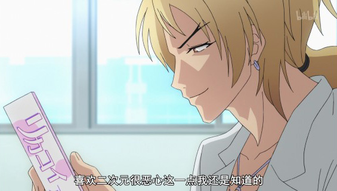
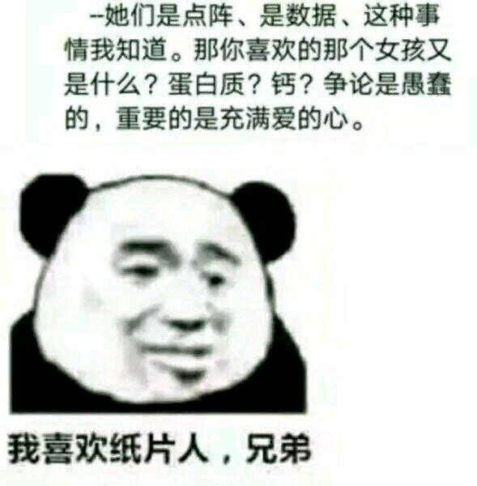

<!--girls.josn例子-->

<!--[-->

​	<!--{"name":"藤原千花",             
​		"from":"辉夜大小姐想让我告白～天才们的恋爱头脑战～",              
​	"avatar":"/girls/img/tengyuan.png"},                     
​	{"name":"四宫辉夜",                     
​		"from":"辉夜大小姐想让我告白～天才们的恋爱头脑战～",           
​	"avatar":"/girls/img/huiye.png"}-->           

<!--]-->

<!--name: 名称-->
<!--avatar: 头像图片链接-->
<!--from: 出自什么作品-->
<!--url: 人物百科链接-->
<!--reason: 喜欢的理由-->

<!--当你不输入 `url` 人物百科链接时，会自动将人物名与[萌娘百科 (opens new window)](https://zh.moegirl.org/)前缀拼接以获得人物百科链接。-->

<!--]-->

# 原则

- 可爱
  拥有某种我喜爱的特质

我对~~普通的三次元~~女孩子没有兴趣。假如你们当中有纸片人、死宅、喜欢动漫或者一切有趣之事的女孩子，尽管来找我。完毕！